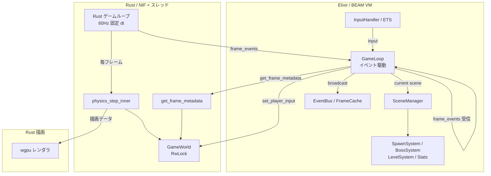

# Elixir × Rust ゲームエンジン

[](https://opensource.org/licenses/MIT)

**Elixir と Rust を組み合わせたゲーム開発環境です。**  
このエンジンでゲームを作り、同じ土台の上で自分も、みんなも、オリジナルゲームを開発できることを目指しています。

現在は **ヴァンサバ** をデモゲームとして含んでいます。数千体の敵が同時出現するサバイバーアクションが動作し、今後の汎用化に向けた基盤が整っています。

---

## 主な特徴

| 観点 | 内容 |
|------|------|
| **ゲームロジック** | Elixir / OTP — 耐障害性、並行性、ホットリロード、宣言的ロジック |
| **物理・描画** | Rust — 低レイテンシ、SoA ECS、空間ハッシュ、GPU インスタンシング |
| **連携** | Rustler NIF — ゲームループと NIF のスムーズな統合 |
| **描画** | wgpu — Vulkan / Metal / DX12 対応、1 draw call で数千体描画 |

---

## クイックスタート

### 前提条件

| ツール | バージョン |
|--------|------------|
| Elixir | ~> 1.19 |
| Erlang/OTP | 26 以上 |
| Rust | 1.80 以上 (stable) |
| wgpu 対応 GPU | Vulkan / Metal / DX12 いずれか |

### インストール & 実行

```bash
git clone https://github.com/your-org/your-repository-name.git
cd your-repository-name

mix deps.get
mix compile
mix run --no-halt
```

> 初回の `mix compile` 時に Rust クレートがビルドされます。数分かかる場合があります。

### テスト

```bash
mix test
cd native/game_native && cargo test
```

> **環境構築の詳細**: [docs/01_setup/SETUP_ELIXIR.md](docs/01_setup/SETUP_ELIXIR.md)（Windows を含む）

---

## アーキテクチャ

### 現状（Step 41: Rust 駆動ゲームループ）



**Step 41**: tick の主導権を Rust に移行。`std::time::Instant` で固定 16.67ms (60Hz) の physics step。Elixir は `{:frame_events, events}` を受信してイベント駆動でシーン制御。

**Rust レイヤーの構成**: SoA ECS | 空間ハッシュ | フリーリスト | SIMD Chase AI | RwLock

### 1 フレームの流れ

1. Rust ゲームループスレッドが 16.67ms 間隔で `physics_step` を実行
2. フレームイベントを Elixir の GameLoop に `{:frame_events, events}` で送信
3. GameLoop が受信 → 入力設定・EventBus 配信・シーン update
4. NIF `get_frame_metadata` で HUD 用メタデータ（HP、敵数、弾数など）を取得
5. LevelUp・BossAlert 中は `pause_physics` で physics を停止

---

## プロジェクト構造

```
elixir_rust/
├── mix.exs
├── config/
├── lib/
│   ├── game.ex
│   └── game/
│       ├── application.ex         # Supervisor ツリー
│       ├── game_loop.ex           # 60Hz ゲームループ
│       ├── scene_manager.ex       # シーン管理
│       ├── scene_behaviour.ex     # シーン共通インターフェース
│       ├── event_bus.ex           # フレームイベント配信
│       ├── frame_cache.ex         # ETS フレームキャッシュ
│       ├── input_handler.ex       # 入力処理
│       ├── stress_monitor.ex      # 負荷監視
│       ├── stats.ex               # スコア・統計
│       ├── telemetry.ex           # 観測
│       ├── nif_bridge.ex          # Rustler NIF 定義
│       ├── scenes/                # シーン実装
│       │   ├── playing.ex
│       │   ├── level_up.ex
│       │   ├── boss_alert.ex
│       │   └── game_over.ex
│       └── systems/               # ゲームロジック
│           ├── spawn_system.ex
│           ├── boss_system.ex
│           └── level_system.ex
├── native/game_native/            # Rust クレート
│   └── src/
│       ├── lib.rs                 # NIF エントリポイント
│       ├── main.rs                # スタンドアロン描画用
│       ├── core/                  # 共通ロジック
│       │   ├── enemy.rs, boss.rs, item.rs, weapon.rs
│       │   ├── constants.rs, util.rs
│       │   └── physics/
│       ├── renderer/              # wgpu 描画
│       ├── asset/                 # アセット管理
│       └── audio.rs
├── assets/
│   ├── sprites/
│   └── audio/
├── docs/                          # 設計・仕様・ロードマップ
└── test/
```

---

## パフォーマンス目標

| 指標 | 目標 |
|------|------|
| 同時敵エンティティ数 | 5,000 体 |
| フレームレート | 60 FPS |
| 物理演算 | 8 ms 以下/フレーム |
| 描画 | 4 ms 以下/フレーム |

---

## ビジョン・ロードマップ

- **現在**: ヴァンパイアサバイバーをデモとして含むエンジン基盤
- **Step 41 完了**: GameLoop の Rust 移行 — 高精度 60Hz タイマー、イベント駆動の Elixir 連携
- **今後**: エンジン層とゲーム層の分離を進め、**誰もが Elixir × Rust 環境でゲームを作れる**形を目指す

詳細は [docs/04_roadmap/NEXT_STEPS.md](docs/04_roadmap/NEXT_STEPS.md) と [docs/05_steps/STEPS_MAP_SAVE_MULTI_DEBUG.md](docs/05_steps/STEPS_MAP_SAVE_MULTI_DEBUG.md) を参照してください。

---

## ドキュメント

| 用途 | リンク |
|------|--------|
| ドキュメント一覧 | [docs/docs_index.md](docs/docs_index.md) |
| 環境構築 | [docs/01_setup/SETUP_ELIXIR.md](docs/01_setup/SETUP_ELIXIR.md) |
| ゲーム仕様 | [docs/01_setup/SPEC.md](docs/01_setup/SPEC.md) |
| Elixir/Rust 役割分担 | [docs/03_tech_decisions/ELIXIR_RUST_DIVISION.md](docs/03_tech_decisions/ELIXIR_RUST_DIVISION.md) |
| 汎用化ロードマップ | [docs/04_roadmap/NEXT_STEPS.md](docs/04_roadmap/NEXT_STEPS.md) |
| 実装ステップ | [docs/05_steps/STEPS.md](docs/05_steps/STEPS.md) |

---

## ライセンス

MIT License
