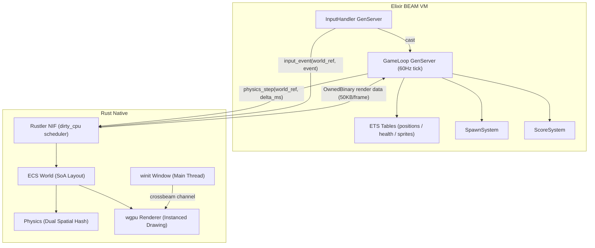

# Elixir x Rust — ヴァンパイアサバイバーライクゲーム

Elixir をゲームロジックの司令塔として、Rust を高性能な描画・物理演算エンジンとして組み合わせた、数千体の敵が同時出現するサバイバーアクションゲームです。

## 技術スタック

| レイヤー | 技術 | 役割 |
|---|---|---|
| ゲームロジック | Elixir / BEAM VM | ゲームループ制御・スポーン管理・スコア・ルール |
| Elixir-Rust 連携 | Rustler NIF (dirty_cpu) | 低レイテンシなネイティブ関数呼び出し |
| 物理演算・衝突判定 | Rust | SoA ECS + Dual Spatial Hash |
| 描画 | Rust + wgpu | GPU インスタンシング（1 draw call で数千体） |
| ウィンドウ管理 | winit (Rust スレッド) | クロスプラットフォームウィンドウ |
| 共有ステート | ETS (Erlang Term Storage) | 高速並行読み取り可能なコンポーネントストア |

## アーキテクチャ概要



### データフロー（1フレーム）

```
1. GameLoop GenServer が :tick を受信（16ms間隔）
2. NIF: physics_step(world_ref, delta) を呼び出し
   └─ Rust: 移動計算 → 衝突判定 → AI更新 → レンダリング指示
3. Rust がレンダリングデータ（バイナリ）を返却
4. Elixir が ETS に差分書き込み
5. winit スレッドが wgpu でフレームを描画
6. 次の :tick をスケジュール
```

## ディレクトリ構造

```
elixir_rust/
├── mix.exs                          # Elixir プロジェクト設定
├── config/
│   └── config.exs
├── lib/
│   └── game/
│       ├── application.ex           # Supervisor ツリー
│       ├── game_loop.ex             # メインゲームループ GenServer (60Hz)
│       ├── input_handler.ex         # 入力イベント GenServer
│       ├── component_store.ex       # ETS ラッパー（ECS コンポーネント）
│       ├── nif_bridge.ex            # Rustler NIF 定義
│       └── systems/
│           ├── spawn_system.ex      # 敵スポーン管理
│           ├── score_system.ex      # スコア・経験値計算
│           └── level_system.ex      # レベル進行・難易度管理
├── native/
│   └── game_native/                 # Rust クレート（Rustler NIF）
│       ├── Cargo.toml
│       └── src/
│           ├── lib.rs               # NIF エントリポイント
│           ├── ecs/
│           │   ├── world.rs         # EnemyWorld（SoA レイアウト）
│           │   └── components.rs    # コンポーネント型定義
│           ├── physics/
│           │   ├── spatial_hash.rs  # Dual Spatial Hash
│           │   ├── collision.rs     # 衝突判定
│           │   └── movement.rs      # 移動・AI ステートマシン
│           └── renderer/
│               ├── mod.rs           # wgpu 初期化・パイプライン
│               ├── sprite_renderer.rs # インスタンシング描画
│               ├── texture_atlas.rs # テクスチャアトラス管理
│               └── shaders/
│                   ├── sprite.wgsl  # 頂点シェーダ
│                   └── sprite_frag.wgsl
├── assets/
│   ├── sprites/                     # スプライトシート（テクスチャアトラス）
│   └── audio/
├── docs/
│   ├── SPEC.md                      # ゲーム仕様書
│   └── WHY_ELIXIR.md                # Elixir採用理由
└── test/
```

## セットアップ

### 前提条件

| ツール | バージョン | 備考 |
|---|---|---|
| Elixir | 1.17 以上 | `asdf install elixir` 推奨 |
| Erlang/OTP | 27 以上 | Elixir に同梱 |
| Rust | 1.80 以上 (stable) | `rustup` でインストール |
| wgpu 対応 GPU ドライバ | — | Vulkan / Metal / DX12 いずれか |

### インストール

```bash
# リポジトリのクローン
git clone https://github.com/your-org/elixir_rust.git
cd elixir_rust

# Elixir 依存パッケージのインストール（Rustler が Rust クレートも自動ビルド）
mix deps.get
mix compile
```

> **注意**: 初回の `mix compile` 時に Rust クレートが Cargo でビルドされます。  
> Rust のビルドには数分かかる場合があります。

### 実行

```bash
# 開発モードで起動
mix run --no-halt

# または IEx セッションで起動
iex -S mix
```

### テスト

```bash
# Elixir テスト
mix test

# Rust ユニットテスト
cd native/game_native && cargo test
```

## パフォーマンス目標

| 指標 | 目標値 |
|---|---|
| 同時敵エンティティ数 | 5,000 体 |
| フレームレート | 60 FPS（16ms/frame） |
| 物理演算時間 | 8ms 以下/フレーム |
| 描画時間 | 4ms 以下/フレーム |
| Elixir-Rust 転送量 | 約 50KB/フレーム（5000体 × 10 bytes） |

## ビルド出力先

| 環境 | コマンド | 出力先 |
|---|---|---|
| デバッグ | `mix compile` | `platform/windows/_build/debug/` |
| リリース | `MIX_ENV=prod mix compile` | `platform/windows/_build/release/` |

Rust クレートのビルド出力先は `native/game_native/.cargo/config.toml` で設定しています。

```
platform/windows/
└── _build/
    ├── debug/    ← mix compile（開発時）
    └── release/  ← MIX_ENV=prod mix compile（本番時）
```

## 関連ドキュメント

- [実装ステップガイド](docs/STEPS.md) — Step 1〜15 の段階的な実装手順
- [ゲーム仕様書](docs/SPEC.md) — ゲームデザイン・技術仕様・NIF API 定義
- [Elixir 採用理由](docs/WHY_ELIXIR.md) — BEAM VM の強み・他言語との比較

## ライセンス

MIT License
