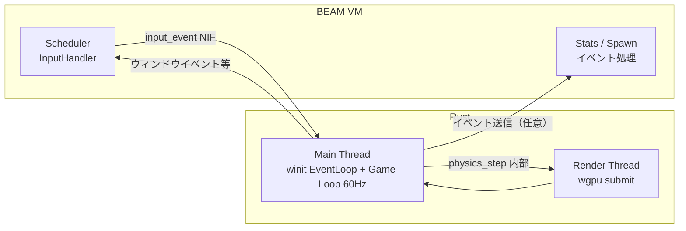

# エンジン仕様書

**プロジェクト名**: Elixir x Rust ゲームエンジン  
**プラットフォーム**: Windows / macOS / Linux（wgpu 対応環境）

本ドキュメントはゲームに依存しない技術アーキテクチャ・ECS・NIF・レンダリング・物理・Elixir 連携・パフォーマンス仕様を定義する。個別ゲーム仕様は `SPEC_GAME_*.md` を参照。

---

## 目次

1. [技術アーキテクチャ](#1-技術アーキテクチャ)
2. [ECS コンポーネント設計](#2-ecs-コンポーネント設計)
3. [Rustler NIF API 定義](#3-rustler-nif-api-定義)
4. [wgpu レンダリングパイプライン](#4-wgpu-レンダリングパイプライン)
5. [物理演算・衝突判定](#5-物理演算衝突判定)
6. [Elixir システム設計](#6-elixir-システム設計)
7. [パフォーマンス仕様](#7-パフォーマンス仕様)

---

## 1. 技術アーキテクチャ

### 1.1 全体構成

```
┌─────────────────────────────────────────────────────────────────┐
│                        Elixir BEAM VM                           │
│                                                                 │
│  ┌──────────────┐  ┌────────────────────┐  ┌─────────────────┐ │
│  │ InputHandler │  │  Supervisor Tree   │  │ Stats / Spawn    │ │
│  │  GenServer   │  │  (障害時自動再起動) │  │ (イベント購読等) │ │
│  └──────┬───────┘  └────────────────────┘  └────────┬────────┘ │
│         │                                            │          │
│  ┌──────▼────────────────────────────────────────────▼──────┐   │
│  │              ETS Tables（コンポーネントストア等）          │   │
│  └───────────────────────────────────────────────────────────┘   │
└─────────────────────┬───────────────────────────────────────────┘
                      │ Rustler NIF（入力送信・スポーン・状態取得）
                      │ ResourceArc<Mutex<GameWorld>> 等
┌─────────────────────▼───────────────────────────────────────────┐
│                         Rust Native                             │
│                                                                 │
│  ┌──────────────────────────────────────────────────────────┐   │
│  │  Game Loop（60 Hz・高精度）                               │   │
│  │  winit EventLoop 内で physics_step → レンダー → 次フレーム │   │
│  └──────────────────────────────────────────────────────────┘   │
│                                                                 │
│  ┌──────────────┐  ┌──────────────┐  ┌──────────────────────┐  │
│  │  ECS World   │  │   Physics    │  │    wgpu Renderer     │  │
│  │  (SoA)       │  │  Spatial     │  │    (Instancing)      │  │
│  │              │  │  Hash        │  │                      │  │
│  └──────────────┘  └──────────────┘  └──────────────────────┘  │
│                                                                 │
│  入力は NIF（input_event）で Elixir → Rust。イベントは Rust →   │
│  Elixir（チャネル／NIF コールバック等）で通知可能。             │
└─────────────────────────────────────────────────────────────────┘
```

### 1.2 スレッドモデル



---

## 2. ECS コンポーネント設計

### 2.1 SoA（Structure of Arrays）レイアウト

多数のエンティティを効率的に処理するため、コンポーネントデータを種別ごとに連続メモリに配置する。

#### メモリレイアウトの利点

| 処理 | AoS（従来） | SoA（本設計） |
|---|---|---|
| 全エンティティの位置更新 | キャッシュミス多発（他フィールドも読む） | positions_x/y だけキャッシュに乗る |
| SIMD 並列化 | 困難（フィールドが散在） | 容易（連続メモリ） |
| GPU 転送 | 不要フィールドも含む | 必要フィールドのみ転送 |

各ゲームは自前の World 構造体（例: EnemyWorld, BulletWorld）を SoA で定義する。共通パターンとして「位置・速度・生存フラグ・count/capacity」を持つ。

### 2.2 エンティティ ID 管理

```rust
pub struct EntityId(pub usize);

pub struct EntityAllocator {
    free_list: Vec<usize>,  // 再利用可能なインデックス
    next_id: usize,
}

impl EntityAllocator {
    pub fn allocate(&mut self) -> EntityId {
        if let Some(id) = self.free_list.pop() {
            EntityId(id)
        } else {
            let id = self.next_id;
            self.next_id += 1;
            EntityId(id)
        }
    }

    pub fn free(&mut self, id: EntityId) {
        self.free_list.push(id.0);
    }
}
```

### 2.3 レンダリングデータ（Rust 内部）共通形式

ゲームループが Rust 側にあるため、`physics_step` は Rust 内で呼ばれ、その結果は同一プロセス内でレンダラーに渡される。レンダリング用のデータレイアウトは以下のとおり（ゲームごとにプレイヤー/敵/弾のフィールドは拡張可能）。

```
バイナリレイアウト（リトルエンディアン）:
┌─────────────────────────────────────────────────────┐
│ Header (8 bytes)                                    │
│   entity_count: u32  frame_id: u32                  │
├─────────────────────────────────────────────────────┤
│ Player (ゲーム依存: 例 20 bytes)                    │
│   x: f32  y: f32  hp: i32  max_hp: i32  level: u32 │
├─────────────────────────────────────────────────────┤
│ Enemy Instances (10 bytes × N)                      │
│   x: f32  y: f32  sprite_id: u16  [各エンティティ] │
├─────────────────────────────────────────────────────┤
│ Bullet Instances (10 bytes × M)                     │
│   x: f32  y: f32  sprite_id: u16  [各弾丸]         │
├─────────────────────────────────────────────────────┤
│ Events (variable)                                   │
│   event_count: u32                                  │
│   [event_type: u8  entity_id: u32] × event_count   │
└─────────────────────────────────────────────────────┘
```

---

## 3. Rustler NIF API 定義

### 3.1 NIF 関数一覧（共通）

ゲームループは **Rust 側で 60 Hz 駆動** するため、Elixir から `physics_step` を呼ぶことはない。Rust のループ内で物理演算・レンダリングが行われる。

```elixir
# lib/game/nif_bridge.ex
defmodule Game.NifBridge do
  use Rustler,
    otp_app: :game,
    crate: :game_native

  # ワールド初期化（Rust 側でゲームループ開始の契機になる場合あり）
  @spec create_world(map()) :: {:ok, reference()} | {:error, term()}
  def create_world(_config), do: :erlang.nif_error(:nif_not_loaded)

  # 入力イベント送信（Elixir → Rust。InputHandler 等から呼ぶ）
  @spec input_event(reference(), atom(), any()) :: :ok
  def input_event(_world_ref, _event_type, _data), do: :erlang.nif_error(:nif_not_loaded)

  # 敵スポーン（Elixir の SpawnSystem 等から NIF で呼ぶ。ゲームごとに引数は拡張可能）
  @spec spawn_enemies(reference(), atom(), non_neg_integer()) :: :ok
  def spawn_enemies(_world_ref, _enemy_type, _count), do: :erlang.nif_error(:nif_not_loaded)

  # ゲームステート取得（デバッグ・UI用）
  @spec get_game_state(reference()) :: map()
  def get_game_state(_world_ref), do: :erlang.nif_error(:nif_not_loaded)

  # レンダラー初期化・ゲームループ開始（winit スレッド起動。Rust 内で 60 Hz ループ）
  @spec init_renderer(map()) :: :ok | {:error, term()}
  def init_renderer(_window_config), do: :erlang.nif_error(:nif_not_loaded)
end
```

### 3.2 Rust 側のゲームループと NIF

ゲームループは **Rust の winit EventLoop 内** で 60 Hz 駆動する。毎フレーム、Rust 内で `physics_step` 相当の処理を行い、その結果をレンダラーに渡す。

```rust
// native/game_native/src/lib.rs（イメージ）

use rustler::ResourceArc;
use std::sync::Mutex;

pub struct GameWorld {
    // ゲームごとに定義（例: enemies, bullets, player, collision, frame_id）
}

// ResourceArc でゲームワールドを Elixir に渡す（参照のみ）。Rust 側ループでも同一 world を参照。
#[rustler::nif]
fn create_world(config: GameConfig) -> ResourceArc<Mutex<GameWorld>> {
    ResourceArc::new(Mutex::new(GameWorld::new(config)))
}

// ゲームループは Rust 内（winit の run 内など）で実行。
// 例: 毎フレーム world.write().unwrap() → update_movement / resolve_collisions / update_ai / cleanup_dead_entities
//      → レンダリングデータをレンダースレッドへ送信。Elixir には返さない。
```

---

## 4. wgpu レンダリングパイプライン

### 4.1 パイプライン概要

```
テクスチャアトラス (単一 PNG)
        │
        ▼
┌───────────────────────────────────────────────────────┐
│  Vertex Buffer: 四角形 1 枚（4 頂点）                  │
│  Index Buffer:  [0,1,2, 0,2,3]（2 三角形）             │
│  Instance Buffer: SpriteInstance × N 体分              │
└────────────────────────────────────────────────────────┘
        │
        ▼ 1 draw call
┌───────────────────────────────────────────────────────┐
│  Vertex Shader (sprite.wgsl)                          │
│  - @builtin(instance_index) でインスタンスデータ参照   │
│  - ワールド座標 → クリップ座標変換                     │
└───────────────────────────────────────────────────────┘
        │
        ▼
┌───────────────────────────────────────────────────────┐
│  Fragment Shader (sprite_frag.wgsl)                    │
│  - テクスチャアトラスから UV サンプリング              │
│  - カラーティント適用                                  │
└───────────────────────────────────────────────────────┘
        │
        ▼
   スワップチェーン（画面出力）
```

### 4.2 SpriteInstance 構造体

```rust
// native/game_native/src/renderer/sprite_renderer.rs

#[repr(C)]
#[derive(Copy, Clone, bytemuck::Pod, bytemuck::Zeroable)]
pub struct SpriteInstance {
    pub position: [f32; 2],    // ワールド座標 (x, y)
    pub size: [f32; 2],        // スプライトサイズ (width, height) px
    pub uv_offset: [f32; 2],   // テクスチャアトラス内 UV 開始位置 (0.0〜1.0)
    pub uv_size: [f32; 2],     // テクスチャアトラス内 UV サイズ (0.0〜1.0)
    pub color_tint: [f32; 4],  // RGBA ティント（通常は [1,1,1,1]）
}
// 合計: 24 bytes/インスタンス
```

### 4.3 WGSL シェーダ

```wgsl
// native/game_native/src/renderer/shaders/sprite.wgsl

struct CameraUniform {
    view_proj: mat4x4<f32>,
};

struct SpriteInstance {
    @location(2) position: vec2<f32>,
    @location(3) size: vec2<f32>,
    @location(4) uv_offset: vec2<f32>,
    @location(5) uv_size: vec2<f32>,
    @location(6) color_tint: vec4<f32>,
};

@group(0) @binding(0) var<uniform> camera: CameraUniform;

@vertex
fn vs_main(
    @location(0) vertex_pos: vec2<f32>,  // [0,0]〜[1,1] の正規化座標
    instance: SpriteInstance,
) -> VertexOutput {
    let world_pos = vertex_pos * instance.size + instance.position;
    var out: VertexOutput;
    out.clip_position = camera.view_proj * vec4<f32>(world_pos, 0.0, 1.0);
    out.uv = instance.uv_offset + vertex_pos * instance.uv_size;
    out.color_tint = instance.color_tint;
    return out;
}
```

### 4.4 描画レイヤー順序（共通）

| レイヤー | 内容 | draw call 数 |
|---|---|---|
| 0: Background | マップタイル（静的） | 1 |
| 1: Shadows | 影（半透明） | 1 |
| 2: Enemies | 敵スプライト（インスタンシング） | 1 |
| 3: Bullets | 弾丸スプライト（インスタンシング） | 1 |
| 4: Player | プレイヤースプライト | 1 |
| 5: Effects | エフェクト（パーティクル） | 1〜3 |
| 6: UI | HP バー・スコア（別パイプライン） | 2〜5 |

**合計: 8〜13 draw calls/フレーム**（従来の個別描画では 5000+ draw calls）

テクスチャアトラス・スプライト ID 割り当てはゲームごとに `SPEC_GAME_*.md` で定義する。

---

## 5. 物理演算・衝突判定

### 5.1 Dual Spatial Hash

均一サイズのエンティティに最適な空間分割手法。

```rust
// native/game_native/src/physics/spatial_hash.rs

pub struct SpatialHash {
    cell_size: f32,
    cells: HashMap<(i32, i32), Vec<EntityId>>,
}

pub struct CollisionWorld {
    // 動的オブジェクト（敵・弾・プレイヤー）: 毎フレーム再構築
    dynamic: SpatialHash,
    // 静的オブジェクト（壁・障害物）: レベルロード時に1回構築
    static_obstacles: SpatialHash,
}

impl CollisionWorld {
    // セルサイズ = 当たり判定半径の 2〜3 倍（例: 32px → 80px）
    pub fn new(cell_size: f32) -> Self { ... }

    pub fn rebuild_dynamic(&mut self, enemies: &EnemyWorld, bullets: &BulletWorld) {
        self.dynamic.clear();
        for i in 0..enemies.count {
            if enemies.alive[i] {
                self.dynamic.insert(
                    EntityId(i),
                    enemies.positions_x[i],
                    enemies.positions_y[i],
                );
            }
        }
        // 弾丸も同様に追加
    }

    pub fn query_circle(&self, x: f32, y: f32, radius: f32) -> Vec<EntityId> {
        // 半径内のセルのみ検索: O(k) where k = nearby entities
        let min_cx = ((x - radius) / self.dynamic.cell_size).floor() as i32;
        let max_cx = ((x + radius) / self.dynamic.cell_size).ceil() as i32;
        // ... セル列挙 + 距離フィルタ
    }
}
```

### 5.2 衝突判定フロー（共通）

```
毎フレーム:
1. dynamic SpatialHash を再構築（全エンティティ）
2. プレイヤー周辺の敵を query_circle で取得
3. 各弾丸の周辺敵を query_circle で取得（ゲーム依存）
4. 円-円 衝突判定（AABB ではなく円で近似）
5. ヒット処理（HP 減算・ノックバック等はゲーム依存）
6. 死亡エンティティを free_list に返却
```

敵の移動・AI ロジック（Chase / Zigzag / Flock 等）はゲームごとに実装し、`SPEC_GAME_*.md` で定義する。

---

## 6. Elixir システム設計

### 6.1 Supervisor ツリー

ゲームループは **Rust 側で 60 Hz 駆動** する。Elixir には **GameEvents** GenServer があり、Rust からの `{:frame_events, events}` を受信してフェーズ管理・NIF 呼び出しを行う。このほか Elixir は入力送信・スポーン指示・Stats 等の役割を持つ。

```elixir
# lib/game/application.ex
defmodule Game.Application do
  use Application

  def start(_type, _args) do
    children = [
      # ETS テーブル初期化（最初に起動）
      Game.ComponentStore,
      # レンダラー初期化・ゲームループ開始（Rust winit スレッド起動。Rust 内で 60 Hz ループ）
      Game.RendererSupervisor,
      # 入力ハンドラ（ウィンドウイベントを NIF で Rust に送る）
      Game.InputHandler,
      # 必要に応じて Stats / イベント購読プロセス等
    ]

    opts = [strategy: :one_for_one, name: Game.Supervisor]
    Supervisor.start_link(children, opts)
  end
end
```

### 6.2 ゲームループ（Rust 側）と Elixir の役割

- **Rust**: winit の EventLoop 内で高精度 60 Hz のゲームループを回す。毎フレーム、物理演算（physics 相当）→ レンダリングを実行。入力は Elixir から `input_event` NIF で受け取る。
- **Elixir**: `InputHandler` がキー入力等を受け、`Game.NifBridge.input_event(world_ref, type, data)` で Rust に送る。スポーン系システムはタイマー等で `spawn_enemies`（またはゲーム固有 NIF）を呼ぶ。Rust からイベント（撃破・レベルアップ等）を受け取る場合は、チャネルや NIF コールバックで Elixir に通知する構成を検討する。

ゲームごとのスポーンテーブル・ルールは `SPEC_GAME_*.md` および各ゲームの SpawnSystem で定義する。

---

## 7. パフォーマンス仕様

### 7.1 フレーム予算（16ms/frame @ 60fps）

| 処理 | 目標時間 | 担当 |
|---|---|---|
| NIF 呼び出しオーバーヘッド | < 0.1ms | Rustler |
| 移動計算（5000体） | < 2ms | Rust (SoA) |
| 衝突判定（Spatial Hash） | < 3ms | Rust |
| AI 更新（5000体） | < 2ms | Rust |
| レンダリングデータ生成 | < 1ms | Rust |
| wgpu GPU 描画 | < 4ms | Rust + GPU |
| Elixir ロジック（スポーン等） | < 1ms | Elixir |
| **合計** | **< 13ms** | — |

### 7.2 メモリ使用量目安

| データ | サイズ | 備考 |
|---|---|---|
| EnemyWorld (SoA, 5000体) | 約 200 KB | CPU メモリ |
| Instance Buffer (GPU) | 約 120 KB | GPU VRAM |
| テクスチャアトラス | 約 16 MB | GPU VRAM |
| NIF 転送バイナリ/フレーム | 約 50 KB | コピー 1 回 |

### 7.3 スケーリング指針

- **5,000体以下**: 本設計で問題なし
- **10,000体**: SIMD 化（`std::simd` or `wide` クレート）を検討
- **50,000体以上**: GPU コンピュートシェーダへの移行を検討
