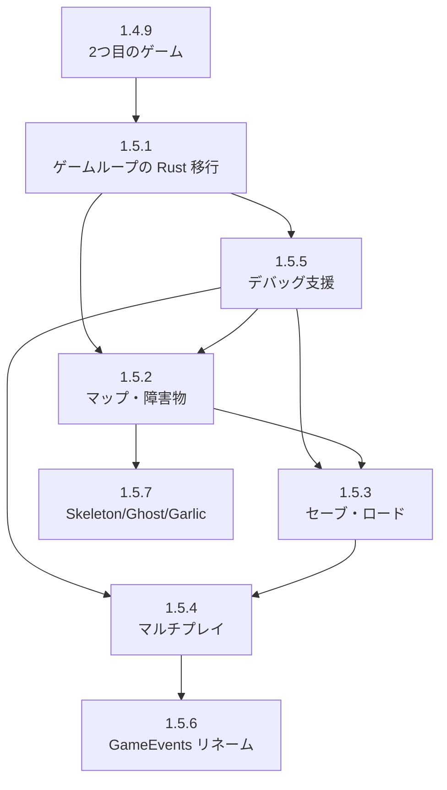

# 1.5 拡張（全7項）

**所属**: [STEPS_ALL.md](./STEPS_ALL.md) 1章 ゲームエンジン基礎 の 1.5 節。

**根拠**: [ENGINE_STRENGTHS_WEAKNESSES.md](../02_spec_design/ENGINE_STRENGTHS_WEAKNESSES.md)、[ELIXIR_RUST_DIVISION.md](../03_tech_decisions/ELIXIR_RUST_DIVISION.md)  
**前提**: 1.4（汎用化）まで完了。1.5.1（ゲームループの Rust 移行）は本ドキュメントで優先実施。

このドキュメントは、エンジン分析で挙がっていた残存課題を実装するためのステップガイドです。

---

## 1.5 節 全体ロードマップ（1.5.1〜1.5.7）

| 項 | 目標 | 備考 |
|----|------|------|
| 1.5.1 | ゲームループの Rust 移行（高精度 60 Hz） | 1.1.7 のゲームループを Rust 側に移行 |
| 1.5.2 | マップ・障害物システム | |
| 1.5.3 | セーブ・ロード | |
| 1.5.4 | マルチプレイ基盤（ルーム管理） | |
| 1.5.5 | デバッグ支援（NIF） | |
| 1.5.6 | GameLoop を GameEvents にリネーム | Elixir 側の役割に合わせてモジュール名を変更 |
| 1.5.7 | SPEC 未実装コンテンツ（Skeleton / Ghost / Garlic / 壁すり抜け） | 2.完了後が望ましい |

**推奨順序**: 1. → 5. → 2. → 3. → 4. → 6.（2.と3.は並行可）。7.は 2.完了後が望ましい。

---

## 目次

1. [全体ロードマップ（詳細）](#1-全体ロードマップ)
2. [1.5.1 ゲームループの Rust 移行](#2-151-ゲームループの-rust-移行高精度-60-hz)（優先度高）
3. [1.5.2 マップ・障害物システム](#3-152-マップ障害物システム)
4. [1.5.3 セーブ・ロード](#4-153-セーブロード)
5. [1.5.4 マルチプレイ](#5-154-マルチプレイ基盤ルーム管理)
6. [1.5.5 デバッグ支援](#6-155-デバッグ支援nif)
7. [1.5.6 GameLoop を GameEvents にリネーム](#7-156-gameloop-を-gameevents-にリネーム)
8. [1.5.7 SPEC 未実装コンテンツ](#8-157-spec-未実装コンテンツskeleton--ghost--garlic--壁すり抜け)
9. [推奨実施順序と依存関係](#9-推奨実施順序と依存関係)
10. [関連ドキュメント](#10-関連ドキュメント)

---

## 1. 全体ロードマップ

```
1.5.1: ゲームループの Rust 移行（高精度 60 Hz）
  └ tick 主導権を Rust に、Elixir はイベント駆動

1.5.2: マップ・障害物システム
  └ 障害物・壁・Ghost 対応

1.5.3: セーブ・ロード
  └ セッション永続化・ハイスコア

1.5.4: マルチプレイ基盤（ルーム管理）
  └ Phoenix Channels 連携の土台

1.5.5: デバッグ支援（NIF）
  └ パニックトレース・NifResult 統一

1.5.6: GameLoop を GameEvents にリネーム
  └ Elixir 側の役割（frame_events 受信・フェーズ管理）に合わせたモジュール名へ変更

1.5.7: SPEC 未実装コンテンツ（Skeleton / Ghost / Garlic / 壁すり抜け）
  └ PROJECT_EVALUATION §1.2 の未実装項目を実装。敵 Skeleton・Ghost、武器 Garlic、Ghost の障害物すり抜け。
```

**実施順序の推奨**:
1. **1.5.1（ゲームループの Rust 移行）** — 精度確保のため最優先。他項の土台になる
2. **1.5.5（デバッグ）** — 他項の開発効率を上げるため早期に
3. **1.5.2（マップ）** — ゲーム性に直結。SPEC に障害物・壁の記載あり
4. **1.5.3（セーブ）** — 独立した機能。マップの影響を受けない
5. **1.5.4（マルチプレイ）** — 設計変更が大きいため最後に

---

## 2. 1.5.1 ゲームループの Rust 移行（高精度 60 Hz）

### 2.1 目標

- **tick の主導権を Rust に移す**: `Process.send_after` による ±数 ms ジッターを解消
- **高精度タイマー**: `std::time::Instant` で固定間隔（16.67 ms @ 60Hz）の physics step
- **Elixir はイベント駆動の司令塔**: tick 駆動から脱却し、Rust からのイベントに反応してシーン制御・コマンド発行

### 2.2 なぜ重要か

- **現状**: Elixir の `Process.send_after` は Erlang スケジューラ依存で ±数 ms のジッター
- **リズムゲー・競技FPS**: ヒット判定 20〜50 ms、ロールバック/TAS の determinism に厳密な精度が必要
- **設計方針**: [ELIXIR_RUST_DIVISION.md § 3.3](../03_tech_decisions/ELIXIR_RUST_DIVISION.md) の「タイミングクリティカルなパスを Rust に移す」を実施

### 2.3 責務分離（移行後）

| レイヤー | 担当 |
|----------|------|
| **Rust** | tick 駆動、高精度タイマー、固定 dt での physics_step、イベント送信 |
| **Elixir** | イベント受信、シーン管理（LevelUp/BossAlert/GameOver）、コマンド発行（add_weapon, spawn_boss, pause/resume） |

### 2.4 実装内容

#### 41.1 Rust: ゲームループ駆動スレッド

- **別スレッド**でループ（NIF は BEAM をブロックしないよう長時間占有しない）
- `std::time::Instant` で次 tick までの sleep
- 固定 `dt = 16.67 ms`（60 Hz）で `physics_step` を内部呼び出し
- フレームごとにイベントを蓄積し、Elixir プロセスへ `send` で送信

#### 41.2 Rust → Elixir 通信

- `drain_frame_events` の結果をスレッドから Elixir の GenServer（例: EventBus または GameEvents の代替プロセス）へ送信
- `:erlang.send(pid, {:frame_events, events})` または Port/Threaded NIF を利用

#### 41.3 Elixir: tick 駆動の停止、イベント駆動への移行

- **GameEvents GenServer**: tick の `Process.send_after` を削除。代わりに Rust からの `{:frame_events, _}` 等を受信
- **シーン制御**: `level_up` / `game_over` / `boss_defeated` イベントで SceneManager が push/pop/replace
- **pause/resume**: LevelUp・BossAlert 中は Rust に `pause_physics` を通知。Elixir が `resume` を送るまで physics を止める

#### 41.4 入力の同期

- オプション A: Rust が入力ポーリングを担当（game_window と同様）
- オプション B: Elixir の InputHandler（ETS）を NIF でポーリング。Rust が tick 前に `get_input` NIF を呼ぶ

### 2.5 確認ポイント

- [x] 60 Hz で安定して tick が回り、ジッターが ±1 ms 以内に収まる
- [x] Elixir がイベントを受信し、シーン遷移・武器選択・ボススポーンが従来通り動作する
- [x] LevelUp オーバーレイ中は physics が停止する
- [x] 既存の VampireSurvivor 系ゲームが動作する

---

## 3. 1.5.2 マップ・障害物システム

### 3.1 目標

- 無限平面から**障害物・壁・タイルマップ**に対応する
- [SPEC.md § 1.5](../01_setup/SPEC.md) の「障害物: 木・岩（Ghost 以外は回避）」を実現
- Ghost（壁すり抜け）の実装を可能にする

### 3.2 なぜ重要か

- **現状**: 無限平面のみ。敵・弾・プレイヤーは障害物を無視
- **仕様**: Ghost は壁すり抜け、他敵は回避する挙動が必要
- **ゲーム性**: 障害物があると戦略的立ち回りが生まれる

### 3.3 責務分離（ELIXIR_RUST_DIVISION 準拠）

| レイヤー | 担当 |
|----------|------|
| **Elixir** | マップ定義（障害物配置データ）、マップ選択、ロード指示 |
| **Rust** | 静的障害物の Spatial Hash 構築、衝突判定（壁・木・岩）、移動制限 |

### 3.4 実装内容

#### 42.1 Rust: 静的障害物の Spatial Hash 拡張

**現状**: `CollisionWorld` に `dynamic` と `static_obstacles` の記載あり（SPEC § 6.1）。`static_obstacles` が未実装の可能性あり。

**対応**:
```rust
// native/game_native/src/core/physics/spatial_hash.rs

pub struct StaticObstacle {
    pub x: f32,
    pub y: f32,
    pub radius: f32,  // 円形障害物（木・岩）
    pub kind: u8,     // 0=木, 1=岩（将来: Ghost のすり抜け判定用）
}

pub struct CollisionWorld {
    pub dynamic: SpatialHash,
    pub static_obstacles: SpatialHash,  // レベルロード時に構築
    obstacles: Vec<StaticObstacle>,     // 障害物データ本体
}
```

- `rebuild_static()`: 障害物リストから Spatial Hash を構築
- `query_static_nearby(x, y, radius)`: 指定範囲の障害物を取得

#### 42.2 Rust: 衝突判定に静的障害物を考慮

**プレイヤー・敵の移動**:
- 移動後の座標が障害物（円）と重なる場合は移動をキャンセルまたはスライド
- Ghost 用フラグ: `enemy.kind_id` が Ghost の場合は `query_static_nearby` をスキップ

**弾丸**:
- 障害物に当たったら弾を消す（`BulletWorld.kill`）

#### 42.3 Rust: NIF で障害物データを渡す

```rust
// lib.rs
#[rustler::nif]
fn set_map_obstacles(
    world: ResourceArc<GameWorld>,
    obstacles: Vec<(f32, f32, f32, u8)>,  // (x, y, radius, kind)
) -> NifResult<Atom> {
    let mut w = world.0.write().map_err(|_| rustler::Error::Atom("lock_poisoned"))?;
    w.collision.rebuild_static(&obstacles);
    Ok(ok())
}
```

#### 42.4 Elixir: マップ定義モジュール

```elixir
# lib/engine/map_loader.ex
defmodule Engine.MapLoader do
  @doc "マップ ID に応じて障害物リストを返す"
  def obstacles_for_map(:plain), do: []
  def obstacles_for_map(:forest) do
    # 木・岩の配置データ（x, y, radius, kind）
    [
      {512, 512, 40, 0},   # 木
      {1024, 768, 30, 1},  # 岩
      # ...
    ]
  end
end
```

#### 42.5 背景タイル描画（オプション）

[STEPS_QUALITY.md](./STEPS_QUALITY.md) の背景タイル・マップサイズの節 を参照。64×64 px グリッドで草地タイルをインスタンシング描画。

### 3.5 確認ポイント

- [x] 障害物にプレイヤーがぶつかると移動が止まる（押し出しで解決）
- [x] 弾が障害物に当たると消える
- [x] 敵（Slime, Bat 等）が障害物を迂回する（またはぶつかって止まる）
- [x] Ghost が実装されれば壁をすり抜ける（`kind` で分岐、`ENEMY_ID_GHOST` でスキップ）
- [x] マップ端（4096×4096）でプレイヤー・カメラが制限される

---

## 4. 1.5.3 セーブ・ロード

### 4.1 目標

- **ゲーム状態の永続化**: セッション中断・再開
- **ハイスコア・実績の保存**: ローカルストレージまたはファイル

### 4.2 なぜ重要か

- **現状**: ゲームオーバー後はすべてリセット。進捗が残らない
- **ユーザー体験**: ハイスコア表示・リトライ時のスコア比較ができない

### 4.3 責務分離

| レイヤー | 担当 |
|----------|------|
| **Elixir** | セーブデータの構造定義、永続化 API（ファイル/ETS/DETS）、ハイスコア比較 |
| **Rust** | ゲーム状態のシリアライズ可能なスナップショット取得 NIF。バイナリは扱わない |

### 4.4 実装内容

#### 43.1 Rust: スナップショット取得 NIF

`#[derive(NifMap)]` で構造体を Elixir の map と相互変換する。Rustler の標準的な型を使い、そのままコンパイル可能。

- **SaveSnapshot**: `player_hp`, `player_x`, `player_y`, `player_max_hp`, `level`, `exp`, `score`, `elapsed_seconds`, `weapon_slots`（`{kind_id, level}` のリスト）
- **get_save_snapshot**: 現在のゲーム状態をスナップショットとして取得
- **load_save_snapshot**: スナップショットを復元（敵・弾・ボスはクリア）
- スナップショットは **Elixir の map** として受け渡される（NifMap が自動変換）
- Rust はシリアライズ形式に依存しない。Elixir が `:erlang.term_to_binary` で永続化

#### 43.2 Elixir: SaveManager モジュール

`lib/engine/save_manager.ex` で状態を持たないユーティリティとして定義。

- **save_session/1**: `saves/session.dat` にセーブ
- **load_session/1**: セーブを復元（`:ok` / `:no_save` / `{:error, reason}`）
- **has_save?/0**: セーブファイルの存在確認
- **save_high_score/1**: スコアを `saves/high_scores.dat` に記録（上位 10 件）
- **load_high_scores/0**: ハイスコア一覧を取得
- **best_score/0**: ベストスコア（1位）を取得

#### 43.3 ハイスコアの永続化

ゲームオーバー時に GameEvents が `Engine.save_high_score(score)` を自動呼び出し。GameOver シーンの init_arg に `high_scores` を渡し、FrameCache にも格納して描画側で利用可能に。

#### 43.4 Engine / GameEvents API

- **Engine.save_session/1**, **Engine.load_session/1**: セーブ/ロード
- **Engine.GameEvents.save_session/0**: cast でセーブを実行
- **Engine.GameEvents.load_session/0**: call でロードを実行し、Playing シーンへ遷移

### 4.5 確認ポイント

- [x] セーブ後にゲームを終了し、ロードで復元できる
- [x] ハイスコアがファイルに保存され、再起動後も表示される
- [x] セーブファイルが壊れた場合のエラーハンドリング（`load_session` が `:no_save` を返す）

**利用例**（IEx から）:

```elixir
# セーブ
Engine.GameEvents.save_session()

# ロード（セーブがあれば Playing に復帰）
Engine.GameEvents.load_session()

# ハイスコア確認
Engine.load_high_scores()
Engine.best_score()
```

---

## 5. 1.5.4 マルチプレイ基盤（ルーム管理）

### 5.1 目標

- **複数プレイヤーのゲーム状態管理**の基盤を整える
- GameWorld の設計を「1 World 1 Player」から拡張可能にする
- Phoenix Channels との連携の土台を用意する

### 5.2 なぜ重要か

- **現状**: `GameWorld` は単一プレイヤー前提。`PlayerState` が 1 つだけ
- **Elixir の強み**: 分散・耐障害性を活かしたリアルタイムマルチプレイが可能

### 5.3 設計上の注意

[ELIXIR_RUST_DIVISION.md § 5.2](../03_tech_decisions/ELIXIR_RUST_DIVISION.md) ではマルチプレイは「現在のスコープ外」とある。本ステップは**将来的な拡張のための設計検討と最小実装**とする。

### 5.4 実装内容

#### 44.1 設計オプションの整理

| 方式 | 説明 | メリット | デメリット |
|------|------|----------|------------|
| **A: 複数 GameWorld** | プレイヤーごとに `create_world()` を呼び、別々の Rust ワールド | 既存コード変更が最小 | プレイヤー間の衝突判定ができない |
| **B: 複数 PlayerState** | `GameWorldInner` に `players: Vec<PlayerState>` を追加 | 同一ワールドで衝突可能 | 大幅な Rust 変更 |
| **C: ルーム単位** | 1 ルーム = 1 GameWorld、ルーム内で複数プレイヤー | ロジックが明確 | B と同様の変更 |

**推奨**: まず **A（複数 GameWorld）** で「並列ゲームセッション」を実現し、必要に応じて B/C へ移行。

#### 1.5.4a: 複数 GameWorld の並列管理（最小実装）✅

**実装済み**:

- **Engine.RoomRegistry**: Registry で room_id → GameEvents pid を管理
- **Engine.RoomSupervisor**: DynamicSupervisor。`start_room(room_id)` / `stop_room(room_id)` / `list_rooms()`
- **Engine.GameEvents**: `room_id` オプションに対応。`:main` は従来どおり `Engine.GameEvents` の名前で起動し、SceneManager・FrameCache を駆動。それ以外は headless（physics のみ）
- **Engine**: `start_room/1`, `stop_room/1`, `list_rooms/0`, `get_loop_for_room/1` を公開

#### 1.5.4b: Phoenix Channels 連携（将来）

- `RoomChannel` で `join("room:123")` 時に `Engine.start_room("123")` を呼ぶ
- 入力イベントを Channel でブロードキャストし、各クライアントの GameEvents が受信
- 状態同期は「入力のブロードキャスト」または「定期的なスナップショット配信」で行う

詳細: [MULTIPLAYER_PHOENIX_CHANNELS.md](../06_system_design/MULTIPLAYER_PHOENIX_CHANNELS.md)

#### 44.4 競技マルチプレイ（ロールバック等）について

[ELIXIR_RUST_DIVISION.md § 4.2](../03_tech_decisions/ELIXIR_RUST_DIVISION.md) 参照。determinism が必要な場合は Rust 内でシミュレーションを一本化する設計が必要。

### 5.5 確認ポイント

- [x] 2 つのルームが同時に動作し、互いに影響しない（`start_room("room_2")` で追加ルーム起動、`:main` は表示・入力、他は headless）
- [x] ルーム終了時に GameWorld が適切に解放される（`stop_room/1` で DynamicSupervisor が子を終了）
- [ ] （将来）Phoenix Channel でルーム参加・入力送信ができる

---

## 6. 1.5.5 デバッグ支援（NIF）

### 6.1 目標

- **NIF クラッシュ時**に Rust 側のスタックトレースを取得できるようにする
- **Elixir/Rust 境界**でのバグ追跡を容易にする
- 開発時のみ有効なデバッグ用 NIF やログ出力を整備する

### 6.2 なぜ重要か

- **現状**: NIF がパニックすると BEAM VM ごとクラッシュ。Rust のパニックメッセージが Elixir のスタックトレースに含まれない
- **開発効率**: 2 言語をまたぐバグの特定に時間がかかる

### 6.3 実装内容

#### 45.1 Rust パニックフックの設定

```rust
// native/game_native/src/lib.rs の初期化時に
#[cfg(debug_assertions)]
fn init_panic_hook() {
    std::panic::set_hook(Box::new(|info| {
        eprintln!("[Rust NIF Panic] {}", info);
        eprintln!("Backtrace:\n{:?}", std::backtrace::Backtrace::capture());
    }));
}

// create_world や rustler::init 内で呼ぶ
```

- `RUST_BACKTRACE=1` 環境変数でバックトレースを有効化
- リリースビルドでは `#[cfg(debug_assertions)]` で無効化

#### 45.2 NIF エラーハンドリングの統一

```rust
// 各 NIF で Result を返し、Err 時は Elixir にエラーを返す
#[rustler::nif]
fn physics_step(world: ResourceArc<GameWorld>, delta_ms: f64) -> NifResult<Binary<'a>> {
    let mut w = world.0.write().map_err(|_| rustler::Error::Atom("lock_poisoned"))?;
    // ...
}
```

- `NifResult` を使うことで Elixir 側で `{:error, reason}` を受け取れる
- パニックではなく `Result::Err` で失敗を返すと BEAM はクラッシュしない

#### 45.3 デバッグ用 NIF（開発時のみ）

```rust
#[cfg(debug_assertions)]
#[rustler::nif]
fn debug_dump_world(world: ResourceArc<GameWorld>) -> String {
    let w = world.0.read().unwrap();
    format!(
        "enemies={} bullets={} player=({},{})",
        w.enemies.count, w.bullets.count, w.player.x, w.player.y
    )
}
```

- `iex> App.NifBridge.debug_dump_world(world_ref)` で状態を文字列取得
- `mix compile` の `--profile dev` 時のみ NIF に含める

#### 45.4 Logger の統合

- Rust 側で `log` クレートを使用し、`env_logger` で RUST_LOG を有効化
- Elixir の `Logger` と出力先を揃える（同じコンソールに出す）

```toml
# Cargo.toml
[dependencies]
log = "0.4"
env_logger = "0.11"
```

```rust
// lib.rs
log::debug!("physics_step: delta={}ms", delta_ms);
```

#### 45.5 クラッシュダンプの取得（Windows）

- Windows では `std::panic::catch_unwind` で NIF 内のパニックを捕捉し、ログに書き出してから `Err` を返す方法がある
- ただし `catch_unwind` は `UnwindSafe` な型のみ対応。`GameWorld` が `UnwindSafe` でない場合は工夫が必要

### 6.5 確認ポイント

- [x] `RUST_BACKTRACE=1 mix run` で NIF パニック時にバックトレースが表示される
- [x] デバッグビルドで `debug_dump_world` が呼び出せる
- [x] `RUST_LOG=debug` で Rust 側のログが出力される
- [x] NifResult でエラーを返した場合、Elixir 側で `{:error, _}` を受け取れる

---

## 7. 1.5.6 GameLoop を GameEvents にリネーム

### 7.1 目標

- **Elixir 側の GenServer 名を役割に合わせて変更する**: 1.5.1 以降、tick 駆動は Rust に移り、Elixir の当該プロセスは「Rust からの `{:frame_events, events}` を受信し、フェーズ管理・NIF 呼び出しを行う」役割になっている。そのため **GameLoop** という名前は誤解を招くので、**GameEvent** または **GameEvents** にリネームする（本実装では **GameEvents** を採用）。

### 7.2 なぜ重要か

- **一貫性**: [ARCHITECTURE.md](../06_system_design/ARCHITECTURE.md) や [PRESENTATION.md](../07_presentation/PRESENTATION.md) では「frame_events 受信・フェーズ管理」と説明しており、ループを回しているのは Rust 側である。
- **可読性**: 新規参加者やドキュメント読者が「GameLoop = 60Hz を回しているプロセス」と勘違いしにくくなる。

### 7.3 名前の候補

| 名前 | 備考 |
|------|------|
| **GameEvents** | 複数形。`frame_events` を扱うモジュールとして自然。推奨。 |
| **GameEvent** | 単数形。イベント駆動の「1 イベント処理」のイメージ。 |

いずれも `Engine.GameEvents` / `Engine.GameEvent` として `Engine` の下に置く。

### 7.4 実装内容

#### 46.1 リネーム対象

- **モジュール**: `Engine.GameLoop` → `Engine.GameEvents`（または `Engine.GameEvent`）
- **ファイル**: `lib/engine/game_loop.ex` → `lib/engine/game_events.ex`（または `game_event.ex`）

#### 46.2 参照の更新

以下で `GameLoop` / `game_loop` を新しい名前に置き換える。

- **Application**: `Engine.GameLoop` を子に起動している箇所 → `Engine.GameEvents`
- **RoomSupervisor**: 子 spec で `Engine.GameLoop` を起動している箇所 → `Engine.GameEvents`
- **RoomRegistry**: 「GameEvents pid」などのコメント・ドキュメント
- **Engine モジュール**: `start_room` 内で `Engine.GameLoop.start_link(...)` を呼んでいる箇所 → `Engine.GameEvents.start_link(...)`
- **Engine.Game / 各ゲーム**: `Engine.GameLoop.save_session` 等の API 呼び出し → `Engine.GameEvents.save_session`
- **NIF ブリッジ・Rust**: `start_rust_game_loop` に渡している `pid` は「GameEvents の pid」である（名前のみの変更のため引数はそのままでよい）
- **その他**: `Engine.FrameCache`、`Engine.InputHandler`、`Engine.EventBus`、`Engine.StressMonitor`、`Engine.SceneBehaviour` 等のドキュメント・参照

#### 46.3 後方互換（オプション）

移行期間中のみ、旧名 `Engine.GameLoop` をエイリアスとして残すこともできる。

```elixir
# lib/engine/game_loop.ex（旧ファイルを残す場合）
defmodule Engine.GameLoop do
  @moduledoc "Deprecated: use Engine.GameEvents. This module will be removed in a future release."
  defdelegate start_link(opts \\ []), to: Engine.GameEvents
  defdelegate save_session(), to: Engine.GameEvents
  defdelegate load_session(), to: Engine.GameEvents
end
```

通常は一括リネームでよい。

#### 46.4 ドキュメント・コメントの更新

- `@moduledoc` の「60 Hz game loop」などの表現を「Rust からの frame_events を受信し、フェーズ管理・NIF 呼び出しを行う GenServer」に合わせて修正
- [ENGINE_API.md](../06_system_design/ENGINE_API.md)、[ARCHITECTURE.md](../06_system_design/ARCHITECTURE.md)、[MULTIPLAYER_PHOENIX_CHANNELS.md](../06_system_design/MULTIPLAYER_PHOENIX_CHANNELS.md) 等で「GameLoop」と書いている箇所を「GameEvents」に統一（文脈に応じて「ルームごとの GameEvents」等に変更）

### 7.5 確認ポイント

- [ ] `Engine.GameEvents`（または `Engine.GameEvent`）が存在し、従来の `GameLoop` と同一の API（`start_link/1`、`save_session/0`、`load_session/0` 等）を提供する
- [ ] `mix compile` が通り、既存テスト・手動プレイが動作する
- [ ] RoomSupervisor 経由で起動するルームも `Engine.GameEvents` を参照している
- [ ] 関連ドキュメント内の「GameLoop」が役割に合わせて「GameEvents」等に更新されている（必要範囲で）

---

## 8. 1.5.7 SPEC 未実装コンテンツ（Skeleton / Ghost / Garlic / 壁すり抜け）

### 8.1 目標

- **PROJECT_EVALUATION.md §1.2** および **SPEC_GAME_Survivor.md** に記載の未実装項目を実装する。
- 敵: **Skeleton**（60秒〜・高HP）、**Ghost**（120秒〜・壁すり抜け）を追加。
- 武器: **Garlic**（プレイヤー周囲オーラで常時ダメージ 5/秒）を追加。
- **Ghost 壁すり抜け**: 既存の `EnemyParams::passes_through_obstacles(kind_id)` により障害物をスキップする敵として Ghost を運用する。

### 8.2 実装内容

#### 47.1 Rust: 敵パラメータ（entity_params）

- 敵 ID を拡張: `0=Slime, 1=Bat, 2=Golem, 3=Skeleton, 4=Ghost`。
- `ENEMY_TABLE` を 5 要素にし、Skeleton（HP 60, 速度 60, ダメージ 15/秒, render_kind 5）、Ghost（HP 40, 速度 100, 壁すり抜け, render_kind 4）を追加。
- `passes_through_obstacles(id)` は `id == ENEMY_ID_GHOST`（4）のとき `true`。1.5.2 の `resolve_obstacles_enemy` で既に参照済み。

#### 47.2 Rust: 武器 Garlic（entity_params + lib）

- `WEAPON_ID_GARLIC = 6`、`WEAPON_TABLE` に Garlic（cooldown 0.2s, damage 1 → 5 dmg/sec 相当のオーラ）を追加。
- `garlic_radius(weapon_id, level)` でオーラ半径（例: 80 + (level-1)*15 px）を定義。
- 武器ループで `WEAPON_ID_GARLIC` のとき、プレイヤー中心の `garlic_radius` 内の敵に一定間隔でダメージを付与（キル時は経験値・アイテム・パーティクルを既存と同様に処理）。

#### 47.3 Rust: レンダリング

- 敵 `render_kind` 4（Ghost）, 5（Skeleton）に対応。`enemy_sprite_size` / `enemy_anim_uv` で kind 4, 5 を追加（プレースホルダーで既存 Bat/Golem UV を流用可）。

#### 47.4 Elixir: ゲーム層

- **entity_registry**: `enemies` に `skeleton: 3`, `ghost: 4` を追加（golem は 2 のまま）。`weapons` に `garlic: 6` を追加。
- **SpawnSystem**: `enemy_kind_for_wave` で経過時間に応じて Skeleton（60秒〜）、Ghost（120秒〜）、Golem（180秒〜）を混在させる。
- **LevelSystem**: `@all_weapons` に `:garlic` を追加し、`weapon_label(:garlic)` を定義。

### 8.3 確認ポイント

- [x] Skeleton が 60 秒以降のウェーブで出現し、高 HP で動作する。
- [x] Ghost が 120 秒以降のウェーブで出現し、障害物（木・岩）をすり抜けて移動する。
- [x] Garlic をレベルアップで選択でき、装備するとプレイヤー周囲の敵に持続ダメージが入る。
- [x] PROJECT_EVALUATION.md §1.2 の「Skeleton, Ghost」「Garlic」「Ghost 壁すり抜け」がすべて ✅ 実装済み に更新できる。

---

## 9. 推奨実施順序と依存関係



**推奨順序**:
1. **1.5.1（ゲームループの Rust 移行）** — 精度確保のため最優先
2. **1.5.5（デバッグ支援）** — 他項の開発を効率化
3. **1.5.2（マップ）** — ゲーム性に直結
4. **1.5.3（セーブ）** — 独立。マップ完了後でも可
5. **1.5.4（マルチプレイ）** — 設計変更が大きいため最後
6. **1.5.6（GameLoop → GameEvents リネーム）** — 命名を役割に合わせて整理（1.5.4 以降で実施可）

**並行可能**: 1.5.2 と 1.5.3 は互いに依存しないため並行実施可能。1.5.6 は 1.5.1 完了後であればいつでも実施可能（1.5.4 のドキュメント更新とまとめてもよい）。

---

## 10. 関連ドキュメント

| ドキュメント | 用途 |
|-------------|------|
| [STEPS_ALL.md](./STEPS_ALL.md) | 全体ロードマップ・章・節・項構成 |
| [ENGINE_STRENGTHS_WEAKNESSES.md](../02_spec_design/ENGINE_STRENGTHS_WEAKNESSES.md) | 本ステップの根拠（残存課題の一覧） |
| [ELIXIR_RUST_DIVISION.md](../03_tech_decisions/ELIXIR_RUST_DIVISION.md) | 責務分離・スコープ外の判断 |
| [MULTIPLAYER_PHOENIX_CHANNELS.md](../06_system_design/MULTIPLAYER_PHOENIX_CHANNELS.md) | 1.5.4 Phoenix Channels 連携の設計指針 |
| [SPEC.md](../01_setup/SPEC.md) | 障害物・マップの仕様 |
| [STEPS_QUALITY.md](./STEPS_QUALITY.md) | 背景タイル・マップサイズの既存記載 |
| [ASSET_MANAGEMENT.md](../06_system_design/ASSET_MANAGEMENT.md) | マップアセットのロード方針 |
| [STEPS_GENERALIZATION.md](./STEPS_GENERALIZATION.md) | 1.4 汎用化ロードマップ |
