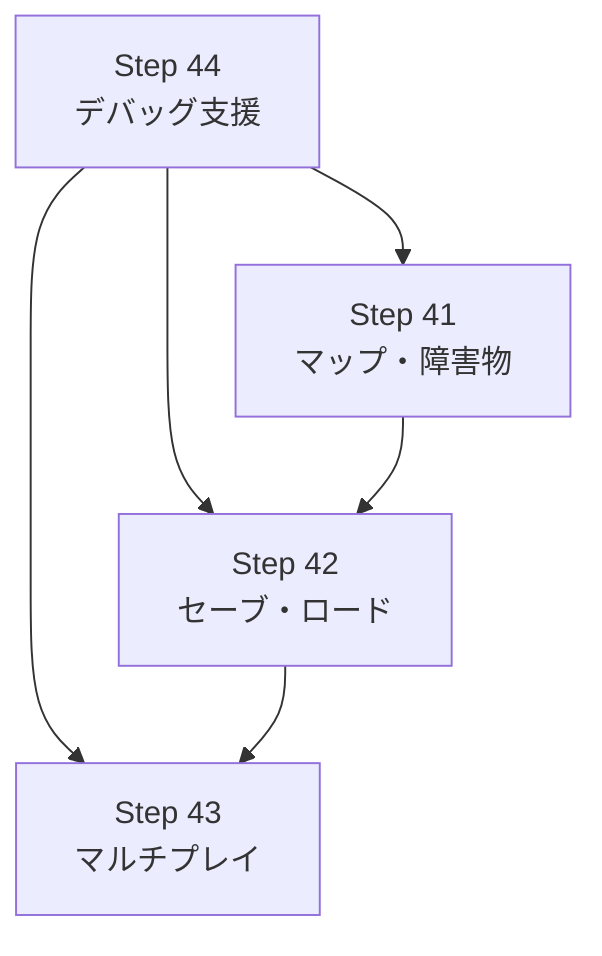

# マップ・セーブ・マルチプレイ・デバッグ支援 ステップガイド

**根拠**: [ENGINE_STRENGTHS_WEAKNESSES.md](../02_spec_design/ENGINE_STRENGTHS_WEAKNESSES.md)、[ELIXIR_RUST_DIVISION.md](../03_tech_decisions/ELIXIR_RUST_DIVISION.md)  
**前提**: Step 1〜40 まで完了（汎用化・シーン管理・アセット管理・ゲーム分離済み）

このドキュメントは、エンジン分析で挙がっていた残存課題を実装するためのステップガイドです。

---

## 目次

1. [全体ロードマップ](#1-全体ロードマップ)
2. [Step 41: マップ・障害物システム](#2-step-41-マップ障害物システム)
3. [Step 42: セーブ・ロード](#3-step-42-セーブロード)
4. [Step 43: マルチプレイ](#4-step-43-マルチプレイ)
5. [Step 44: デバッグ支援](#5-step-44-デバッグ支援)
6. [推奨実施順序と依存関係](#6-推奨実施順序と依存関係)
7. [関連ドキュメント](#7-関連ドキュメント)

---

## 1. 全体ロードマップ

```
Step 41: マップ・障害物システム
  └ 無限平面 → 障害物・壁・タイルマップ対応
  └ Ghost（壁すり抜け）の実装を可能にする

Step 42: セーブ・ロード
  └ ゲーム状態の永続化
  └ ハイスコア・実績の保存基盤

Step 43: マルチプレイ
  └ GameWorld の設計変更
  └ Phoenix Channels 連携の土台

Step 44: デバッグ支援
  └ NIF クラッシュ時のトレース改善
  └ Elixir/Rust 境界でのデバッグ容易化
```

**実施順序の推奨**:
1. **Step 41（マップ）** — ゲーム性に直結。SPEC に障害物・壁の記載あり
2. **Step 44（デバッグ）** — 他ステップの開発効率を上げるため早期に
3. **Step 42（セーブ）** — 独立した機能。マップの影響を受けない
4. **Step 43（マルチプレイ）** — 設計変更が大きいため最後に

---

## 2. Step 41: マップ・障害物システム

### 2.1 目標

- 無限平面から**障害物・壁・タイルマップ**に対応する
- [SPEC.md § 1.5](../01_setup/SPEC.md) の「障害物: 木・岩（Ghost 以外は回避）」を実現
- Ghost（壁すり抜け）の実装を可能にする

### 2.2 なぜ重要か

- **現状**: 無限平面のみ。敵・弾・プレイヤーは障害物を無視
- **仕様**: Ghost は壁すり抜け、他敵は回避する挙動が必要
- **ゲーム性**: 障害物があると戦略的立ち回りが生まれる

### 2.3 責務分離（ELIXIR_RUST_DIVISION 準拠）

| レイヤー | 担当 |
|----------|------|
| **Elixir** | マップ定義（障害物配置データ）、マップ選択、ロード指示 |
| **Rust** | 静的障害物の Spatial Hash 構築、衝突判定（壁・木・岩）、移動制限 |

### 2.4 実装内容

#### 41.1 Rust: 静的障害物の Spatial Hash 拡張

**現状**: `CollisionWorld` に `dynamic` と `static_obstacles` の記載あり（SPEC § 6.1）。`static_obstacles` が未実装の可能性あり。

**対応**:
```rust
// native/game_native/src/core/physics/spatial_hash.rs

pub struct StaticObstacle {
    pub x: f32,
    pub y: f32,
    pub radius: f32,  // 円形障害物（木・岩）
    pub kind: u8,     // 0=木, 1=岩（将来: Ghost のすり抜け判定用）
}

pub struct CollisionWorld {
    pub dynamic: SpatialHash,
    pub static_obstacles: SpatialHash,  // レベルロード時に構築
    obstacles: Vec<StaticObstacle>,     // 障害物データ本体
}
```

- `rebuild_static()`: 障害物リストから Spatial Hash を構築
- `query_static_nearby(x, y, radius)`: 指定範囲の障害物を取得

#### 41.2 Rust: 衝突判定に静的障害物を考慮

**プレイヤー・敵の移動**:
- 移動後の座標が障害物（円）と重なる場合は移動をキャンセルまたはスライド
- Ghost 用フラグ: `enemy.kind_id` が Ghost の場合は `query_static_nearby` をスキップ

**弾丸**:
- 障害物に当たったら弾を消す（`BulletWorld.kill`）

#### 41.3 Rust: NIF で障害物データを渡す

```rust
// lib.rs
#[rustler::nif]
fn set_map_obstacles(
    world: ResourceArc<GameWorld>,
    obstacles: Vec<(f32, f32, f32, u8)>,  // (x, y, radius, kind)
) -> Atom {
    let mut w = world.0.write().unwrap();
    w.collision.rebuild_static(&obstacles);
    ok()
}
```

#### 41.4 Elixir: マップ定義モジュール

```elixir
# lib/engine/map_loader.ex
defmodule Engine.MapLoader do
  @doc "マップ ID に応じて障害物リストを返す"
  def obstacles_for_map(:plain), do: []
  def obstacles_for_map(:forest) do
    # 木・岩の配置データ（x, y, radius, kind）
    [
      {512, 512, 40, 0},   # 木
      {1024, 768, 30, 1},  # 岩
      # ...
    ]
  end
end
```

#### 41.5 背景タイル描画（オプション）

[STEPS_QUALITY.md](./STEPS_QUALITY.md) の背景タイル・マップサイズの節 を参照。64×64 px グリッドで草地タイルをインスタンシング描画。

### 2.5 確認ポイント

- [ ] 障害物にプレイヤーがぶつかると移動が止まる
- [ ] 弾が障害物に当たると消える
- [ ] 敵（Slime, Bat 等）が障害物を迂回する（またはぶつかって止まる）
- [ ] Ghost が実装されれば壁をすり抜ける（`kind` で分岐）
- [ ] マップ端（4096×4096）でプレイヤー・カメラが制限される

---

## 3. Step 42: セーブ・ロード

### 3.1 目標

- **ゲーム状態の永続化**: セッション中断・再開
- **ハイスコア・実績の保存**: ローカルストレージまたはファイル

### 3.2 なぜ重要か

- **現状**: ゲームオーバー後はすべてリセット。進捗が残らない
- **ユーザー体験**: ハイスコア表示・リトライ時のスコア比較ができない

### 3.3 責務分離

| レイヤー | 担当 |
|----------|------|
| **Elixir** | セーブデータの構造定義、永続化 API（ファイル/ETS/DETS）、ハイスコア比較 |
| **Rust** | ゲーム状態のシリアライズ可能なスナップショット取得 NIF。バイナリは扱わない |

### 3.4 実装内容

#### 42.1 Rust: スナップショット取得 NIF

```rust
// lib.rs
#[rustler::nif]
fn get_save_snapshot(world: ResourceArc<GameWorld>) -> Map {
    let w = world.0.read().unwrap();
    // プレイヤーHP/座標/レベル/武器/経過時間/スコア などを Map に詰める
    // rustler::Map または term に変換して返す
}

#[rustler::nif]
fn load_save_snapshot(world: ResourceArc<GameWorld>, snapshot: Map) -> Atom {
    let mut w = world.0.write().unwrap();
    // snapshot から GameWorldInner を復元
    ok()
}
```

- スナップショットは **Elixir の term（map）** として受け渡す
- Rust はシリアライズ形式に依存しない。Elixir が JSON や `:erlang.term_to_binary` で永続化

#### 42.2 Elixir: SaveManager GenServer

```elixir
# lib/engine/save_manager.ex
defmodule Engine.SaveManager do
  use GenServer

  @save_path "saves/session.dat"

  def save(world_ref) do
    snapshot = App.NifBridge.get_save_snapshot(world_ref)
    binary = :erlang.term_to_binary(snapshot)
    File.mkdir_p!("saves")
    File.write!(@save_path, binary)
  end

  def load(world_ref) do
    case File.read(@save_path) do
      {:ok, binary} ->
        snapshot = :erlang.binary_to_term(binary)
        App.NifBridge.load_save_snapshot(world_ref, snapshot)
      _ -> :no_save
    end
  end
end
```

#### 42.3 ハイスコアの永続化

```elixir
# ハイスコアは独立したファイルまたは ETS/DETS
def save_high_score(score) do
  current = load_high_scores()
  new_list = [score | current] |> Enum.take(10) |> Enum.sort(:desc)
  File.write!("saves/high_scores.dat", :erlang.term_to_binary(new_list))
end
```

#### 42.4 ゲームオーバーシーンでの活用

- ゲームオーバー時に `SaveManager.save/1` を呼ぶ（オプション）
- ハイスコア表示は `SaveManager.load_high_scores/0` から取得

### 3.5 確認ポイント

- [ ] セーブ後にゲームを終了し、ロードで復元できる
- [ ] ハイスコアがファイルに保存され、再起動後も表示される
- [ ] セーブファイルが壊れた場合のエラーハンドリング（`load` が `:no_save` を返す）

---

## 4. Step 43: マルチプレイ

### 4.1 目標

- **複数プレイヤーのゲーム状態管理**の基盤を整える
- GameWorld の設計を「1 World 1 Player」から拡張可能にする
- Phoenix Channels との連携の土台を用意する

### 4.2 なぜ重要か

- **現状**: `GameWorld` は単一プレイヤー前提。`PlayerState` が 1 つだけ
- **Elixir の強み**: 分散・耐障害性を活かしたリアルタイムマルチプレイが可能

### 4.3 設計上の注意

[ELIXIR_RUST_DIVISION.md § 5.2](../03_tech_decisions/ELIXIR_RUST_DIVISION.md) ではマルチプレイは「現在のスコープ外」とある。本ステップは**将来的な拡張のための設計検討と最小実装**とする。

### 4.4 実装内容

#### 43.1 設計オプションの整理

| 方式 | 説明 | メリット | デメリット |
|------|------|----------|------------|
| **A: 複数 GameWorld** | プレイヤーごとに `create_world()` を呼び、別々の Rust ワールド | 既存コード変更が最小 | プレイヤー間の衝突判定ができない |
| **B: 複数 PlayerState** | `GameWorldInner` に `players: Vec<PlayerState>` を追加 | 同一ワールドで衝突可能 | 大幅な Rust 変更 |
| **C: ルーム単位** | 1 ルーム = 1 GameWorld、ルーム内で複数プレイヤー | ロジックが明確 | B と同様の変更 |

**推奨**: まず **A（複数 GameWorld）** で「並列ゲームセッション」を実現し、必要に応じて B/C へ移行。

#### 43.2 Step 43a: 複数 GameWorld の並列管理（最小実装）

**Elixir**: ルーム ID ごとに `world_ref` を保持する GenServer

```elixir
# lib/engine/room_supervisor.ex
defmodule Engine.RoomSupervisor do
  use DynamicSupervisor

  def start_room(room_id) do
    world_ref = App.NifBridge.create_world()
    child_spec = {Engine.GameLoop, {room_id, world_ref}}
    DynamicSupervisor.start_child(__MODULE__, child_spec)
  end

  def get_world_ref(room_id) do
    # Registry または ETS で room_id → world_ref を管理
  end
end
```

- 各ルームは独立した GameLoop + GameWorld を持つ
- 入力は `room_id` と紐づけて `set_player_input(room_id, world_ref, dx, dy)` のように渡す

#### 43.3 Step 43b: Phoenix Channels 連携（将来）

- `RoomChannel` で `join("room:123")` 時に `RoomSupervisor.start_room("123")` を呼ぶ
- 入力イベントを Channel でブロードキャストし、各クライアントの GameLoop が受信
- 状態同期は「入力のブロードキャスト」または「定期的なスナップショット配信」で行う

#### 43.4 競技マルチプレイ（ロールバック等）について

[ELIXIR_RUST_DIVISION.md § 4.2](../03_tech_decisions/ELIXIR_RUST_DIVISION.md) 参照。determinism が必要な場合は Rust 内でシミュレーションを一本化する設計が必要。

### 4.5 確認ポイント

- [ ] 2 つのルームが同時に動作し、互いに影響しない
- [ ] ルーム終了時に GameWorld が適切に解放される
- [ ] （将来）Phoenix Channel でルーム参加・入力送信ができる

---

## 5. Step 44: デバッグ支援

### 5.1 目標

- **NIF クラッシュ時**に Rust 側のスタックトレースを取得できるようにする
- **Elixir/Rust 境界**でのバグ追跡を容易にする
- 開発時のみ有効なデバッグ用 NIF やログ出力を整備する

### 5.2 なぜ重要か

- **現状**: NIF がパニックすると BEAM VM ごとクラッシュ。Rust のパニックメッセージが Elixir のスタックトレースに含まれない
- **開発効率**: 2 言語をまたぐバグの特定に時間がかかる

### 5.3 実装内容

#### 44.1 Rust パニックフックの設定

```rust
// native/game_native/src/lib.rs の初期化時に
#[cfg(debug_assertions)]
fn init_panic_hook() {
    std::panic::set_hook(Box::new(|info| {
        eprintln!("[Rust NIF Panic] {}", info);
        eprintln!("Backtrace:\n{:?}", std::backtrace::Backtrace::capture());
    }));
}

// create_world や rustler::init 内で呼ぶ
```

- `RUST_BACKTRACE=1` 環境変数でバックトレースを有効化
- リリースビルドでは `#[cfg(debug_assertions)]` で無効化

#### 44.2 NIF エラーハンドリングの統一

```rust
// 各 NIF で Result を返し、Err 時は Elixir にエラーを返す
#[rustler::nif]
fn physics_step(world: ResourceArc<GameWorld>, delta_ms: f64) -> NifResult<Binary<'a>> {
    let mut w = world.0.write().map_err(|_| rustler::Error::Atom("lock_poisoned"))?;
    // ...
}
```

- `NifResult` を使うことで Elixir 側で `{:error, reason}` を受け取れる
- パニックではなく `Result::Err` で失敗を返すと BEAM はクラッシュしない

#### 44.3 デバッグ用 NIF（開発時のみ）

```rust
#[cfg(debug_assertions)]
#[rustler::nif]
fn debug_dump_world(world: ResourceArc<GameWorld>) -> String {
    let w = world.0.read().unwrap();
    format!(
        "enemies={} bullets={} player=({},{})",
        w.enemies.count, w.bullets.count, w.player.x, w.player.y
    )
}
```

- `iex> App.NifBridge.debug_dump_world(world_ref)` で状態を文字列取得
- `mix compile` の `--profile dev` 時のみ NIF に含める

#### 44.4 Logger の統合

- Rust 側で `log` クレートを使用し、`env_logger` で RUST_LOG を有効化
- Elixir の `Logger` と出力先を揃える（同じコンソールに出す）

```toml
# Cargo.toml
[dependencies]
log = "0.4"
env_logger = "0.11"
```

```rust
// lib.rs
log::debug!("physics_step: delta={}ms", delta_ms);
```

#### 44.5 クラッシュダンプの取得（Windows）

- Windows では `std::panic::catch_unwind` で NIF 内のパニックを捕捉し、ログに書き出してから `Err` を返す方法がある
- ただし `catch_unwind` は `UnwindSafe` な型のみ対応。`GameWorld` が `UnwindSafe` でない場合は工夫が必要

### 5.5 確認ポイント

- [ ] `RUST_BACKTRACE=1 mix run` で NIF パニック時にバックトレースが表示される
- [ ] デバッグビルドで `debug_dump_world` が呼び出せる
- [ ] `RUST_LOG=debug` で Rust 側のログが出力される
- [ ] NifResult でエラーを返した場合、Elixir 側で `{:error, _}` を受け取れる

---

## 6. 推奨実施順序と依存関係



**推奨順序**:
1. **Step 44（デバッグ支援）** — 他ステップの開発を効率化
2. **Step 41（マップ）** — ゲーム性に直結
3. **Step 42（セーブ）** — 独立。マップ完了後でも可
4. **Step 43（マルチプレイ）** — 設計変更が大きいため最後

**並行可能**: Step 41 と Step 42 は互いに依存しないため並行実施可能。

---

## 7. 関連ドキュメント

| ドキュメント | 用途 |
|-------------|------|
| [ENGINE_STRENGTHS_WEAKNESSES.md](../02_spec_design/ENGINE_STRENGTHS_WEAKNESSES.md) | 本ステップの根拠（残存課題の一覧） |
| [ELIXIR_RUST_DIVISION.md](../03_tech_decisions/ELIXIR_RUST_DIVISION.md) | 責務分離・スコープ外の判断 |
| [SPEC.md](../01_setup/SPEC.md) | 障害物・マップの仕様 |
| [STEPS_QUALITY.md](./STEPS_QUALITY.md) | 背景タイル・マップサイズの既存記載 |
| [ASSET_MANAGEMENT.md](../06_system_design/ASSET_MANAGEMENT.md) | マップアセットのロード方針 |
| [NEXT_STEPS.md](../04_roadmap/NEXT_STEPS.md) | Step 32〜40 の汎用化ロードマップ |
