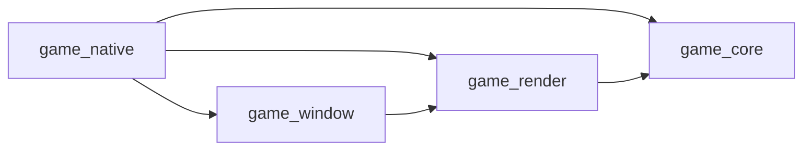

# システムアーキテクチャ（全体像）

**根拠**: [SERVER_DESIGN.md](./SERVER_DESIGN.md)、[MULTIPLAYER_PHOENIX_CHANNELS.md](./MULTIPLAYER_PHOENIX_CHANNELS.md)、[ENGINE_API.md](./ENGINE_API.md)  
**適用状態**: 1.10 方針決定とアーキテクチャ再構築（Umbrella 化・Push 型同期・補間描画）完了後

マルチプレイ・友達連携を視野に入れた、クライアント〜サーバー〜エンジンまでの全体アーキテクチャを定義する。

---

## 1. 全体構成

### 1.1 Umbrella アプリ構成（1.10.2〜1.10.9）

```
elixir_rust/
  umbrella/                    ← Umbrella ルート
    mix.exs                    ← Umbrella 定義（apps_path: "apps"）
    config/
      config.exs               ← 共通設定（tick_hz: 20, headless: false）
      prod.exs                 ← 本番設定（headless: true）
    apps/
      game_engine/             ← エンジンコア（SSOT・NIF・tick_hz・ルーム管理）
      game_content/            ← ゲーム別コンテンツ（VampireSurvivor / MiniShooter）
      game_network/            ← ネットワーク汎用層（Phoenix Socket/Channel・Presence）
      game_server/             ← 本番デプロイ用エントリ（ヘッドレス起動）
  native/                      ← Rust クレート群（変更なし）
    game_native/
    game_core/
    game_render/
    game_window/

[ローカル起動]
  game_engine + game_content
  └─ Rust NIF（計算・描画・音）をロード（headless: false）

[サーバーデプロイ]
  game_engine + game_content + game_network + game_server
  └─ Rust NIF をロードしない（headless: true）
  └─ Phoenix で WebSocket を受け付ける
```

### 1.2 ネットワーク層

```
┌─────────────────────────────────────────────────────────────────────────────┐
│ クライアント（ゲームクライアント / ブラウザ）                                 │
│   WebSocket → Phoenix Socket（認証済み user_id）                              │
│   join: "user:" <> user_id 必須 / "room:" <> room_id はゲーム参加時          │
└───────────────────────────────┬─────────────────────────────────────────────┘
                                │
┌───────────────────────────────▼─────────────────────────────────────────────┐
│ game_network（Phoenix サーバー）                                             │
│                                                                             │
│ 認証・識別     Socket connect で user_id を assigns、全 Channel で利用       │
│ プレゼンス     Phoenix.Presence（lobby / room 単位）                         │
│ フレンド       Ecto 永続化 + user: Channel で申請・承認の push               │
│ メッセージ     Ecto 永続化 + user: Channel で配送、履歴 API                   │
│ 通知           user: Channel へ PubSub broadcast → push                     │
│                                                                             │
│ Channel 構成:                                                                │
│   "user:" <> user_id  … メッセージ・通知・フレンドイベント                    │
│   "room:" <> room_id  … ゲームルーム（入力・状態同期）→ Engine 連携          │
│   "lobby"             … プレゼンス（オンライン一覧）                          │
└───────────────────────────────┬─────────────────────────────────────────────┘
                                │ RoomChannel join → GameEngine.start_room
                                │ handle_in("input", ...) → GameEvents
┌───────────────────────────────▼─────────────────────────────────────────────┐
│ game_engine（エンジンコア）                                                  │
│                                                                             │
│ GameEngine.RoomSupervisor / RoomRegistry … ルーム ID ごとに GameEvents + GameWorld │
│ GameEngine.GameEvents GenServer          … frame_events 受信・フェーズ管理・NIF 呼び出し │
│ GameEngine.Commands / Queries            … command/query 境界で NIF 呼び出しを集約 │
│ Rust NIF (game_native)                   … ResourceArc<RwLock<GameWorld>>   │
│ Rust Window (game_window)                … winit EventLoop・入力・リサイズ  │
│ Rust Render (game_render)                … wgpu Renderer・render(frame)     │
│ Rust Core (game_core)                    … 共通定数・物理・敵/武器ロジック    │
└─────────────────────────────────────────────────────────────────────────────┘
```

- **前半（サーバー・ソーシャル層）**: [SERVER_DESIGN.md](./SERVER_DESIGN.md) で定義（認証 → プレゼンス/フレンド → ルーム参加）。
- **ゲームルーム層**: [MULTIPLAYER_PHOENIX_CHANNELS.md](./MULTIPLAYER_PHOENIX_CHANNELS.md) の RoomChannel + Engine API。
- **エンジン層**: [ENGINE_API.md](./ENGINE_API.md)、[SPEC_ENGINE.md](../01_setup/SPEC_ENGINE.md)。

---

## 2. 接続・参加フロー

1. **認証**  
   クライアントが Socket 接続。`connect/3` でユーザーを検証し、`assign(socket, :user_id, user.id)` のみ保持（メモリ節約）。

2. **ユーザー Channel**  
   接続後、少なくとも `"user:" <> my_user_id` に join。メッセージ・通知・フレンドイベントを受信。

3. **プレゼンス**  
   必要に応じて `"lobby"`（または `"presence:global"`）に join し、オンライン一覧・フレンドのオンライン状態を表示。

4. **ゲームルーム参加**  
   ルーム作成・参加時に `"room:" <> room_id` に join。RoomChannel が `Engine.start_room(room_id)` を呼び、入力・状態同期は [MULTIPLAYER_PHOENIX_CHANNELS.md](./MULTIPLAYER_PHOENIX_CHANNELS.md) に従う。

---

## 3. 機能レイヤーと責務

| レイヤー | 責務 | 参照 |
|----------|------|------|
| **認証・識別** | ログイン、セッション、Socket の `user_id` | SERVER_DESIGN §3 |
| **プレゼンス** | 誰がオンラインか、どのルームにいるか | SERVER_DESIGN §4 |
| **フレンド・ソーシャル** | 申請・承認・リスト、オンライン状態 | SERVER_DESIGN §5 |
| **メッセージ** | テキスト送受信、既読、履歴 | SERVER_DESIGN §6 |
| **通知** | フレンド申請・ルーム招待・メッセージ着信の push | SERVER_DESIGN §7 |
| **マッチング・ルーム** | ルーム作成/参加/退出、RoomChannel、Engine 連携 | MULTIPLAYER_PHOENIX_CHANNELS |
| **エンジン** | ルームごとの GameEvents / GameWorld、物理・描画 | ENGINE_API, SPEC_ENGINE |

---

## 3.1 エンジン内部（1.8 描画責務分離後）

`native` 配下は次の依存方向で分離される。



- `game_native`: NIF 境界、`GameWorld` 管理、RenderBridge 実装。
- `game_window`: `winit` のライフサイクル管理と入力イベント吸収。
- `game_render`: `wgpu` 初期化・描画パイプライン・`render(frame)` / `resize(width, height)`。
- `game_core`: 物理・敵・武器・定数の共通ロジック。

### 3.2 1.9 改善の反映点

- Elixir 側は `Engine.Commands` / `Engine.Queries` を追加し、`App.NifBridge` 直接呼び出しを境界集約した。
- Rust 側は `game_native/src/game_logic/systems` で処理を機能分割し、`physics_step.rs` はオーケストレーション中心の薄い層になった。
- `systems` には `spawn` / `leveling` / `collision` / `effects` / `items` / `projectiles` / `boss` / `weapons` が配置される。
- 旧描画取得 NIF API（`get_render_data` / `get_particle_data` / `get_item_data`）は削除済みで、描画は Rust 内部完結を前提とする。

### 3.3 1.10 アーキテクチャ再構築の反映点

- **Umbrella 化**: `umbrella/` ディレクトリに Elixir アプリを集約。`game_engine` / `game_content` / `game_network` / `game_server` の 4 アプリ構成。
- **Elixir SSOT**: `GameEngine` モジュールが公開 API となり、`GameEngine.Commands` / `GameEngine.Queries` / `GameEngine.Snapshots` の 3 境界で NIF を集約。
- **Push 型同期**: `push_tick` NIF で Elixir が入力を Rust に送り、delta のみを受け取る。
- **tick_hz 可変**: `Application.get_env(:game_engine, :tick_hz, 20)` で設定可能。
- **ヘッドレス対応**: `headless: true` 設定で Rust NIF（描画・音）をロードしない。
- **補間描画**: `render_bridge.rs` の `next_frame()` が `prev_player_x/y` と `curr_player_x/y` を線形補間し、60Hz 描画でも滑らかに見える。
- **モジュール名変更**: `Engine.*` → `GameEngine.*`、`Game.*` → `GameContent.*`、`App.NifBridge` → `GameEngine.NifBridge`。

---

## 4. 実装優先順位（SERVER_DESIGN 準拠）

| 順序 | 項目 | 内容 |
|------|------|------|
| 1 | 認証 | Socket で `user_id` を識別できるようにする |
| 2 | プレゼンス（最小） | グローバルまたは lobby でオンライン一覧を表示 |
| 3 | ゲームルーム連携 | RoomChannel を実装（Step 44b）、Engine.start_room / get_loop_for_room |
| 4 | フレンド（基本） | 申請・承認・リストの API または Channel |
| 5 | 通知 | フレンド申請・承認を `user:` Channel で push |
| 6 | メッセージ | テキスト送受信・履歴・既読（必要に応じて） |

---

## 5. 多人数時の通信方式（方針）

| 人数の目安 | 方式 | サーバーの役割 |
|------------|------|----------------|
| **少人数（2〜4 人）** | WebRTC P2P（メッシュ） | マッチング・シグナリングのみ |
| **多人数** | ホスト 1 人 + 他は P2P、または **専用ゲームサーバー** | マッチングのみ / またはサーバー上で Engine を実行 |

詳細は [SERVER_DESIGN.md §9](./SERVER_DESIGN.md#9-多人数時の通信方式負荷分散方針) を参照。

---

## 6. 関連ドキュメント

| ドキュメント | 用途 |
|-------------|------|
| [SERVER_DESIGN.md](./SERVER_DESIGN.md) | サーバー設計（認証・プレゼンス・フレンド・メッセージ・通知・Channel 構成） |
| [MULTIPLAYER_PHOENIX_CHANNELS.md](./MULTIPLAYER_PHOENIX_CHANNELS.md) | ゲームルーム（RoomChannel）・Engine 連携・入力・状態同期 |
| [ENGINE_API.md](./ENGINE_API.md) | Engine API（start_room, get_loop_for_room 等） |
| [SPEC_ENGINE.md](../01_setup/SPEC_ENGINE.md) | エンジン層の技術アーキテクチャ・ECS・NIF |
