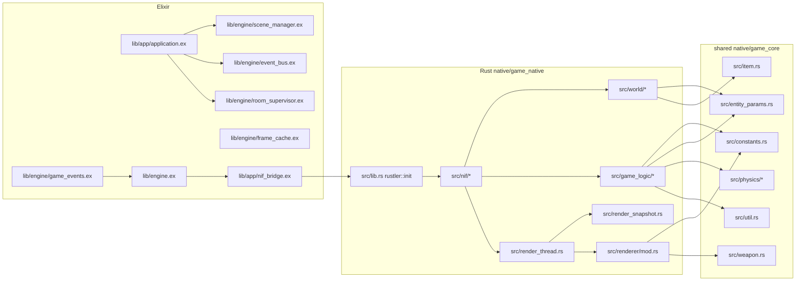
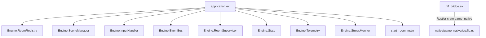
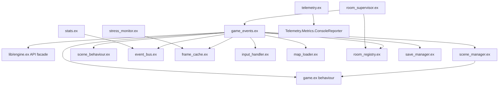
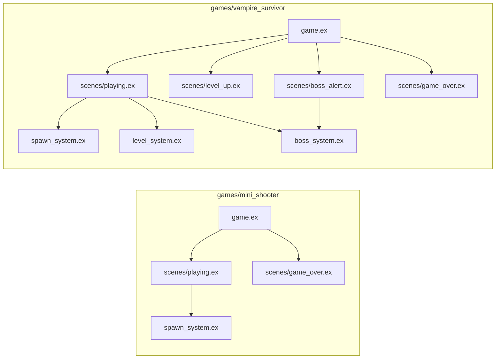
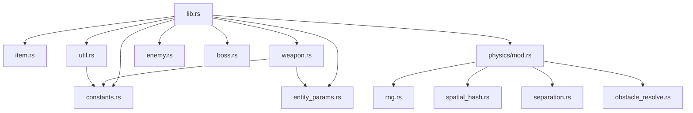
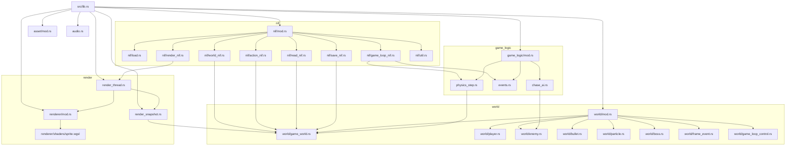
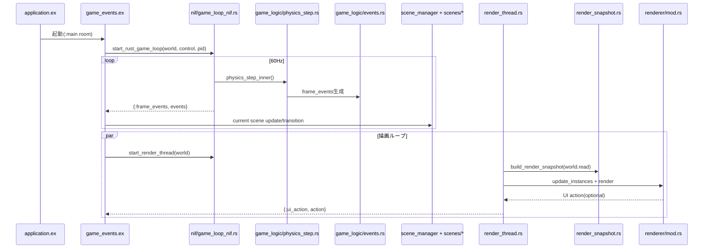

# ファイル単位アーキテクチャ図解（Mermaid版）

最終更新: 2026-02-25

対象:

- `lib/app`
- `lib/engine`
- `lib/games`
- `native/game_core/src`
- `native/game_native/src`

---

## 1) 全体構成（Elixir <-> Rust）

---

## 2) `lib/app`（ファイル単位）

---

## 3) `lib/engine`（ファイル単位）

---

## 4) `lib/games`（ファイル単位）

---

## 5) `native/game_core/src`（ファイル単位）

---

## 6) `native/game_native/src`（ファイル単位）

---

## 7) 実行シーケンス（1フレーム）

---

## 8) 評価（強み / 弱み）

### 強み

- Elixir（運用・遷移）とRust（高頻度計算・描画）の責務分離が明確。
- NIF境界が `nif_bridge.ex` と `src/lib.rs` で一意に追える。
- OTPプロセス分離（`GameEvents`、`EventBus`、`Stats`、`StressMonitor`）が効いている。
- SoA + free list により `world/*` が高負荷時に安定しやすい。

### 弱み

- `game_logic/physics_step.rs` に責務が集中（変更影響が大きい）。
- `game_core` で `enemy.rs`/`boss.rs` と `entity_params.rs` が併存。
- UI action が文字列プロトコルで型安全性が低い。
- `GameWorld` 単一 `RwLock` に read/write 競合点が集まりやすい。

