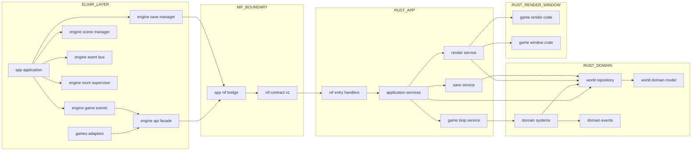
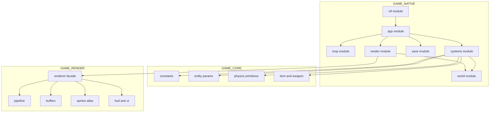
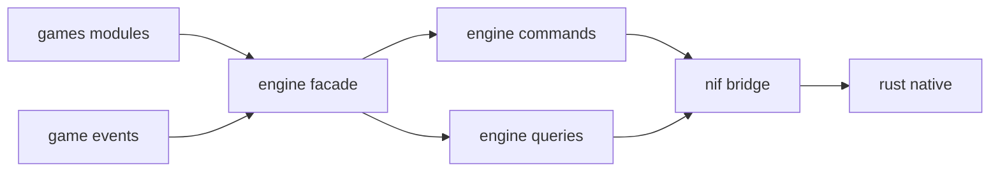

# 改善アーキテクチャ提案

**対象**: `lib/app` `lib/engine` `lib/games` `native/game_core/src` `native/game_native/src` `native/game_render/src` `native/game_window/src`  
**目的**: 責務の明確化、巨大ファイル分割、NIF 境界の整理  
**ステータス**: 提案

---

## 1. ねらい

現状アーキテクチャの強みは維持しつつ、以下を改善する。

- `native/game_native/src/game_logic/physics_step.rs` の責務集中を解消する
- `native/game_render/src/renderer/mod.rs` の肥大化を分割する
- `App.NifBridge` の API 面積を整理し、境界契約を明確化する
- Elixir 側のゲーム実装差し替え性を維持したまま、変更影響範囲を小さくする

---

## 2. 全体改善案

---

## 3. Rust 側分割案

---

## 4. Elixir 側境界整理案

---

## 5. 段階的移行ステップ

1. `game_native` に `systems` 配下を作り、`physics_step.rs` の関数を機能別に移す  
2. `game_render` で `renderer/mod.rs` を facade 化し、内部モジュールへ分割する  
3. Elixir 側に command と query の入口を追加し、`App.NifBridge` 呼び出しを集約する  
4. 既存 API を deprecate して段階置換し、最終的に旧入口を削除する

---

## 6. 追記課題（クローズ）

### 6.1 `game_native` の `world` module 分離

- **課題**: `world` 配下の責務を `state` `events` `control` に明確分離する
- **背景**: `game_logic` と `nif` からの参照が増え、境界が曖昧になりやすい
- **方針**:
  - `world/state`: `game_world.rs` `player.rs` `enemy.rs` `bullet.rs` `boss.rs` `particle.rs`
  - `world/events`: `frame_event.rs`
  - `world/control`: `game_loop_control.rs`
  - 依存方向は `game_logic -> world` を維持し、`world -> game_logic` を作らない
- **期待効果**:
  - `physics_step` 分割時の依存整理が容易になる
  - `nif` 層の read/write 境界を明示しやすくなる
  - テスト対象を小さく分割できる
- **ステータス**: **Closed（方針合意済み）**
- **次アクション**: 実装開始時に「ファイル移動マップ」と「`mod.rs` 更新差分」を作成して着手する

