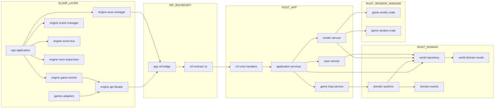
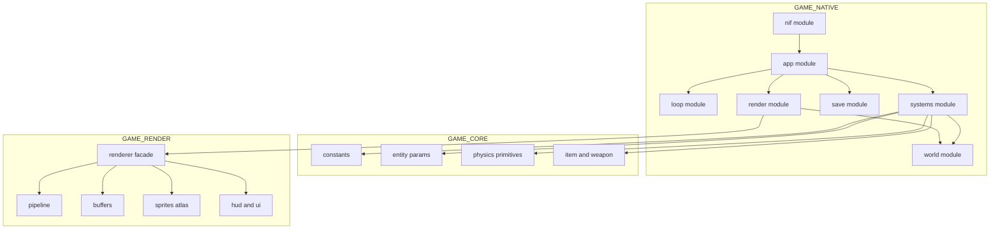
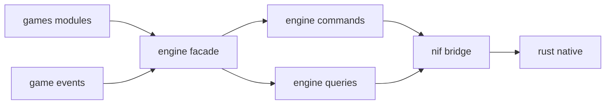

# 改善アーキテクチャ提案

**対象**: `lib/app` `lib/engine` `lib/games` `native/game_core/src` `native/game_native/src` `native/game_render/src` `native/game_window/src`  
**目的**: 責務の明確化、巨大ファイル分割、NIF 境界の整理  
**ステータス**: 実施中（1.9.2 / 1.9.3 / 1.9.4 を段階反映中）

---

## 1. ねらい

現状アーキテクチャの強みは維持しつつ、以下を改善する。

- `native/game_native/src/game_logic/physics_step.rs` の責務集中を解消する
- `native/game_render/src/renderer/mod.rs` の肥大化を分割する
- `App.NifBridge` の API 面積を整理し、境界契約を明確化する
- Elixir 側のゲーム実装差し替え性を維持したまま、変更影響範囲を小さくする

---

## 2. 全体改善案

---

## 3. Rust 側分割案

---

## 4. Elixir 側境界整理案

---

## 5. 段階的移行ステップ

1. `game_native` に `systems` 配下を作り、`physics_step.rs` の関数を機能別に移す  
2. `game_render` で `renderer/mod.rs` を facade 化し、内部モジュールへ分割する  
3. Elixir 側に command と query の入口を追加し、`App.NifBridge` 呼び出しを集約する  
4. 既存 API を deprecate して段階置換し、最終的に旧入口を削除する

### 実施メモ（2026-02-26）

- `lib/engine/commands.ex` と `lib/engine/queries.ex` を追加し、`Engine` から command/query を明示して呼び出す構成へ移行。
- `Engine.GameEvents` / `Engine.SaveManager` の `App.NifBridge` 直接呼び出しを除去し、`Engine` または `Engine.Commands` / `Engine.Queries` 経由に集約。
- `native/game_render/src/renderer/ui.rs` を新設し、HUD/UI 実装を `renderer/mod.rs` から分離（`mod.rs` は Renderer の facade 入口を維持）。
- `native/game_native/src/game_logic/systems/{mod.rs,spawn.rs,leveling.rs}` を追加し、`physics_step.rs` からスポーン座標生成とレベルアップ候補計算を段階移設。
- `native/game_native/src/game_logic/systems/{collision.rs,effects.rs,items.rs,projectiles.rs,boss.rs}` を追加し、`physics_step.rs` の移動/衝突/更新処理を段階分離。
- 旧描画取得 API（`get_render_data` / `get_particle_data` / `get_item_data`）を Elixir/Rust 両側から削除し、NIF 境界を縮小。
- Windows で `iex.bat -S mix` の起動確認を実施し、IEx プロンプト到達・ゲームループ起動ログを確認。

---

## 6. 追記課題（クローズ）

### 6.1 `game_native` の `world` module 分離

- **課題**: `world` 配下の責務を `state` `events` `control` に明確分離する
- **背景**: `game_logic` と `nif` からの参照が増え、境界が曖昧になりやすい
- **方針**:
  - `world/state`: `game_world.rs` `player.rs` `enemy.rs` `bullet.rs` `boss.rs` `particle.rs`
  - `world/events`: `frame_event.rs`
  - `world/control`: `game_loop_control.rs`
  - 依存方向は `game_logic -> world` を維持し、`world -> game_logic` を作らない
- **期待効果**:
  - `physics_step` 分割時の依存整理が容易になる
  - `nif` 層の read/write 境界を明示しやすくなる
  - テスト対象を小さく分割できる
- **ステータス**: **Closed（方針合意済み）**
- **次アクション**: 実装開始時に「ファイル移動マップ」と「`mod.rs` 更新差分」を作成して着手する

---

## 7. 設計原則（Elixir と Rust の責務分離）

このプロジェクトでは、次の原則を採用する。

> 「システム運用と分散制御」は Elixir 側に明確に残す。

### 7.1 役割分担

- **Rust**: 1 フレーム内で完結すべき高頻度・高負荷処理を担当する（物理、衝突、描画、音）。
- **Elixir**: プロセス管理・障害復旧・ルーム管理・イベント配信などの運用制御を担当する。
- **NIF 境界**: Elixir は `Resource` 参照と制御コマンドを中心に扱い、巨大データの往復を避ける。

### 7.2 判断基準（迷ったとき）

- その処理が **60fps 制約** に直接影響するなら Rust に置く。
- その処理が **可用性・分散制御・運用性** に関わるなら Elixir に置く。
- 境界設計では「高頻度データ移送の削減」と「Elixir 側の復旧責務維持」を同時に満たす。

### 7.3 「巨大データの往復を避ける」の具体化

- **非推奨（毎フレーム転送）**:
  - `enemies` / `bullets` / `particles` の全件を毎フレーム `Vec` から Elixir の list/tuple へ変換して返す。
- **推奨（制御 API 中心）**:
  - Elixir から Rust へは `set_input` `pause/resume` `spawn_boss` などの小さいコマンドを送る。
- **推奨（軽量 query 中心）**:
  - Elixir が毎フレーム参照する情報は `hp` `score` `enemy_count` など軽量メタデータに限定する。
- **推奨（参照保持）**:
  - 大きな実体データは Elixir ヒープに複製せず、`Resource` ハンドル参照として保持する。
- **例外（明示操作時のみ）**:
  - セーブ/ロード/デバッグ用途の大きなスナップショット取得は、毎フレームではなく明示操作時に限定する。

### 7.4 NIF API 境界の運用ルール

NIF API は次の 3 区分で管理する。

| 区分 | 用途 | 例 | 呼び出し頻度 | `World` write |
|------|------|----|--------------|---------------|
| `control` | 更新・制御命令 | `set_player_input`, `spawn_enemies`, `add_weapon`, `pause_physics` | 必要時（高頻度含む） | 許可 |
| `query_light` | 軽量観測 | `get_frame_metadata`, `get_enemy_count`, `is_player_dead` | 毎フレーム可 | 禁止（read only） |
| `snapshot_heavy` | 保存・復元・デバッグ | `get_save_snapshot`, `load_save_snapshot`, `debug_dump_world` | 明示操作時のみ | 原則禁止（`load` のみ許可） |

- `control` 以外で `World` に直接 write する入口は増やさない。
- 新規 NIF 追加時は、まずこの 3 区分のどれに属するかを明示してから実装する。

### 7.5 lock 競合メトリクス閾値

- `read lock wait` 警告閾値: **300us**
- `write lock wait` 警告閾値: **500us**
- 集計ログ出力間隔: **5 秒ごと**（平均待機時間とサンプル数）

上記閾値は運用しながら見直すが、初期値としてこの値を採用する。

### 7.6 負荷検証シナリオ（敵/弾/パーティクル）

- ベンチ: `native/game_native/benches/load_world_bench.rs`
- 実行コマンド:
  - `cd native/game_native`
  - `cargo bench --bench load_world_bench`
- 評価観点:
  - `world_load_medium` / `world_load_high` / `world_load_extreme` の 3 段階で
    `physics_step` の処理時間傾向を確認する。
  - `LOCK` ログ（平均待機時間）と合わせて、`RwLock` 競合が増えていないか確認する。

