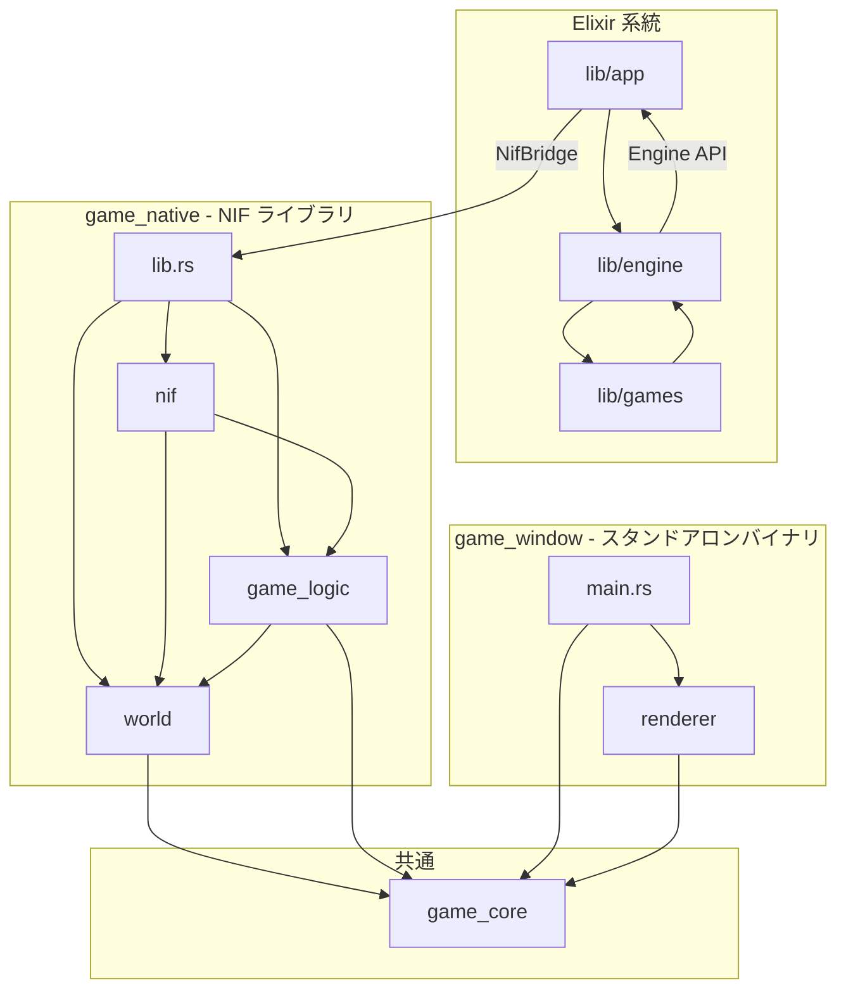
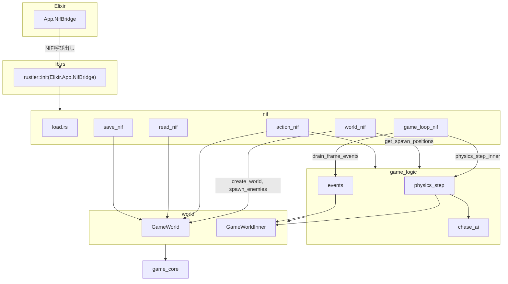
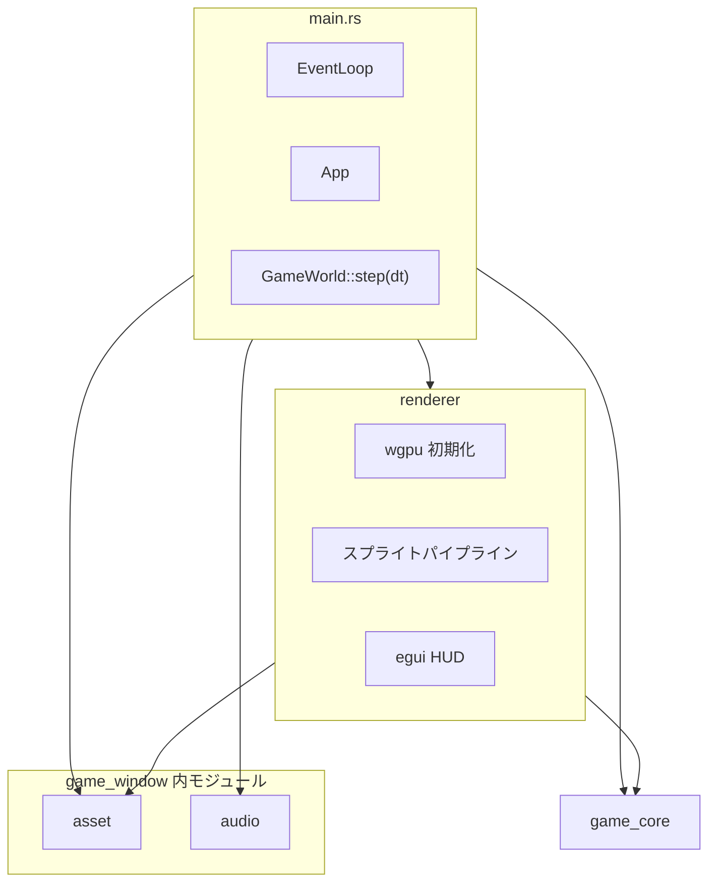
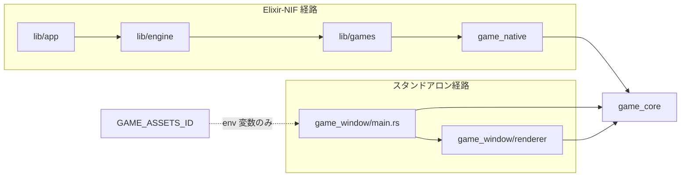

# フォルダ単位 接続関係図解

**根拠**: [ARCHITECTURE.md](./ARCHITECTURE.md)、[ENGINE_API.md](./ENGINE_API.md)、[WorkspaceLayout.md](../../WorkspaceLayout.md)

`lib/app`、`lib/engine`、`lib/games`、`native/game_native`（nif, game_logic, world, lib.rs）、`native/game_window`（main.rs, renderer）のフォルダ単位での接続関係を可視化する。

---

## 1. 全体アーキテクチャ（2系統）

プロジェクトには **Elixir-NIF 系統** と **スタンドアロン描画系統** の2つがあり、`game_core` のみ共通で参照されます。



---

## 2. lib フォルダ詳細（Elixir 側）

| フォルダ | 主な役割 | 依存先 | 呼び出し元 |
|----------|----------|--------|------------|
| **lib/app** | OTP Application、NIF 橋渡し | `lib/engine`, `lib/app/nif_bridge` → game_native | OTP |
| **lib/engine** | ゲームエンジン（シーン、イベント、Room） | `lib/app`（NifBridge）、`lib/games`（config） | lib/app |
| **lib/games** | ゲーム実装（VampireSurvivor, MiniShooter） | `lib/engine` | lib/engine（GameEvents 経由） |

### lib フロー

```mermaid
flowchart LR
    subgraph lib_app [lib/app]
        Application[Application.ex]
        NifBridge[NifBridge.ex]
    end

    subgraph lib_engine [lib/engine]
        GameEvents[GameEvents]
        Engine[Engine]
        SceneManager[SceneManager]
    end

    subgraph lib_games [lib/games]
        VampireSurvivor[VampireSurvivor]
        MiniShooter[MiniShooter]
    end

    Application -->|起動| SceneManager
    Application -->|起動| GameEvents
    Application -->|GAME_ASSETS_ID| EnvVar[環境変数]

    NifBridge -->|create_world, physics_step 等| game_native[game_native NIF]

    GameEvents -->|{:frame_events}| Engine
    GameEvents -->|update| VampireSurvivor
    Engine --> NifBridge
    VampireSurvivor --> Engine
    MiniShooter --> Engine
```

---

## 3. native/game_native 詳細（NIF 側）

| フォルダ/ファイル | 主な役割 | 依存先 | 呼び出し元 |
|-------------------|----------|--------|------------|
| **lib.rs** | NIF 初期化、Elixir.App.NifBridge 登録、pub use | nif, game_logic, world | Elixir（Rustler ロード時） |
| **nif/** | NIF エントリ（world_nif, action_nif, game_loop_nif, read_nif, save_nif） | game_logic, world | App.NifBridge |
| **game_logic/** | 物理ステップ、chase_ai、frame_events drain | world, game_core | nif |
| **world/** | GameWorld, PlayerState, EnemyWorld 等 | game_core | nif, game_logic |

### game_native フロー



---

## 4. native/game_window 詳細（スタンドアロン側）

| フォルダ/ファイル | 主な役割 | 依存先 | 備考 |
|-------------------|----------|--------|------|
| **main.rs** | ウィンドウ・イベントループ、ゲームループ | asset, audio, renderer, game_core | Elixir 非依存 |
| **renderer/** | wgpu 描画、スプライト、HUD | game_core, asset | main から呼び出し |

### game_window と Elixir の接続

- **直接の依存関係はない**: game_window は game_native を参照しない
- **環境変数で連携**: `lib/app/application.ex` が `GAME_ASSETS_ID` を設定
- **起動方法**:
  - Elixir 起動後、同じシェルで `cargo run -p game_window` → env を継承
  - `bin/start.bat` で `GAME_ASSETS_ID` を設定して直接起動

### game_window フロー



---

## 5. 接続サマリ表

| 起点 | 接続先 | 接続種別 |
|------|--------|----------|
| lib/app | lib/engine | Application 起動（子プロセス） |
| lib/app | native/game_native | NifBridge 経由 NIF 呼び出し |
| lib/app | game_window | GAME_ASSETS_ID 環境変数 |
| lib/engine | lib/app | NifBridge 経由で NIF 呼び出し |
| lib/engine | lib/games | Application.get_env、Scene update |
| lib/games | lib/engine | Engine API（spawn, is_player_dead 等） |
| native/game_native/lib.rs | nif | モジュール集約・初期化 |
| native/game_native/lib.rs | game_logic | pub use |
| native/game_native/lib.rs | world | pub use |
| native/game_native/nif | game_logic | physics_step_inner, get_spawn_positions |
| native/game_native/nif | world | GameWorld 操作 |
| native/game_native/game_logic | world | GameWorldInner 更新 |
| native/game_window/main.rs | renderer | 描画呼び出し |
| native/game_window/main.rs | game_core | ゲームロジック |
| native/game_window/renderer | game_core | 定数・種別 |

---

## 6. 2系統の分離



Elixir 系統と game_window は **game_core 以外は共有しておらず**、game_window は NIF を使わないスタンドアロンバイナリです。
