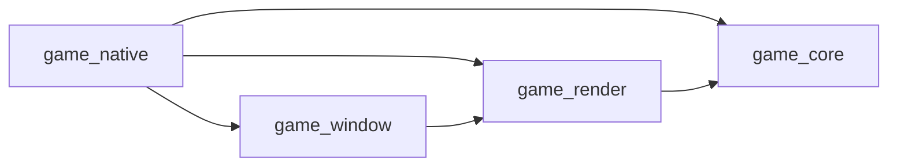
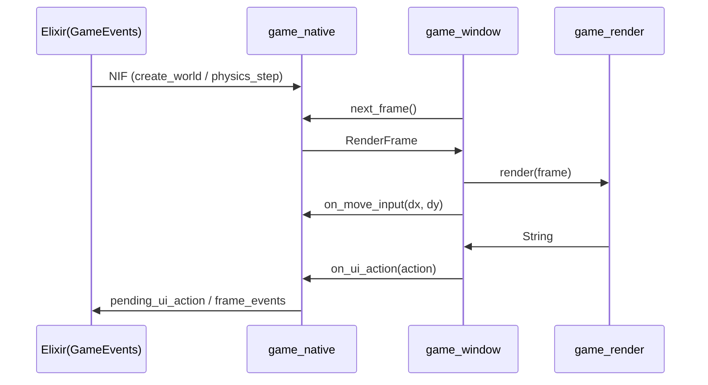

# フォルダ単位 接続関係図解（1.8 描画責務分離後）

**根拠**: [ARCHITECTURE.md](./ARCHITECTURE.md)、[ENGINE_API.md](./ENGINE_API.md)、[WorkspaceLayout.md](../../WorkspaceLayout.md)  
**適用状態**: `STEPS_RENDER_SEPARATION.md` の 1.8.6 完了後

`lib/app`、`lib/engine`、`lib/games`、`native/game_native`、`native/game_window`、`native/game_render`、`native/game_core` の接続関係を、責務分離後の実装に合わせて整理する。

---

## 1. 全体アーキテクチャ（分離後）

```mermaid
flowchart TB
    subgraph Elixir [Elixir 系統]
        lib_app[lib/app]
        lib_engine[lib/engine]
        lib_games[lib/games]
    end

    subgraph NativeNif [native/game_native]
        native_lib[lib.rs / nif / game_logic / world]
        bridge[render_bridge]
    end

    subgraph NativeWindow [native/game_window]
        window_loop[winit EventLoop]
    end

    subgraph NativeRender [native/game_render]
        renderer[wgpu Renderer]
    end

    subgraph Shared [共通]
        game_core[native/game_core]
    end

    lib_app --> lib_engine
    lib_engine --> lib_games
    lib_games --> lib_engine
    lib_app -->|NifBridge| native_lib

    native_lib --> bridge
    bridge -->|run_render_loop / RenderBridge| window_loop
    window_loop -->|render(frame), resize| renderer

    native_lib --> game_core
    renderer --> game_core
```

---

## 2. レイヤー別責務

| レイヤー | 主な責務 | 依存先 |
|---|---|---|
| `lib/app` | OTP 起動、NIF ロード、環境初期化 | `lib/engine`, `native/game_native` |
| `lib/engine` | ゲーム進行制御、ルーム管理、イベント処理 | `lib/app`, `lib/games` |
| `lib/games` | ゲーム別ロジック（シーン・スポーン等） | `lib/engine` |
| `native/game_native` | NIF 境界、`GameWorld` 管理、RenderBridge 実装 | `game_core`, `game_window`, `game_render` |
| `native/game_window` | `winit` EventLoop、入力イベント・リサイズ管理 | `game_render` |
| `native/game_render` | `wgpu` 描画パイプライン、`render/resize`、HUD | `game_core` |
| `native/game_core` | 物理・敵・武器・定数など共通ロジック | 依存なし（下位共通） |

---

## 3. native 配下の依存方向



- `game_window` は `game_native` に依存しない（Bridge トレイトで逆依存を回避）。
- `game_render` は NIF や `rustler` を知らず、描画データ入力に専念する。
- `game_native` は描画詳細を持たず、`RenderFrame` 生成と入力・UI 反映を担当する。

---

## 4. フレームと入力のデータフロー



---

## 5. 接続サマリ表

| 起点 | 接続先 | 接続種別 |
|---|---|---|
| `lib/app` | `lib/engine` | Application 起動（Supervisor） |
| `lib/app` | `native/game_native` | Rustler による NIF ロード |
| `lib/engine` | `lib/games` | シーン更新・ゲーム設定参照 |
| `native/game_native` | `native/game_window` | `run_render_loop` 呼び出し |
| `native/game_window` | `native/game_render` | `Renderer::new / render / resize` |
| `native/game_native` | `native/game_render` | `RenderFrame` 型共有 |
| `native/game_native` | `native/game_core` | 物理・敵・武器・定数の利用 |
| `native/game_render` | `native/game_core` | 描画種別・定数の利用 |

---

## 6. 実装上の境界ルール

- `game_render` に `rustler` / `ResourceArc` を持ち込まない。
- `game_window` は描画命令の生成を行わず、イベント処理とループ進行に限定する。
- `game_native` は `GameWorld` の読み取りスナップショット生成と入力・UI の橋渡しに限定する。
- Windows は `with_any_thread(true)` を使い、NIF spawn スレッド上の EventLoop 実行を許可する。
