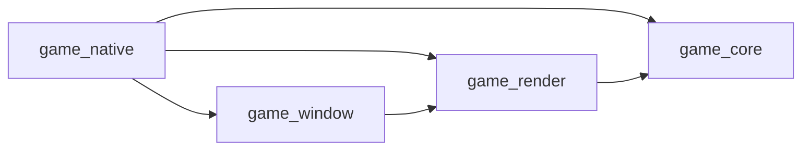
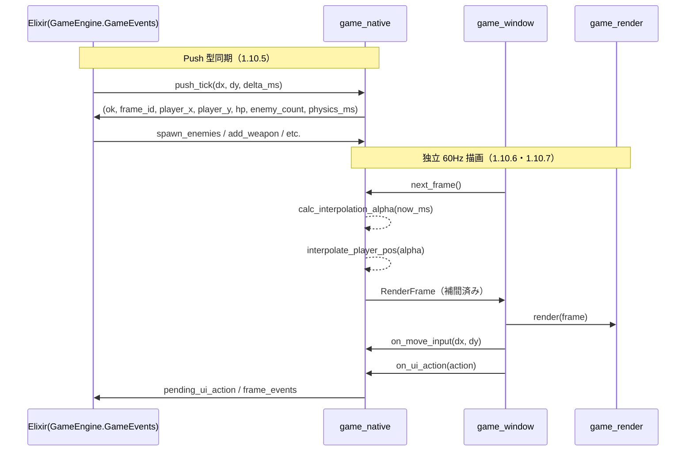

# フォルダ単位 接続関係図解（1.10 Umbrella 化後）

**根拠**: [ARCHITECTURE.md](./ARCHITECTURE.md)、[ENGINE_API.md](./ENGINE_API.md)、[WorkspaceLayout.md](../../WorkspaceLayout.md)  
**適用状態**: `STEPS_ARCH_REDESIGN.md` の 1.10 完了後

`umbrella/apps/` 配下の Elixir アプリと `native/` 配下の Rust クレートの接続関係を整理する。

---

## 1. 全体アーキテクチャ（Umbrella 化後）

```mermaid
flowchart TB
    subgraph Umbrella [umbrella/apps/]
        game_server[game_server\n本番デプロイ用エントリ]
        game_network[game_network\nPhoenix Socket/Channel/Presence]
        game_content[game_content\nVampireSurvivor / MiniShooter]
        game_engine[game_engine\nエンジンコア・NIF・tick_hz]
        engine_boundary[GameEngine.Commands\nGameEngine.Queries\nGameEngine.Snapshots]
    end

    subgraph NativeNif [native/game_native]
        native_lib[lib.rs / nif / game_logic / world]
        bridge[render_bridge\n補間描画]
    end

    subgraph NativeWindow [native/game_window]
        window_loop[winit EventLoop]
    end

    subgraph NativeRender [native/game_render]
        renderer[wgpu Renderer]
    end

    subgraph Shared [共通]
        game_core[native/game_core]
    end

    game_server --> game_network
    game_server --> game_content
    game_server --> game_engine
    game_network --> game_engine
    game_content --> game_engine
    game_engine --> engine_boundary
    engine_boundary -->|NifBridge 呼び出し集約| native_lib
    game_engine -->|Rustler load\numbrella feature| native_lib

    native_lib --> bridge
    bridge -->|run_render_loop / RenderBridge| window_loop
    window_loop -->|render(frame), resize| renderer

    native_lib --> game_core
    renderer --> game_core
```

---

## 2. レイヤー別責務

| レイヤー | 主な責務 | 依存先 |
|---|---|---|
| `umbrella/apps/game_engine` | OTP 起動、NIF ロード、tick_hz・headless 設定、ルーム管理 | `native/game_native` |
| `GameEngine.Commands` | NIF command（更新系）呼び出しの集約 | `GameEngine.NifBridge` |
| `GameEngine.Queries` | NIF query（取得系）呼び出しの集約 | `GameEngine.NifBridge` |
| `GameEngine.Snapshots` | snapshot_heavy（セーブ/ロード）の集約 | `GameEngine.NifBridge` |
| `umbrella/apps/game_content` | ゲーム別ロジック（シーン・スポーン等） | `game_engine` |
| `umbrella/apps/game_network` | Phoenix Socket/Channel・Presence・認証 | `game_engine` |
| `umbrella/apps/game_server` | 本番デプロイ用エントリ（headless: true） | 全アプリ |
| `native/game_native` | NIF 境界、`GameWorld` 管理、RenderBridge 実装（補間対応） | `game_core`, `game_window`, `game_render` |
| `native/game_window` | `winit` EventLoop、入力イベント・リサイズ管理 | `game_render` |
| `native/game_render` | `wgpu` 描画パイプライン、`render/resize`、HUD | `game_core` |
| `native/game_core` | 物理・敵・武器・定数など共通ロジック | 依存なし（下位共通） |

---

## 3. native 配下の依存方向



- `game_window` は `game_native` に依存しない（Bridge トレイトで逆依存を回避）。
- `game_render` は NIF や `rustler` を知らず、描画データ入力に専念する。
- `game_native` は描画詳細を持たず、`RenderFrame` 生成と入力・UI 反映を担当する。
- `game_native/src/game_logic/systems` で責務を機能分割し、`physics_step` は統合オーケストレーションのみを担当する。

---

## 4. フレームと入力のデータフロー（Push 型同期・補間描画）



---

## 5. 接続サマリ表

| 起点 | 接続先 | 接続種別 |
|---|---|---|
| `game_engine` | `native/game_native` | Rustler による NIF ロード（umbrella feature） |
| `GameEngine.Commands` | `GameEngine.NifBridge` | 更新系 command の呼び出し |
| `GameEngine.Queries` | `GameEngine.NifBridge` | 取得系 query の呼び出し |
| `GameEngine.Snapshots` | `GameEngine.NifBridge` | snapshot_heavy（セーブ/ロード） |
| `game_content` | `game_engine` | シーン更新・ゲーム設定参照 |
| `game_network` | `game_engine` | RoomChannel → GameEngine.start_room |
| `game_server` | 全アプリ | 本番デプロイ用エントリ（headless: true） |
| `native/game_native` | `native/game_window` | `run_render_loop` 呼び出し |
| `native/game_window` | `native/game_render` | `Renderer::new / render / resize` |
| `native/game_native` | `native/game_render` | `RenderFrame` 型共有 |
| `native/game_native` | `native/game_core` | 物理・敵・武器・定数の利用 |
| `native/game_render` | `native/game_core` | 描画種別・定数の利用 |

---

## 6. 実装上の境界ルール

- `game_render` に `rustler` / `ResourceArc` を持ち込まない。
- `game_window` は描画命令の生成を行わず、イベント処理とループ進行に限定する。
- `game_native` は `GameWorld` の読み取りスナップショット生成と入力・UI の橋渡しに限定する。
- Windows は `with_any_thread(true)` を使い、NIF spawn スレッド上の EventLoop 実行を許可する。
- 旧描画取得 NIF API（`get_render_data` / `get_particle_data` / `get_item_data`）は廃止し、描画データ転送の主経路にしない。
- Umbrella 側の `GameEngine.NifBridge` は `features: ["umbrella"]` を指定し、`rustler::init!` が `Elixir.GameEngine.NifBridge` として登録されるようにする。
- 既存の `lib/` 配下のコードは `App.NifBridge` を使い続ける（後方互換）。
