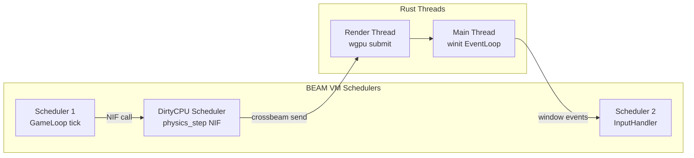

# ゲーム仕様書

**プロジェクト名**: Elixir x Rust Survivor  
**ジャンル**: ヴァンパイアサバイバーライク（ローグライト・バレットヘル）  
**プラットフォーム**: Windows / macOS / Linux（wgpu 対応環境）

---

## 目次

1. [ゲームデザイン仕様](#1-ゲームデザイン仕様)
2. [技術アーキテクチャ](#2-技術アーキテクチャ)
3. [ECS コンポーネント設計](#3-ecs-コンポーネント設計)
4. [Rustler NIF API 定義](#4-rustler-nif-api-定義)
5. [wgpu レンダリングパイプライン](#5-wgpu-レンダリングパイプライン)
6. [物理演算・衝突判定](#6-物理演算衝突判定)
7. [Elixir システム設計](#7-elixir-システム設計)
8. [パフォーマンス仕様](#8-パフォーマンス仕様)

---

## 1. ゲームデザイン仕様

### 1.1 ゲーム概要

プレイヤーは無限に湧き続ける敵の群れを自動攻撃で生き延びる。時間経過とともに敵の数・強さが増加し、プレイヤーは経験値を集めてキャラクターを強化する。

### 1.2 プレイヤー仕様

| パラメータ | 初期値 | 最大値 | 備考 |
|---|---|---|---|
| HP | 100 | 500（強化後） | 0 で即死 |
| 移動速度 | 150 px/s | 400 px/s | 8方向移動 |
| 攻撃力 | 10 | 200 | 武器依存 |
| 経験値倍率 | 1.0x | 3.0x | レベルアップで上昇 |
| 無敵時間（被弾後） | 0.5 秒 | — | 連続ダメージ防止 |

#### プレイヤー入力

| 入力 | アクション |
|---|---|
| WASD / 矢印キー | 移動 |
| ESC | ポーズ |
| Enter（レベルアップ時） | 武器選択確定 |

### 1.3 敵仕様

#### 敵タイプ一覧

| タイプ | HP | 速度 | 攻撃力 | 出現開始時間 | 特徴 |
|---|---|---|---|---|---|
| Slime | 20 | 80 px/s | 5 | 0秒〜 | 最基本。直進してくる |
| Bat | 15 | 140 px/s | 8 | 30秒〜 | 高速。ジグザグ移動 |
| Skeleton | 60 | 60 px/s | 15 | 60秒〜 | 高HP。集団行動 |
| Ghost | 40 | 100 px/s | 12 | 120秒〜 | 壁すり抜け（障害物無視） |
| Golem | 300 | 30 px/s | 40 | 180秒〜 | ボス級。範囲攻撃 |

#### 敵スポーンルール

```
スポーン数 = base_count × (1 + elapsed_minutes × 0.5)
スポーン間隔 = max(0.5秒, 3.0秒 - elapsed_minutes × 0.2)
スポーン位置 = プレイヤーから 800〜1200px の円周上（画面外）
```

### 1.4 武器システム

プレイヤーはレベルアップ時に 3 択から武器・強化を選ぶ。

| 武器 | 攻撃方式 | 初期ダメージ | 発射間隔 |
|---|---|---|---|
| Magic Wand | 最近接敵へ自動発射 | 10 | 0.8秒 |
| Garlic | 自身周囲に常時ダメージ | 5/秒 | — |
| Axe | 放物線投擲（範囲） | 20 | 1.5秒 |
| Lightning | 連鎖電撃（最大5体） | 15 | 1.2秒 |
| Whip | 左右交互に横一直線 | 25 | 1.0秒 |

### 1.5 ステージ仕様

- **マップサイズ**: 4096 × 4096 px（スクロールあり）
- **カメラ**: プレイヤー中心追従（画面サイズ: 1280 × 720）
- **障害物**: 木・岩（Ghost 以外は回避）
- **ゲーム時間**: 最大 30 分（クリア条件）

---

## 2. 技術アーキテクチャ

### 2.1 全体構成

```
┌─────────────────────────────────────────────────────────────────┐
│                        Elixir BEAM VM                           │
│                                                                 │
│  ┌─────────────────┐  ┌──────────────┐  ┌────────────────────┐ │
│  │  GameLoop       │  │ InputHandler │  │  Supervisor Tree   │ │
│  │  GenServer      │  │  GenServer   │  │  (障害時自動再起動) │ │
│  │  (60Hz tick)    │  │              │  │                    │ │
│  └────────┬────────┘  └──────┬───────┘  └────────────────────┘ │
│           │                  │                                  │
│  ┌────────▼──────────────────▼──────────────────────────────┐  │
│  │              ETS Tables（コンポーネントストア）            │  │
│  │   :positions  :health  :sprite_ids  :ai_states           │  │
│  └───────────────────────────────────────────────────────────┘  │
└─────────────────────┬───────────────────────────────────────────┘
                      │ Rustler NIF (dirty_cpu)
                      │ ResourceArc<Mutex<GameWorld>>
┌─────────────────────▼───────────────────────────────────────────┐
│                         Rust Native                             │
│                                                                 │
│  ┌──────────────┐  ┌──────────────┐  ┌──────────────────────┐  │
│  │  ECS World   │  │   Physics    │  │    wgpu Renderer     │  │
│  │  (SoA)       │  │  Spatial     │  │    (Instancing)      │  │
│  │              │  │  Hash        │  │                      │  │
│  └──────────────┘  └──────────────┘  └──────────────────────┘  │
│                                                                 │
│  ┌─────────────────────────────────────────────────────────┐    │
│  │  winit EventLoop（メインスレッド）                       │    │
│  │  crossbeam-channel でレンダラーと通信                    │    │
│  └─────────────────────────────────────────────────────────┘    │
└─────────────────────────────────────────────────────────────────┘
```

### 2.2 スレッドモデル



---

## 3. ECS コンポーネント設計

### 3.1 SoA（Structure of Arrays）レイアウト

数千体の敵を効率的に処理するため、コンポーネントデータを種別ごとに連続メモリに配置する。

```rust
// native/game_native/src/ecs/world.rs

pub struct EnemyWorld {
    // --- 毎フレーム更新（位置・速度） ---
    pub positions_x: Vec<f32>,       // ワールド X 座標
    pub positions_y: Vec<f32>,       // ワールド Y 座標
    pub velocities_x: Vec<f32>,      // X 方向速度 (px/s)
    pub velocities_y: Vec<f32>,      // Y 方向速度 (px/s)

    // --- 低頻度更新（HP・状態） ---
    pub health: Vec<i32>,            // 現在 HP
    pub max_health: Vec<i32>,        // 最大 HP
    pub damage: Vec<i32>,            // 攻撃力

    // --- ほぼ不変（スプライト・タイプ） ---
    pub sprite_ids: Vec<u16>,        // テクスチャアトラス内インデックス
    pub enemy_types: Vec<EnemyType>, // 敵タイプ（AI 挙動分岐用）
    pub speeds: Vec<f32>,            // 基本移動速度

    // --- フラグ ---
    pub alive: Vec<bool>,            // 生存フラグ
    pub count: usize,                // 有効エンティティ数
    pub capacity: usize,             // 確保済みキャパシティ
}
```

#### メモリレイアウトの利点

| 処理 | AoS（従来） | SoA（本設計） |
|---|---|---|
| 全エンティティの位置更新 | キャッシュミス多発（他フィールドも読む） | positions_x/y だけキャッシュに乗る |
| SIMD 並列化 | 困難（フィールドが散在） | 容易（連続メモリ） |
| GPU 転送 | 不要フィールドも含む | 必要フィールドのみ転送 |

### 3.2 エンティティ ID 管理

```rust
pub struct EntityId(pub usize);

pub struct EntityAllocator {
    free_list: Vec<usize>,  // 再利用可能なインデックス
    next_id: usize,
}

impl EntityAllocator {
    pub fn allocate(&mut self) -> EntityId {
        if let Some(id) = self.free_list.pop() {
            EntityId(id)
        } else {
            let id = self.next_id;
            self.next_id += 1;
            EntityId(id)
        }
    }

    pub fn free(&mut self, id: EntityId) {
        self.free_list.push(id.0);
    }
}
```

### 3.3 プレイヤーコンポーネント

```rust
pub struct PlayerState {
    pub position_x: f32,
    pub position_y: f32,
    pub velocity_x: f32,
    pub velocity_y: f32,
    pub health: i32,
    pub max_health: i32,
    pub level: u32,
    pub experience: u32,
    pub invincible_timer: f32,  // 無敵時間残り（秒）
    pub weapons: Vec<WeaponState>,
}
```

### 3.4 弾丸コンポーネント

```rust
pub struct BulletWorld {
    pub positions_x: Vec<f32>,
    pub positions_y: Vec<f32>,
    pub velocities_x: Vec<f32>,
    pub velocities_y: Vec<f32>,
    pub damage: Vec<i32>,
    pub lifetime: Vec<f32>,    // 残り寿命（秒）
    pub sprite_ids: Vec<u16>,
    pub alive: Vec<bool>,
    pub count: usize,
}
```

---

## 4. Rustler NIF API 定義

### 4.1 NIF 関数一覧

```elixir
# lib/game/nif_bridge.ex
defmodule Game.NifBridge do
  use Rustler,
    otp_app: :game,
    crate: :game_native

  # ワールド初期化
  @spec create_world(map()) :: {:ok, reference()} | {:error, term()}
  def create_world(_config), do: :erlang.nif_error(:nif_not_loaded)

  # 物理演算ステップ（dirty_cpu: BEAMスケジューラをブロックしない）
  @spec physics_step(reference(), float()) :: binary()
  def physics_step(_world_ref, _delta_ms), do: :erlang.nif_error(:nif_not_loaded)

  # 入力イベント送信
  @spec input_event(reference(), atom(), any()) :: :ok
  def input_event(_world_ref, _event_type, _data), do: :erlang.nif_error(:nif_not_loaded)

  # 敵スポーン
  @spec spawn_enemies(reference(), atom(), non_neg_integer()) :: :ok
  def spawn_enemies(_world_ref, _enemy_type, _count), do: :erlang.nif_error(:nif_not_loaded)

  # ゲームステート取得（デバッグ・UI用）
  @spec get_game_state(reference()) :: map()
  def get_game_state(_world_ref), do: :erlang.nif_error(:nif_not_loaded)

  # レンダラー初期化（winit スレッド起動）
  @spec init_renderer(map()) :: :ok | {:error, term()}
  def init_renderer(_window_config), do: :erlang.nif_error(:nif_not_loaded)
end
```

### 4.2 physics_step の戻り値バイナリ形式

`physics_step/2` はレンダリングに必要な最小限のデータをバイナリで返す。

```
バイナリレイアウト（リトルエンディアン）:
┌─────────────────────────────────────────────────────┐
│ Header (8 bytes)                                    │
│   entity_count: u32  frame_id: u32                  │
├─────────────────────────────────────────────────────┤
│ Player (20 bytes)                                   │
│   x: f32  y: f32  hp: i32  max_hp: i32  level: u32 │
├─────────────────────────────────────────────────────┤
│ Enemy Instances (10 bytes × N)                      │
│   x: f32  y: f32  sprite_id: u16  [各エンティティ] │
├─────────────────────────────────────────────────────┤
│ Bullet Instances (10 bytes × M)                     │
│   x: f32  y: f32  sprite_id: u16  [各弾丸]         │
├─────────────────────────────────────────────────────┤
│ Events (variable)                                   │
│   event_count: u32                                  │
│   [event_type: u8  entity_id: u32] × event_count   │
└─────────────────────────────────────────────────────┘
```

```elixir
# Elixir 側でのデコード例
defmodule Game.RenderDataDecoder do
  def decode(<<
    entity_count::uint32-little,
    frame_id::uint32-little,
    px::float32-little, py::float32-little,
    php::int32-little, pmax_hp::int32-little, plevel::uint32-little,
    rest::binary
  >>) do
    {enemies, rest2} = decode_enemies(rest, entity_count, [])
    %{
      frame_id: frame_id,
      player: %{x: px, y: py, hp: php, max_hp: pmax_hp, level: plevel},
      enemies: enemies
    }
  end

  defp decode_enemies(bin, 0, acc), do: {Enum.reverse(acc), bin}
  defp decode_enemies(
    <<x::float32-little, y::float32-little, sprite::uint16-little, rest::binary>>,
    n, acc
  ) do
    decode_enemies(rest, n - 1, [{x, y, sprite} | acc])
  end
end
```

### 4.3 Rust 側 NIF 実装パターン

```rust
// native/game_native/src/lib.rs

use rustler::{ResourceArc, Env, Binary, OwnedBinary};
use std::sync::Mutex;

pub struct GameWorld {
    pub enemies: EnemyWorld,
    pub bullets: BulletWorld,
    pub player: PlayerState,
    pub collision: CollisionWorld,
    pub frame_id: u32,
}

// ResourceArc でゲームワールドをElixirに渡す（参照のみ）
#[rustler::nif]
fn create_world(config: GameConfig) -> ResourceArc<Mutex<GameWorld>> {
    ResourceArc::new(Mutex::new(GameWorld::new(config)))
}

// dirty_cpu: BEAMスケジューラをブロックしない重い処理
#[rustler::nif(schedule = "DirtyCpu")]
fn physics_step<'a>(
    env: Env<'a>,
    world: ResourceArc<Mutex<GameWorld>>,
    delta_ms: f32,
) -> Binary<'a> {
    let mut world = world.lock().unwrap();

    // 1. 移動計算
    world.update_movement(delta_ms / 1000.0);
    // 2. 衝突判定
    world.resolve_collisions();
    // 3. AI 更新
    world.update_ai(delta_ms / 1000.0);
    // 4. 死亡処理
    world.cleanup_dead_entities();

    world.frame_id += 1;

    // レンダリングデータをバイナリとして返す（コピー最小化）
    let size = world.render_data_size();
    let mut binary = OwnedBinary::new(size).unwrap();
    world.write_render_data(binary.as_mut_slice());
    binary.release(env)
}

#[rustler::nif]
fn spawn_enemies(
    world: ResourceArc<Mutex<GameWorld>>,
    enemy_type: EnemyTypeAtom,
    count: usize,
) -> rustler::Atom {
    let mut world = world.lock().unwrap();
    world.spawn_enemies(enemy_type.into(), count);
    rustler::atoms::ok()
}
```

---

## 5. wgpu レンダリングパイプライン

### 5.1 パイプライン概要

```
テクスチャアトラス (単一 PNG)
        │
        ▼
┌───────────────────────────────────────────────────────┐
│  Vertex Buffer: 四角形 1 枚（4 頂点）                  │
│  Index Buffer:  [0,1,2, 0,2,3]（2 三角形）             │
│  Instance Buffer: SpriteInstance × N 体分              │
└───────────────────────────────────────────────────────┘
        │
        ▼ 1 draw call
┌───────────────────────────────────────────────────────┐
│  Vertex Shader (sprite.wgsl)                          │
│  - @builtin(instance_index) でインスタンスデータ参照   │
│  - ワールド座標 → クリップ座標変換                     │
└───────────────────────────────────────────────────────┘
        │
        ▼
┌───────────────────────────────────────────────────────┐
│  Fragment Shader (sprite_frag.wgsl)                   │
│  - テクスチャアトラスから UV サンプリング              │
│  - カラーティント適用                                  │
└───────────────────────────────────────────────────────┘
        │
        ▼
   スワップチェーン（画面出力）
```

### 5.2 SpriteInstance 構造体

```rust
// native/game_native/src/renderer/sprite_renderer.rs

#[repr(C)]
#[derive(Copy, Clone, bytemuck::Pod, bytemuck::Zeroable)]
pub struct SpriteInstance {
    pub position: [f32; 2],    // ワールド座標 (x, y)
    pub size: [f32; 2],        // スプライトサイズ (width, height) px
    pub uv_offset: [f32; 2],   // テクスチャアトラス内 UV 開始位置 (0.0〜1.0)
    pub uv_size: [f32; 2],     // テクスチャアトラス内 UV サイズ (0.0〜1.0)
    pub color_tint: [f32; 4],  // RGBA ティント（通常は [1,1,1,1]）
}
// 合計: 24 bytes/インスタンス
// 5000体: 120 KB（GPU VRAM 上）
```

### 5.3 WGSL シェーダ

```wgsl
// native/game_native/src/renderer/shaders/sprite.wgsl

struct CameraUniform {
    view_proj: mat4x4<f32>,
};

struct SpriteInstance {
    @location(2) position: vec2<f32>,
    @location(3) size: vec2<f32>,
    @location(4) uv_offset: vec2<f32>,
    @location(5) uv_size: vec2<f32>,
    @location(6) color_tint: vec4<f32>,
};

@group(0) @binding(0) var<uniform> camera: CameraUniform;

@vertex
fn vs_main(
    @location(0) vertex_pos: vec2<f32>,  // [0,0]〜[1,1] の正規化座標
    instance: SpriteInstance,
) -> VertexOutput {
    let world_pos = vertex_pos * instance.size + instance.position;
    var out: VertexOutput;
    out.clip_position = camera.view_proj * vec4<f32>(world_pos, 0.0, 1.0);
    out.uv = instance.uv_offset + vertex_pos * instance.uv_size;
    out.color_tint = instance.color_tint;
    return out;
}
```

### 5.4 描画レイヤー順序

| レイヤー | 内容 | draw call 数 |
|---|---|---|
| 0: Background | マップタイル（静的） | 1 |
| 1: Shadows | 影（半透明） | 1 |
| 2: Enemies | 敵スプライト（インスタンシング） | 1 |
| 3: Bullets | 弾丸スプライト（インスタンシング） | 1 |
| 4: Player | プレイヤースプライト | 1 |
| 5: Effects | エフェクト（パーティクル） | 1〜3 |
| 6: UI | HP バー・スコア（別パイプライン） | 2〜5 |

**合計: 8〜13 draw calls/フレーム**（従来の個別描画では 5000+ draw calls）

### 5.5 テクスチャアトラス仕様

```
atlas.png: 2048 × 2048 px
├── Slime:    [0, 0] 〜 [64, 64]（アニメーション 4 フレーム × 横並び）
├── Bat:      [256, 0] 〜 [320, 64]
├── Skeleton: [512, 0] 〜 [576, 64]
├── Ghost:    [768, 0] 〜 [832, 64]
├── Golem:    [0, 64] 〜 [128, 192]（128×128 px）
├── Player:   [0, 256] 〜 [64, 320]
└── Bullets:  [0, 512] 〜 [512, 544]（各種弾丸）
```

---

## 6. 物理演算・衝突判定

### 6.1 Dual Spatial Hash

均一サイズの敵エンティティに最適な空間分割手法。

```rust
// native/game_native/src/physics/spatial_hash.rs

pub struct SpatialHash {
    cell_size: f32,
    cells: HashMap<(i32, i32), Vec<EntityId>>,
}

pub struct CollisionWorld {
    // 動的オブジェクト（敵・弾・プレイヤー）: 毎フレーム再構築
    dynamic: SpatialHash,
    // 静的オブジェクト（壁・障害物）: レベルロード時に1回構築
    static_obstacles: SpatialHash,
}

impl CollisionWorld {
    // セルサイズ = 当たり判定半径の 2〜3 倍（例: 32px → 80px）
    pub fn new(cell_size: f32) -> Self { ... }

    pub fn rebuild_dynamic(&mut self, enemies: &EnemyWorld, bullets: &BulletWorld) {
        self.dynamic.clear();
        for i in 0..enemies.count {
            if enemies.alive[i] {
                self.dynamic.insert(
                    EntityId(i),
                    enemies.positions_x[i],
                    enemies.positions_y[i],
                );
            }
        }
        // 弾丸も同様に追加
    }

    pub fn query_circle(&self, x: f32, y: f32, radius: f32) -> Vec<EntityId> {
        // 半径内のセルのみ検索: O(k) where k = nearby entities
        let min_cx = ((x - radius) / self.dynamic.cell_size).floor() as i32;
        let max_cx = ((x + radius) / self.dynamic.cell_size).ceil() as i32;
        // ... セル列挙 + 距離フィルタ
    }
}
```

### 6.2 衝突判定フロー

```
毎フレーム:
1. dynamic SpatialHash を再構築（全エンティティ）
2. プレイヤー周辺の敵を query_circle で取得
3. 各弾丸の周辺敵を query_circle で取得
4. 円-円 衝突判定（AABB ではなく円で近似）
5. ヒット処理（HP 減算・ノックバック）
6. 死亡エンティティを free_list に返却
```

### 6.3 移動・AI ステートマシン

```rust
// native/game_native/src/physics/movement.rs

#[derive(Clone, Copy)]
pub enum AiState {
    Chase,          // プレイヤーに直進
    Zigzag { phase: f32 },  // ジグザグ移動（Bat）
    Flock,          // 集団行動（Skeleton）
    Wander,         // 徘徊（Ghost）
}

pub fn update_enemy_movement(world: &mut EnemyWorld, player_x: f32, player_y: f32, dt: f32) {
    for i in 0..world.count {
        if !world.alive[i] { continue; }

        let dx = player_x - world.positions_x[i];
        let dy = player_y - world.positions_y[i];
        let dist = (dx * dx + dy * dy).sqrt().max(0.001);

        match world.ai_states[i] {
            AiState::Chase => {
                world.velocities_x[i] = (dx / dist) * world.speeds[i];
                world.velocities_y[i] = (dy / dist) * world.speeds[i];
            }
            AiState::Zigzag { ref mut phase } => {
                *phase += dt * 3.0;
                let perp_x = -dy / dist;
                let perp_y =  dx / dist;
                world.velocities_x[i] = (dx / dist + perp_x * phase.sin()) * world.speeds[i];
                world.velocities_y[i] = (dy / dist + perp_y * phase.sin()) * world.speeds[i];
            }
            // ... 他の AI タイプ
        }

        world.positions_x[i] += world.velocities_x[i] * dt;
        world.positions_y[i] += world.velocities_y[i] * dt;
    }
}
```

---

## 7. Elixir システム設計

### 7.1 Supervisor ツリー

```elixir
# lib/game/application.ex
defmodule Game.Application do
  use Application

  def start(_type, _args) do
    children = [
      # ETS テーブル初期化（最初に起動）
      Game.ComponentStore,
      # レンダラー初期化（Rust winit スレッド起動）
      Game.RendererSupervisor,
      # 入力ハンドラ
      Game.InputHandler,
      # メインゲームループ（最後に起動）
      Game.GameLoop,
    ]

    opts = [strategy: :one_for_one, name: Game.Supervisor]
    Supervisor.start_link(children, opts)
  end
end
```

### 7.2 GameLoop GenServer

```elixir
# lib/game/game_loop.ex
defmodule Game.GameLoop do
  use GenServer

  @tick_ms 16  # 約 60fps

  def start_link(opts) do
    GenServer.start_link(__MODULE__, opts, name: __MODULE__)
  end

  def init(_opts) do
    {:ok, world_ref} = Game.NifBridge.create_world(%{
      map_width: 4096,
      map_height: 4096,
      max_enemies: 5000,
    })

    Process.send_after(self(), :tick, @tick_ms)

    {:ok, %{
      world_ref: world_ref,
      last_tick: System.monotonic_time(:millisecond),
      score: 0,
      elapsed_seconds: 0.0,
    }}
  end

  def handle_info(:tick, state) do
    now = System.monotonic_time(:millisecond)
    delta = now - state.last_tick

    # Rust に物理演算を委譲（dirty_cpu NIF）
    render_data = Game.NifBridge.physics_step(state.world_ref, delta * 1.0)

    # スポーンシステムの更新
    new_elapsed = state.elapsed_seconds + delta / 1000.0
    Game.SpawnSystem.maybe_spawn(state.world_ref, new_elapsed)

    # 次の tick をスケジュール
    Process.send_after(self(), :tick, @tick_ms)

    {:noreply, %{state |
      last_tick: now,
      elapsed_seconds: new_elapsed,
    }}
  end

  # 入力イベントを受信（InputHandler から cast）
  def handle_cast({:input, event_type, data}, state) do
    Game.NifBridge.input_event(state.world_ref, event_type, data)
    {:noreply, state}
  end
end
```

### 7.3 SpawnSystem

```elixir
# lib/game/systems/spawn_system.ex
defmodule Game.SpawnSystem do
  @spawn_table [
    # {開始秒, 敵タイプ, 基本スポーン数}
    {0,   :slime,    5},
    {30,  :bat,      3},
    {60,  :skeleton, 2},
    {120, :ghost,    2},
    {180, :golem,    1},
  ]

  def maybe_spawn(world_ref, elapsed_seconds) do
    @spawn_table
    |> Enum.filter(fn {start, _type, _count} -> elapsed_seconds >= start end)
    |> Enum.each(fn {_start, type, base_count} ->
      count = trunc(base_count * (1 + elapsed_seconds / 60.0 * 0.5))
      Game.NifBridge.spawn_enemies(world_ref, type, count)
    end)
  end
end
```

---

## 8. パフォーマンス仕様

### 8.1 フレーム予算（16ms/frame @ 60fps）

| 処理 | 目標時間 | 担当 |
|---|---|---|
| NIF 呼び出しオーバーヘッド | < 0.1ms | Rustler |
| 移動計算（5000体） | < 2ms | Rust (SoA) |
| 衝突判定（Spatial Hash） | < 3ms | Rust |
| AI 更新（5000体） | < 2ms | Rust |
| レンダリングデータ生成 | < 1ms | Rust |
| wgpu GPU 描画 | < 4ms | Rust + GPU |
| Elixir ロジック（スポーン等） | < 1ms | Elixir |
| **合計** | **< 13ms** | — |

### 8.2 メモリ使用量目安

| データ | サイズ | 備考 |
|---|---|---|
| EnemyWorld (SoA, 5000体) | 約 200 KB | CPU メモリ |
| Instance Buffer (GPU) | 約 120 KB | GPU VRAM |
| テクスチャアトラス | 約 16 MB | GPU VRAM |
| NIF 転送バイナリ/フレーム | 約 50 KB | コピー 1 回 |

### 8.3 スケーリング指針

- **5,000体以下**: 本設計で問題なし
- **10,000体**: SIMD 化（`std::simd` or `wide` クレート）を検討
- **50,000体以上**: GPU コンピュートシェーダへの移行を検討
