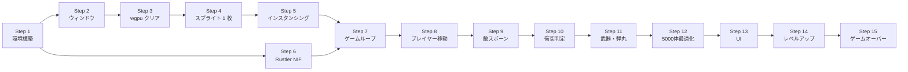

# 実装ステップガイド

このドキュメントは、Elixir x Rust ヴァンパイアサバイバーライクゲームを**ひとつずつ丁寧に**実装するためのステップガイドです。  
各ステップは独立して動作確認できる単位に分割されています。

---

## 全体ロードマップ

```
Step 1: 環境構築
Step 2: Rust クレート雛形 + ウィンドウ表示
Step 3: wgpu 初期化 + 単色クリア
Step 4: スプライト 1 枚描画
Step 5: インスタンシング（100体描画）
Step 6: Elixir プロジェクト + Rustler NIF 連携
Step 7: ゲームループ（GenServer 60Hz tick）
Step 8: プレイヤー移動
Step 9: 敵スポーン + 追跡 AI（100体）
Step 10: 衝突判定（Spatial Hash）
Step 11: 武器・弾丸システム
Step 12: 大規模スポーン（5000体）+ パフォーマンス最適化
Step 13: UI（HP バー・スコア・タイマー）
Step 14: レベルアップ・武器選択
Step 15: ゲームオーバー・リスタート
```

---

## Step 1: 環境構築

**目標**: 開発に必要なすべてのツールをインストールし、動作確認する。

### 1.1 Rust のインストール

```powershell
# rustup インストーラをダウンロードして実行
winget install Rustlang.Rustup

# または公式サイト https://rustup.rs/ からインストーラを実行

# インストール確認
rustc --version   # rustc 1.80.0 以上
cargo --version   # cargo 1.80.0 以上
```

### 1.2 Elixir / Erlang のインストール

```powershell
# 1. Erlang OTP を winget でインストール
winget install Erlang.ErlangOTP --accept-package-agreements --accept-source-agreements
# → C:\Program Files\Erlang OTP\ にインストールされる

# 2. Elixir 公式インストーラ（OTP 28 対応版）をダウンロードして実行
#    Elixir のリリース一覧ページから、最新の `elixir-otp-28.exe` をダウンロードします:
#    https://github.com/elixir-lang/elixir/releases
#    ダウンロード後、サイレントインストール:
& "elixir-otp-28.exe" /S
# → C:\Program Files\Elixir\ にインストールされる

# 3. ユーザー PATH に追加（PowerShell）
$pathsToAdd = @(
    "C:\Program Files\Erlang OTP\bin",
    "C:\Program Files\Elixir\bin"
)
$userPath = [System.Environment]::GetEnvironmentVariable("PATH", "User")
$pathArray = $userPath.Split(';') | Where-Object { $_ }
foreach ($p in $pathsToAdd) {
    if ($pathArray -notcontains $p) {
        $pathArray += $p
    }
}
$newPath = $pathArray -join ';'
[System.Environment]::SetEnvironmentVariable("PATH", $newPath, "User")
# ターミナルを再起動して PATH を反映させること

# インストール確認
elixir --version   # Elixir 1.19.5 以上
erl -eval 'erlang:display(erlang:system_info(otp_release)), halt().'  # OTP 28 以上
```

### 1.3 GPU ドライバ確認（wgpu 用）

Windows では DirectX 12 が使用されます。

```powershell
# DirectX 診断ツールで確認
dxdiag
# 「ディスプレイ」タブ → DirectX バージョンが 12 以上であること
```

### 1.4 動作確認

```powershell
rustc --version
cargo --version
elixir --version
mix --version
```

**チェックポイント**: すべてのコマンドがバージョンを表示すれば OK。

---

## Step 2: Rust クレート雛形 + ウィンドウ表示

**目標**: winit でウィンドウを開き、タイトルバーに「Elixir x Rust Survivor」と表示する。

### 2.1 プロジェクト構造の作成

```powershell
# リポジトリルートで実行
mkdir platform\windows
mkdir native\game_native\src

# Rust クレートの初期化
cd native\game_native
cargo init --lib
```

### 2.2 Cargo.toml の設定

`native/game_native/Cargo.toml` を以下の内容にする:

```toml
[package]
name = "game_native"
version = "0.1.0"
edition = "2024"

[lib]
name = "game_native"
crate-type = ["cdylib"]  # Rustler NIF 用（後のステップで使用）

[[bin]]
name = "game_window"
path = "src/main.rs"

[dependencies]
winit = "0.30.12"
pollster = "0.4"

[profile.dev]
opt-level = 1  # デバッグビルドでも最低限の最適化

[profile.release]
opt-level = 3
lto = true
codegen-units = 1
```

### 2.3 ウィンドウ表示コード

`native/game_native/src/main.rs`（動作確認用の一時ファイル）:

```rust
use winit::{
    application::ApplicationHandler,
    event::WindowEvent,
    event_loop::{ActiveEventLoop, EventLoop},
    window::{Window, WindowId},
};

#[derive(Default)]
struct App {
    window: Option<Window>,
}

impl ApplicationHandler for App {
    fn resumed(&mut self, event_loop: &ActiveEventLoop) {
        self.window = Some(
            event_loop
                .create_window(
                    Window::default_attributes()
                        .with_title("Elixir x Rust Survivor")
                        .with_inner_size(winit::dpi::LogicalSize::new(1280, 720)),
                )
                .expect("ウィンドウの作成に失敗しました"),
        );
    }

    fn window_event(&mut self, event_loop: &ActiveEventLoop, _id: WindowId, event: WindowEvent) {
        match event {
            WindowEvent::CloseRequested => event_loop.exit(),
            WindowEvent::RedrawRequested => {
                // Step 3 以降で描画コードを実装する
            }
            _ => {}
        }
    }
}

fn main() -> Result<(), Box<dyn std::error::Error>> {
    let event_loop = EventLoop::new()?;
    let mut app = App::default();
    event_loop.run_app(&mut app)?;
    Ok(())
}
```

### 2.4 ビルドと実行

```powershell
cd native\game_native
cargo run --bin game_window
```

**チェックポイント**: 1280×720 のウィンドウが開き、閉じるボタンで終了できれば OK。

---

## Step 3: wgpu 初期化 + 単色クリア

**目標**: wgpu を初期化し、画面を濃い紫（ゲームの背景色）でクリアする。

### 3.1 依存関係の追加

`Cargo.toml` に追加:

```toml
[dependencies]
winit = "0.30.12"
wgpu = "24"
pollster = "0.3"
```

### 3.2 wgpu 初期化の流れ

```
Instance → Surface → Adapter → Device + Queue → SurfaceConfiguration
```

```rust
// native/game_native/src/renderer/mod.rs

use std::sync::Arc;
use winit::window::Window;

pub struct Renderer {
    surface: wgpu::Surface<'static>,
    device: wgpu::Device,
    queue: wgpu::Queue,
    config: wgpu::SurfaceConfiguration,
}

impl Renderer {
    pub async fn new(window: Arc<Window>) -> Self {
        let instance = wgpu::Instance::default();
        let surface = instance.create_surface(window.clone()).unwrap();

        let adapter = instance
            .request_adapter(&wgpu::RequestAdapterOptions {
                power_preference: wgpu::PowerPreference::HighPerformance,
                compatible_surface: Some(&surface),
                ..Default::default()
            })
            .await
            .unwrap();

        let (device, queue) = adapter
            .request_device(&wgpu::DeviceDescriptor::default(), None)
            .await
            .unwrap();

        let size = window.inner_size();
        let config = surface
            .get_default_config(&adapter, size.width, size.height)
            .unwrap();
        surface.configure(&device, &config);

        Self { surface, device, queue, config }
    }

    pub fn resize(&mut self, new_width: u32, new_height: u32) {
        if new_width == 0 || new_height == 0 {
            return;
        }
        self.config.width = new_width;
        self.config.height = new_height;
        self.surface.configure(&self.device, &self.config);
    }

    pub fn render(&mut self) {
        let output = match self.surface.get_current_texture() {
            Ok(t) => t,
            Err(wgpu::SurfaceError::Lost | wgpu::SurfaceError::Outdated) => {
                self.surface.configure(&self.device, &self.config);
                return;
            }
            Err(e) => {
                eprintln!("Surface error: {e:?}");
                return;
            }
        };

        let view = output.texture.create_view(&Default::default());
        let mut encoder = self.device.create_command_encoder(&wgpu::CommandEncoderDescriptor {
            label: Some("Render Encoder"),
        });
        {
            let _pass = encoder.begin_render_pass(&wgpu::RenderPassDescriptor {
                label: Some("Clear Pass"),
                color_attachments: &[Some(wgpu::RenderPassColorAttachment {
                    view: &view,
                    resolve_target: None,
                    ops: wgpu::Operations {
                        load: wgpu::LoadOp::Clear(wgpu::Color {
                            r: 0.05, g: 0.0, b: 0.1, a: 1.0,  // 濃い紫
                        }),
                        store: wgpu::StoreOp::Store,
                    },
                })],
                depth_stencil_attachment: None,
                timestamp_writes: None,
                occlusion_query_set: None,
            });
        }

        self.queue.submit([encoder.finish()]);
        output.present();
    }
}
```

### 3.3 main.rs の更新

`native/game_native/src/main.rs` を以下の内容に更新する:

```rust
mod renderer;

use std::sync::Arc;

use renderer::Renderer;
use winit::{
    application::ApplicationHandler,
    event::WindowEvent,
    event_loop::{ActiveEventLoop, EventLoop},
    window::{Window, WindowId},
};

#[derive(Default)]
struct App {
    window: Option<Arc<Window>>,
    renderer: Option<Renderer>,
}

impl ApplicationHandler for App {
    fn resumed(&mut self, event_loop: &ActiveEventLoop) {
        let window = Arc::new(
            event_loop
                .create_window(
                    Window::default_attributes()
                        .with_title("Elixir x Rust Survivor")
                        .with_inner_size(winit::dpi::LogicalSize::new(1280u32, 720u32)),
                )
                .expect("ウィンドウの作成に失敗しました"),
        );

        let renderer = pollster::block_on(Renderer::new(window.clone()));

        self.window = Some(window);
        self.renderer = Some(renderer);
    }

    fn window_event(&mut self, event_loop: &ActiveEventLoop, _id: WindowId, event: WindowEvent) {
        match event {
            WindowEvent::CloseRequested => event_loop.exit(),
            WindowEvent::Resized(size) => {
                if let Some(renderer) = self.renderer.as_mut() {
                    renderer.resize(size.width, size.height);
                }
            }
            WindowEvent::RedrawRequested => {
                if let Some(renderer) = self.renderer.as_mut() {
                    renderer.render();
                }
                if let Some(window) = self.window.as_ref() {
                    window.request_redraw();
                }
            }
            _ => {}
        }
    }
}

fn main() -> Result<(), Box<dyn std::error::Error>> {
    let event_loop = EventLoop::new()?;
    let mut app = App::default();
    event_loop.run_app(&mut app)?;
    Ok(())
}
```

### 3.4 ビルドと実行

```powershell
cd native\game_native
cargo run --bin game_window
```

**チェックポイント**: ウィンドウが濃い紫色で塗りつぶされれば OK。

---

## Step 4: スプライト 1 枚描画

**目標**: テクスチャアトラスから 1 枚のスプライトを画面中央に描画する。

### 4.1 依存関係の追加

```toml
[dependencies]
# ... 既存 ...
bytemuck = { version = "1", features = ["derive"] }
image = "0.25"
```

### 4.2 テクスチャアトラスの準備

`assets/sprites/atlas.png` を用意する（仮のプレースホルダー画像でも可）。  
詳細な仕様は [SPEC.md § 5.5](SPEC.md#55-テクスチャアトラス仕様) を参照。

### 4.3 頂点・インデックスバッファ

```rust
// 四角形 1 枚（正規化座標 0.0〜1.0）
const VERTICES: &[[f32; 2]] = &[
    [0.0, 0.0],  // 左上
    [1.0, 0.0],  // 右上
    [1.0, 1.0],  // 右下
    [0.0, 1.0],  // 左下
];
const INDICES: &[u16] = &[0, 1, 2, 0, 2, 3];
```

### 4.4 WGSL シェーダ（単一スプライト版）

`native/game_native/src/renderer/shaders/sprite.wgsl`:

```wgsl
@group(0) @binding(0) var sprite_texture: texture_2d<f32>;
@group(0) @binding(1) var sprite_sampler: sampler;

struct VertexInput {
    @location(0) position: vec2<f32>,
};

struct VertexOutput {
    @builtin(position) clip_position: vec4<f32>,
    @location(0) uv: vec2<f32>,
};

@vertex
fn vs_main(in: VertexInput) -> VertexOutput {
    var out: VertexOutput;
    // 画面中央に 64x64 px のスプライトを配置（仮）
    let world_pos = in.position * vec2<f32>(64.0, 64.0) - vec2<f32>(32.0, 32.0);
    out.clip_position = vec4<f32>(world_pos / vec2<f32>(640.0, 360.0), 0.0, 1.0);
    out.uv = in.position;
    return out;
}

@fragment
fn fs_main(in: VertexOutput) -> @location(0) vec4<f32> {
    return textureSample(sprite_texture, sprite_sampler, in.uv);
}
```

**チェックポイント**: 画面中央にスプライトが 1 枚表示されれば OK。

---

## Step 5: インスタンシング（100体描画）

**目標**: GPU インスタンシングで 100 体のスプライトを 1 draw call で描画する。

### 5.1 SpriteInstance 構造体

```rust
#[repr(C)]
#[derive(Copy, Clone, bytemuck::Pod, bytemuck::Zeroable)]
pub struct SpriteInstance {
    pub position: [f32; 2],
    pub size: [f32; 2],
    pub uv_offset: [f32; 2],
    pub uv_size: [f32; 2],
    pub color_tint: [f32; 4],
}
```

### 5.2 インスタンスバッファの作成

```rust
let instances: Vec<SpriteInstance> = (0..100)
    .map(|i| SpriteInstance {
        position: [(i % 10) as f32 * 64.0, (i / 10) as f32 * 64.0],
        size: [64.0, 64.0],
        uv_offset: [0.0, 0.0],
        uv_size: [1.0, 1.0],
        color_tint: [1.0, 1.0, 1.0, 1.0],
    })
    .collect();

let instance_buffer = device.create_buffer_init(&wgpu::util::BufferInitDescriptor {
    label: Some("Instance Buffer"),
    contents: bytemuck::cast_slice(&instances),
    usage: wgpu::BufferUsages::VERTEX | wgpu::BufferUsages::COPY_DST,
});
```

### 5.3 draw_indexed でインスタンス描画

```rust
render_pass.draw_indexed(
    0..6,                    // インデックス数（四角形 2 三角形）
    0,
    0..instances.len() as u32,  // インスタンス数
);
```

**チェックポイント**: 100 体のスプライトが格子状に表示されれば OK。  
FPS カウンタを追加して 60fps 以上であることを確認する。

---

## Step 6: Elixir プロジェクト + Rustler NIF 連携

**目標**: `mix new` で Elixir プロジェクトを作成し、Rustler NIF で Rust の関数を呼び出す。

### 6.1 Elixir プロジェクトの作成

```powershell
# リポジトリルートで実行
mix new . --app game --sup
```

### 6.2 mix.exs の設定

```elixir
defmodule Game.MixProject do
  use Mix.Project

  def project do
    [
      app: :game,
      version: "0.1.0",
      elixir: "~> 1.17",
      start_permanent: Mix.env() == :prod,
      deps: deps(),
      # Windows ビルド出力先の設定
      build_path: build_path(),
    ]
  end

  defp build_path do
    case Mix.env() do
      :prod -> "platform/windows/_build/release"
      _     -> "platform/windows/_build/debug"
    end
  end

  defp deps do
    [
      {:rustler, "~> 0.34"},
    ]
  end
end
```

### 6.3 NifBridge モジュールの作成

```elixir
# lib/game/nif_bridge.ex
defmodule Game.NifBridge do
  use Rustler,
    otp_app: :game,
    crate: :game_native

  def add(_a, _b), do: :erlang.nif_error(:nif_not_loaded)
end
```

### 6.4 Rust 側に NIF 関数を追加

`native/game_native/src/lib.rs`:

```rust
use rustler::NifResult;

#[rustler::nif]
fn add(a: i64, b: i64) -> NifResult<i64> {
    Ok(a + b)
}

rustler::init!("Elixir.Game.NifBridge", [add]);
```

### 6.5 ビルドと動作確認

```powershell
mix deps.get
mix compile
iex -S mix
# iex> Game.NifBridge.add(1, 2)
# => 3
```

**チェックポイント**: `Game.NifBridge.add(1, 2)` が `3` を返せば OK。

---

## Step 7: ゲームループ（GenServer 60Hz tick）

**目標**: Elixir の GenServer で 60Hz のゲームループを実装し、Rust の `physics_step` NIF を呼び出す。

### 7.1 GameWorld NIF の実装

```rust
// native/game_native/src/lib.rs
use rustler::ResourceArc;
use std::sync::Mutex;

pub struct GameWorld {
    pub frame_id: u32,
}

#[rustler::nif]
fn create_world() -> ResourceArc<Mutex<GameWorld>> {
    ResourceArc::new(Mutex::new(GameWorld { frame_id: 0 }))
}

#[rustler::nif(schedule = "DirtyCpu")]
fn physics_step(world: ResourceArc<Mutex<GameWorld>>, delta_ms: f64) -> u32 {
    let mut w = world.lock().unwrap();
    w.frame_id += 1;
    w.frame_id
}
```

### 7.2 GameLoop GenServer

```elixir
# lib/game/game_loop.ex
defmodule Game.GameLoop do
  use GenServer
  require Logger

  @tick_ms 16

  def start_link(opts), do: GenServer.start_link(__MODULE__, opts, name: __MODULE__)

  def init(_opts) do
    world_ref = Game.NifBridge.create_world()
    Process.send_after(self(), :tick, @tick_ms)
    {:ok, %{world_ref: world_ref, last_tick: now_ms(), frame_count: 0}}
  end

  def handle_info(:tick, state) do
    delta = now_ms() - state.last_tick
    _frame_id = Game.NifBridge.physics_step(state.world_ref, delta * 1.0)

    if rem(state.frame_count, 60) == 0 do
      Logger.info("Frame: #{state.frame_count}")
    end

    Process.send_after(self(), :tick, @tick_ms)
    {:noreply, %{state | last_tick: now_ms(), frame_count: state.frame_count + 1}}
  end

  defp now_ms, do: System.monotonic_time(:millisecond)
end
```

**チェックポイント**: `iex -S mix` で起動後、ログに `Frame: 0`, `Frame: 60`, ... が 1 秒ごとに出力されれば OK。

---

## Step 8: プレイヤー移動

**目標**: WASD キーでプレイヤーを移動させ、wgpu で描画する。

### 8.1 InputHandler GenServer

```elixir
# lib/game/input_handler.ex
defmodule Game.InputHandler do
  use GenServer

  def start_link(opts), do: GenServer.start_link(__MODULE__, opts, name: __MODULE__)

  def init(_opts), do: {:ok, %{keys_held: MapSet.new()}}

  def key_down(key), do: GenServer.cast(__MODULE__, {:key_down, key})
  def key_up(key),   do: GenServer.cast(__MODULE__, {:key_up, key})

  def handle_cast({:key_down, key}, state) do
    new_state = %{state | keys_held: MapSet.put(state.keys_held, key)}
    # GameLoop に移動ベクトルを通知
    dx =
      (if MapSet.member?(new_state.keys_held, :d), do: 1, else: 0) +
      (if MapSet.member?(new_state.keys_held, :a), do: -1, else: 0)
    dy =
      (if MapSet.member?(new_state.keys_held, :s), do: 1, else: 0) +
      (if MapSet.member?(new_state.keys_held, :w), do: -1, else: 0)
    GenServer.cast(Game.GameLoop, {:input, :move, {dx, dy}})
    {:noreply, new_state}
  end
  # key_up も同様
end
```

### 8.2 Rust 側プレイヤー移動

```rust
// native/game_native/src/lib.rs に追加

#[rustler::nif]
fn set_player_input(
    world: ResourceArc<Mutex<GameWorld>>,
    dx: f32,
    dy: f32,
) -> rustler::Atom {
    let mut w = world.lock().unwrap();
    w.player.input_dx = dx;
    w.player.input_dy = dy;
    rustler::atoms::ok()
}
```

**チェックポイント**: WASD でプレイヤースプライトが移動すれば OK。

---

## Step 9: 敵スポーン + 追跡 AI（100体）

**目標**: 画面外から敵を 100 体スポーンさせ、プレイヤーを追跡させる。

### 9.1 SpawnSystem

```elixir
# lib/game/systems/spawn_system.ex
defmodule Game.SpawnSystem do
  @spawn_interval_ms 2000  # 2 秒ごとにスポーン

  def maybe_spawn(world_ref, elapsed_ms, last_spawn_ms) do
    if elapsed_ms - last_spawn_ms >= @spawn_interval_ms do
      Game.NifBridge.spawn_enemies(world_ref, :slime, 10)
      elapsed_ms
    else
      last_spawn_ms
    end
  end
end
```

### 9.2 Rust 側 AI（Chase）

```rust
// native/game_native/src/physics/movement.rs

pub fn update_chase_ai(
    enemies: &mut EnemyWorld,
    player_x: f32,
    player_y: f32,
    dt: f32,
) {
    for i in 0..enemies.count {
        if !enemies.alive[i] { continue; }
        let dx = player_x - enemies.positions_x[i];
        let dy = player_y - enemies.positions_y[i];
        let dist = (dx * dx + dy * dy).sqrt().max(0.001);
        enemies.velocities_x[i] = (dx / dist) * enemies.speeds[i];
        enemies.velocities_y[i] = (dy / dist) * enemies.speeds[i];
        enemies.positions_x[i] += enemies.velocities_x[i] * dt;
        enemies.positions_y[i] += enemies.velocities_y[i] * dt;
    }
}
```

**チェックポイント**: 100 体の敵がプレイヤーに向かって移動すれば OK。

---

## Step 10: 衝突判定（Spatial Hash）

**目標**: Dual Spatial Hash で敵とプレイヤー・弾丸の衝突を検出し、HP を減らす。

### 10.1 Spatial Hash の実装

詳細な実装は [SPEC.md § 6.1](SPEC.md#61-dual-spatial-hash) を参照。

```rust
// native/game_native/src/physics/spatial_hash.rs
pub struct SpatialHash {
    cell_size: f32,
    cells: std::collections::HashMap<(i32, i32), Vec<usize>>,
}

impl SpatialHash {
    pub fn new(cell_size: f32) -> Self {
        Self { cell_size, cells: Default::default() }
    }

    pub fn clear(&mut self) { self.cells.clear(); }

    pub fn insert(&mut self, id: usize, x: f32, y: f32) {
        let key = self.cell_key(x, y);
        self.cells.entry(key).or_default().push(id);
    }

    fn cell_key(&self, x: f32, y: f32) -> (i32, i32) {
        ((x / self.cell_size).floor() as i32,
         (y / self.cell_size).floor() as i32)
    }

    pub fn query_nearby(&self, x: f32, y: f32, radius: f32) -> Vec<usize> {
        let r = (radius / self.cell_size).ceil() as i32;
        let cx = (x / self.cell_size).floor() as i32;
        let cy = (y / self.cell_size).floor() as i32;
        let mut result = Vec::new();
        for ix in (cx - r)..=(cx + r) {
            for iy in (cy - r)..=(cy + r) {
                if let Some(ids) = self.cells.get(&(ix, iy)) {
                    result.extend_from_slice(ids);
                }
            }
        }
        result
    }
}
```

**チェックポイント**: 敵がプレイヤーに触れると HP が減り、0 になると敵が消えれば OK。

---

## Step 11: 武器・弾丸システム

**目標**: Magic Wand（最近接敵への自動発射）を実装する。

### 11.1 弾丸の SoA データ構造

```rust
pub struct BulletWorld {
    pub positions_x: Vec<f32>,
    pub positions_y: Vec<f32>,
    pub velocities_x: Vec<f32>,
    pub velocities_y: Vec<f32>,
    pub damage: Vec<i32>,
    pub lifetime: Vec<f32>,
    pub alive: Vec<bool>,
    pub count: usize,
}
```

### 11.2 最近接敵の検索

```rust
pub fn find_nearest_enemy(enemies: &EnemyWorld, px: f32, py: f32) -> Option<usize> {
    let mut min_dist = f32::MAX;
    let mut nearest = None;
    for i in 0..enemies.count {
        if !enemies.alive[i] { continue; }
        let dx = enemies.positions_x[i] - px;
        let dy = enemies.positions_y[i] - py;
        let dist = dx * dx + dy * dy;
        if dist < min_dist {
            min_dist = dist;
            nearest = Some(i);
        }
    }
    nearest
}
```

**チェックポイント**: プレイヤーが自動的に最近接の敵に向けて弾を発射し、敵に当たると HP が減れば OK。

---

## Step 12: 大規模スポーン（5000体）+ パフォーマンス最適化

**目標**: 5000 体の敵を 60fps で動かす。

### 12.1 パフォーマンス計測

```rust
// 各処理のタイムスタンプを計測
let t0 = std::time::Instant::now();
update_movement(&mut world.enemies, ...);
let t1 = std::time::Instant::now();
rebuild_spatial_hash(&mut world.collision, &world.enemies);
let t2 = std::time::Instant::now();
resolve_collisions(&mut world, ...);
let t3 = std::time::Instant::now();

// 16ms を超えていたら警告
if (t3 - t0).as_millis() > 16 {
    eprintln!("Frame budget exceeded: {}ms", (t3 - t0).as_millis());
}
```

### 12.2 最適化チェックリスト

| 最適化 | 効果 | 実装難易度 |
|---|---|---|
| SoA レイアウト（既実装） | キャッシュ効率向上 | 低 |
| `alive` フラグのビットマスク化 | ブランチ削減 | 中 |
| Spatial Hash のセルサイズ調整 | クエリ速度向上 | 低 |
| `rayon` による並列移動計算 | CPU コア活用 | 中 |
| SIMD（`std::simd` or `wide`） | 4〜8倍高速化 | 高 |

### 12.3 rayon による並列化（推奨）

```toml
# Cargo.toml に追加
rayon = "1"
```

```rust
use rayon::prelude::*;

// 移動計算を並列化
(0..enemies.count)
    .into_par_iter()
    .filter(|&i| enemies.alive[i])
    .for_each(|i| {
        // 移動計算（各要素は独立しているので並列安全）
    });
```

**チェックポイント**: 5000 体が 60fps（16ms 以内）で動作すれば OK。  
フレーム時間をログに出力して確認する。

---

## Step 13: UI（HP バー・スコア・タイマー）

**目標**: 画面上部に HP バー、スコア、経過時間を表示する。

### 13.1 UI レンダリングの方針

wgpu の別パイプライン（UI 専用）を使用するか、`egui` ライブラリを統合する。

```toml
# Cargo.toml に追加（egui を使う場合）
egui = "0.29"
egui-wgpu = "0.29"
egui-winit = "0.29"
```

### 13.2 HP バーの描画

```rust
// egui を使った HP バー
egui::Window::new("HUD").show(ctx, |ui| {
    let hp_ratio = player.health as f32 / player.max_health as f32;
    ui.add(egui::ProgressBar::new(hp_ratio).text(
        format!("HP: {}/{}", player.health, player.max_health)
    ));
    ui.label(format!("Score: {}", score));
    ui.label(format!("Time: {:.0}s", elapsed_seconds));
});
```

**チェックポイント**: HP バー・スコア・タイマーが画面に表示されれば OK。

---

## Step 14: レベルアップ・武器選択

**目標**: 経験値が溜まるとレベルアップ画面が表示され、3 択から武器を選べる。

### 14.1 Elixir 側でのレベルアップ管理

```elixir
# lib/game/systems/level_system.ex
defmodule Game.LevelSystem do
  @exp_table [0, 10, 25, 45, 70, 100, 135, 175, 220, 270]

  def check_level_up(current_exp, current_level) do
    required = Enum.at(@exp_table, current_level, :infinity)
    if current_exp >= required do
      {:level_up, current_level + 1}
    else
      :no_change
    end
  end
end
```

### 14.2 武器選択 UI

レベルアップ時にゲームを一時停止し、3 択の武器カードを表示する。  
プレイヤーが選択すると `Game.NifBridge.add_weapon/2` で Rust 側に通知する。

**チェックポイント**: レベルアップ時に選択画面が表示され、武器が追加されれば OK。

---

## Step 15: ゲームオーバー・リスタート

**目標**: HP が 0 になるとゲームオーバー画面が表示され、リスタートできる。

### 15.1 ゲームフェーズ管理

```elixir
# GameLoop の state にフェーズを追加
defmodule Game.GameLoop do
  # フェーズ: :playing | :paused | :level_up | :game_over
  def handle_info(:tick, %{phase: :game_over} = state) do
    # ゲームオーバー中は物理演算を止める
    {:noreply, state}
  end

  def handle_cast(:restart, state) do
    {:ok, new_world} = {:ok, Game.NifBridge.create_world()}
    {:noreply, %{state |
      world_ref: new_world,
      phase: :playing,
      score: 0,
      elapsed_seconds: 0.0,
    }}
  end
end
```

**チェックポイント**: HP が 0 になるとゲームオーバー画面が表示され、R キーでリスタートできれば OK。

---

## ビルド出力先

本プロジェクトのビルド成果物は以下のパスに出力されます。

| 環境 | パス |
|---|---|
| デバッグビルド | `platform/windows/_build/debug/` |
| リリースビルド | `platform/windows/_build/release/` |

### デバッグビルド

```powershell
# Elixir（mix.exs で build_path を設定済み）
mix compile

# Rust（Rustler が自動的に呼び出すが、単体でビルドする場合）
cd native\game_native
cargo build
# → native/game_native/target/debug/ に出力
```

### リリースビルド

```powershell
# Elixir
MIX_ENV=prod mix compile

# Rust（Rustler が自動的に呼び出すが、単体でビルドする場合）
cd native\game_native
cargo build --release
# → native/game_native/target/release/ に出力
```

### 実行ファイルのパッケージング（Step 15 完了後）

```powershell
# リリースビルドを platform/windows/_build/release/ にまとめる
mix release
# → platform/windows/_build/release/game/ に実行ファイル一式が生成される
```

---

## 各ステップの依存関係



---

## 参考ドキュメント

- [ゲーム仕様書](SPEC.md) — 各ステップの詳細な技術仕様
- [Elixir 採用理由](WHY_ELIXIR.md) — アーキテクチャの設計思想
- [Rustler ドキュメント](https://docs.rs/rustler) — NIF 実装の詳細
- [wgpu ドキュメント](https://docs.rs/wgpu) — GPU 描画の詳細
- [Learn wgpu](https://sotrh.github.io/learn-wgpu/) — wgpu チュートリアル
