# クオリティアップ ステップガイド

**「及第点から、本物のヴァンサバ系ゲームへ」**

Step 15 までで「動くゲーム」は完成しました。ここからは**プレイヤーが楽しめるゲーム**を目指します。

---

## 現状の整理（Step 15 完了時点）

| 機能 | 状態 |
|---|---|
| プレイヤー移動 | ✅ WASD / 矢印キー |
| 敵スポーン（ウェーブ制） | ✅ 最大 10,000 体 |
| 武器 3 種（MagicWand / Axe / Cross） | ✅ |
| レベルアップ・武器選択 | ✅ |
| HP バー・スコア・タイマー HUD | ✅ |
| ゲームオーバー・リスタート | ✅ |
| 60 FPS 安定動作 | ✅ |

**不足しているもの（クオリティの壁）:**

- 敵が全員同じ見た目・同じ動き → 単調
- 武器が弱く、成長実感がない → レベルアップが空虚
- 視覚フィードバックがない → ヒット感がない
- BGM・SE がない → 没入感がない
- カメラが固定 → マップが狭く感じる
- アイテムドロップがない → 戦略性がない

---

## クオリティアップ ステップ一覧

```
Step 16: ヒットエフェクト（パーティクル）
Step 17: 武器レベルアップ（同じ武器を重ねると強化）
Step 18: 複数の敵タイプ（速い・硬い・大きい）
Step 19: アイテムドロップ（回復・磁石・爆弾）
Step 20: カメラシステム（プレイヤー追従スクロール）
Step 21: 武器の追加（Whip / Fireball / Lightning）
Step 22: BGM・SE（rodio クレート）
Step 23: スプライトアニメーション（フレーム切り替え）
Step 24: ボスエネミー（定期出現・特殊行動）
Step 25: ゲームバランス調整・ポリッシュ
```

---

## Step 16: ヒットエフェクト（パーティクル）

### 目標
敵が弾丸に当たったとき、死んだとき、プレイヤーがダメージを受けたときに**視覚フィードバック**を追加する。

### なぜ重要か
ヒット感はゲームの「気持ちよさ」の根幹。これがないとどれだけ敵を倒しても達成感がない。

### 実装内容

#### Rust 側: パーティクル SoA を追加

```rust
// native/game_native/src/lib.rs に追加

pub struct ParticleWorld {
    pub positions_x:  Vec<f32>,
    pub positions_y:  Vec<f32>,
    pub velocities_x: Vec<f32>,
    pub velocities_y: Vec<f32>,
    pub lifetime:     Vec<f32>,   // 残り寿命（秒）
    pub max_lifetime: Vec<f32>,   // 初期寿命（フェードアウト計算用）
    pub color:        Vec<[f32; 4]>, // RGBA
    pub size:         Vec<f32>,   // ピクセルサイズ
    pub alive:        Vec<bool>,
    pub count:        usize,
}

impl ParticleWorld {
    pub fn emit(&mut self, x: f32, y: f32, count: usize, color: [f32; 4], rng: &mut SimpleRng) {
        for _ in 0..count {
            let angle = rng.next_f32() * std::f32::consts::TAU;
            let speed = 50.0 + rng.next_f32() * 150.0;
            let vx = angle.cos() * speed;
            let vy = angle.sin() * speed;
            let lifetime = 0.3 + rng.next_f32() * 0.4;
            self.spawn(x, y, vx, vy, lifetime, color, 4.0 + rng.next_f32() * 4.0);
        }
    }
}
```

#### パーティクルの更新（physics_step 内）

```rust
// パーティクル更新: 移動 + フェードアウト
for i in 0..w.particles.len() {
    if !w.particles.alive[i] { continue; }
    w.particles.positions_x[i] += w.particles.velocities_x[i] * dt;
    w.particles.positions_y[i] += w.particles.velocities_y[i] * dt;
    // 重力効果
    w.particles.velocities_y[i] += 200.0 * dt;
    w.particles.lifetime[i] -= dt;
    if w.particles.lifetime[i] <= 0.0 {
        w.particles.kill(i);
    }
}
```

#### レンダラー側: パーティクルを描画

```rust
// renderer/mod.rs: get_render_data の戻り値にパーティクルを追加
// color_tint の alpha を lifetime/max_lifetime でフェードアウト
let alpha = p.lifetime[i] / p.max_lifetime[i];
instances.push(SpriteInstance {
    position:   [px - p.size[i]/2.0, py - p.size[i]/2.0],
    size:       [p.size[i], p.size[i]],
    uv_offset:  particle_uv().0,
    uv_size:    particle_uv().1,
    color_tint: [r, g, b, alpha],  // ← フェードアウト
});
```

### アトラス更新

```python
# assets/sprites/gen_atlas.py
# パーティクル用の白い円スプライトを追加（192〜255 px 列）
```

### 確認ポイント
- [ ] 敵が死ぬとオレンジ色のパーティクルが飛び散る
- [ ] プレイヤーがダメージを受けると赤いパーティクルが出る
- [ ] パーティクルが自然にフェードアウトする
- [ ] 10,000 体 + パーティクル 1,000 個でも 60 FPS を維持

---

## Step 17: 武器レベルアップ（同じ武器を重ねると強化）

### 目標
レベルアップ時に**すでに持っている武器を選ぶと強化**される。ヴァンサバの核心システム。

### なぜ重要か
「この武器をレベル MAX にしたい」という目標がゲームの縦軸になる。

### 実装内容

#### Rust 側: WeaponSlot にレベルを追加

```rust
pub struct WeaponSlot {
    pub kind:           WeaponKind,
    pub level:          u32,      // 1〜8
    pub cooldown_timer: f32,
}

impl WeaponSlot {
    /// レベルに応じたクールダウン（レベルが上がるほど速く撃てる）
    pub fn effective_cooldown(&self) -> f32 {
        let base = self.kind.cooldown();
        // レベル 1 が基準、レベル 8 で 50% 短縮
        base * (1.0 - (self.level as f32 - 1.0) * 0.07).max(0.5)
    }

    /// レベルに応じたダメージ（レベルが上がるほど強い）
    pub fn effective_damage(&self) -> i32 {
        let base = self.kind.damage();
        base + (self.level as i32 - 1) * (base / 4).max(1)
    }

    /// レベルに応じた弾丸数（MagicWand: Lv3 で 2 発、Lv5 で 3 発）
    pub fn bullet_count(&self) -> usize {
        match self.kind {
            WeaponKind::MagicWand => match self.level {
                1..=2 => 1,
                3..=4 => 2,
                5..=6 => 3,
                _     => 4,
            },
            WeaponKind::Cross => match self.level {
                1..=3 => 4,  // 上下左右
                4..=6 => 8,  // 斜め追加
                _     => 8,
            },
            _ => 1,
        }
    }
}
```

#### add_weapon NIF の更新

```rust
// 同じ武器を選んだ場合はレベルアップ
if let Some(slot) = w.weapon_slots.iter_mut().find(|s| s.kind == kind) {
    slot.level = (slot.level + 1).min(8);
} else if w.weapon_slots.len() < MAX_SLOTS {
    w.weapon_slots.push(WeaponSlot::new(kind));
}
```

#### Elixir 側: LevelSystem の更新

```elixir
# lib/game/systems/level_system.ex
# すでに持っている武器は「Lv.X → Lv.X+1」として表示
def generate_weapon_choices(current_weapons, weapon_levels) do
  all_weapons = [:magic_wand, :axe, :cross]
  # 未所持を優先、次に低レベル武器を優先
  all_weapons
  |> Enum.sort_by(fn w ->
    lv = Map.get(weapon_levels, w, 0)
    if lv == 0, do: -1, else: lv  # 未所持を最優先
  end)
  |> Enum.take(3)
end
```

#### HUD: 武器レベル表示

```
[🔮 Magic Wand Lv.3]  [🪓 Axe Lv.1]  [✝ Cross Lv.2]
```

### 確認ポイント
- [ ] 同じ武器を選ぶとレベルが上がる
- [ ] レベルが上がると弾が速く/強くなる
- [ ] MagicWand Lv.3 で 2 発同時発射される
- [ ] HUD に武器レベルが表示される

---

## Step 18: 複数の敵タイプ

### 目標
**3 種類の敵**を追加して戦略的多様性を生む。

| 敵タイプ | 見た目 | HP | 速度 | サイズ | 経験値 | 特徴 |
|---|---|---|---|---|---|---|
| Slime（スライム） | 緑 | 30 | 80 | 40px | 5 | 基本敵（現在の敵） |
| Bat（コウモリ） | 紫 | 15 | 160 | 24px | 3 | 速いが弱い |
| Golem（ゴーレム） | 灰 | 150 | 40 | 64px | 20 | 遅いが硬い |

### 実装内容

#### Rust 側: EnemyKind を追加

```rust
#[derive(Clone, Copy, PartialEq, Debug)]
#[repr(u8)]
pub enum EnemyKind {
    Slime = 0,
    Bat   = 1,
    Golem = 2,
}

impl EnemyKind {
    pub fn max_hp(&self) -> f32 {
        match self { Self::Slime => 30.0, Self::Bat => 15.0, Self::Golem => 150.0 }
    }
    pub fn speed(&self) -> f32 {
        match self { Self::Slime => 80.0, Self::Bat => 160.0, Self::Golem => 40.0 }
    }
    pub fn radius(&self) -> f32 {
        match self { Self::Slime => 20.0, Self::Bat => 12.0, Self::Golem => 32.0 }
    }
    pub fn exp_reward(&self) -> u32 {
        match self { Self::Slime => 5, Self::Bat => 3, Self::Golem => 20 }
    }
    pub fn damage_per_sec(&self) -> f32 {
        match self { Self::Slime => 20.0, Self::Bat => 10.0, Self::Golem => 40.0 }
    }
}
```

#### EnemyWorld SoA に kind を追加

```rust
pub struct EnemyWorld {
    // ... 既存フィールド ...
    pub kinds: Vec<EnemyKind>,  // 追加
}
```

#### アトラス更新

```
[0..63]    プレイヤー（緑の騎士）
[64..127]  Slime（緑のスライム）
[128..191] Bat（紫のコウモリ）
[192..255] Golem（灰色のゴーレム）
[256..319] 弾丸（白い光球）
[320..383] パーティクル（白い円）
```

#### Elixir 側: SpawnSystem の更新

```elixir
# lib/game/systems/spawn_system.ex
# ウェーブ進行に応じて敵タイプを変える
def enemy_kind_for_wave(elapsed_s) do
  cond do
    elapsed_s < 30  -> :slime              # 序盤: スライムのみ
    elapsed_s < 60  -> Enum.random([:slime, :bat])
    elapsed_s < 120 -> Enum.random([:slime, :bat, :golem])
    true            -> Enum.random([:slime, :bat, :golem])
  end
end
```

### 確認ポイント
- [ ] 30 秒後にコウモリが出現する
- [ ] 60 秒後にゴーレムが出現する
- [ ] ゴーレムは複数発当てないと倒せない
- [ ] 各敵タイプが異なるスプライトで描画される

---

## Step 19: アイテムドロップ

### 目標
敵を倒すと**アイテムが落ちる**。プレイヤーが近づくと自動収集。

| アイテム | ドロップ率 | 効果 |
|---|---|---|
| 経験値宝石（緑） | 100% | EXP +5〜20（敵タイプによる） |
| 回復ポーション（赤） | 5% | HP +20 |
| 磁石（黄） | 2% | 10 秒間、画面内の宝石を自動収集 |

### 実装内容

#### Rust 側: ItemWorld SoA

```rust
#[derive(Clone, Copy, PartialEq)]
pub enum ItemKind { Gem, Potion, Magnet }

pub struct ItemWorld {
    pub positions_x: Vec<f32>,
    pub positions_y: Vec<f32>,
    pub kinds:       Vec<ItemKind>,
    pub value:       Vec<u32>,   // Gem: EXP 量, Potion: 回復量
    pub alive:       Vec<bool>,
    pub count:       usize,
}
```

#### 磁石エフェクト

```rust
// 磁石アクティブ中は宝石がプレイヤーに向かって飛んでくる
if w.magnet_timer > 0.0 {
    for i in 0..w.items.len() {
        if w.items.alive[i] && w.items.kinds[i] == ItemKind::Gem {
            let dx = px - w.items.positions_x[i];
            let dy = py - w.items.positions_y[i];
            let dist = (dx*dx + dy*dy).sqrt().max(1.0);
            w.items.positions_x[i] += (dx/dist) * 300.0 * dt;
            w.items.positions_y[i] += (dy/dist) * 300.0 * dt;
        }
    }
    w.magnet_timer -= dt;
}
```

#### 自動収集判定

```rust
// プレイヤーの収集半径（通常 60px、磁石中は全画面）
let collect_r = if w.magnet_timer > 0.0 { 9999.0 } else { 60.0 };
```

### 確認ポイント
- [ ] 敵を倒すと宝石が落ちる
- [ ] 宝石に近づくと自動収集される
- [ ] 磁石を取ると画面中の宝石が集まってくる
- [ ] 回復ポーションで HP が回復する

---

## Step 20: カメラシステム（プレイヤー追従スクロール）

### 目標
プレイヤーが画面中央に来るようにカメラが追従する。マップを広くして探索感を出す。

### なぜ重要か
固定画面では「逃げ場がない」感が強すぎる。スクロールにより戦略的な立ち回りが可能になる。

### 実装内容

#### Rust 側: カメラ Uniform を追加

```rust
#[repr(C)]
#[derive(Copy, Clone, bytemuck::Pod, bytemuck::Zeroable)]
struct CameraUniform {
    offset: [f32; 2],  // カメラのワールド座標オフセット
    _pad:   [f32; 2],
}
```

#### WGSL シェーダーの更新

```wgsl
// camera offset を引いてスクリーン座標に変換
let world_pos = instance.position - camera.offset;
let screen_pos = (world_pos / screen.half_size) * vec2(1.0, -1.0) - vec2(1.0, -1.0);
```

#### カメラの滑らかな追従（lerp）

```rust
// カメラは即座にではなく、滑らかにプレイヤーを追う
let target_x = player_x - SCREEN_WIDTH  / 2.0;
let target_y = player_y - SCREEN_HEIGHT / 2.0;
let lerp_speed = 5.0;
camera.x += (target_x - camera.x) * lerp_speed * dt;
camera.y += (target_y - camera.y) * lerp_speed * dt;
```

#### マップサイズの拡大

```rust
// constants.rs
pub const MAP_WIDTH:  f32 = 4096.0;
pub const MAP_HEIGHT: f32 = 4096.0;
// プレイヤーの移動範囲をマップ内に制限
```

#### 背景タイル描画

```rust
// カメラ位置に応じてタイルをインスタンシングで描画
// 草地タイルを 64x64 px グリッドで敷き詰める
```

### 確認ポイント
- [ ] プレイヤーが画面中央に常に表示される
- [ ] カメラが滑らかに追従する
- [ ] マップ端でカメラが止まる
- [ ] 背景タイルが正しくスクロールする

---

## Step 21: 武器の追加（Whip / Fireball / Lightning）

### 目標
武器を 6 種類に増やし、プレイスタイルの多様性を生む。

| 武器 | 動作 | 特徴 |
|---|---|---|
| Magic Wand | 最近接敵に自動照準 | 基本武器（既存） |
| Axe | 放物線を描いて飛ぶ | 高ダメージ（既存） |
| Cross | 上下左右 4 方向 | 範囲攻撃（既存） |
| **Whip** | プレイヤー周囲を薙ぎ払う | 近距離・扇状範囲 |
| **Fireball** | 敵を貫通する炎弾 | 貫通・複数ヒット |
| **Lightning** | 最近接から連鎖する電撃 | チェーン・最大 5 体 |

### Whip の実装

```rust
WeaponKind::Whip => {
    // プレイヤーの移動方向に扇状の判定を出す
    let whip_range = 120.0 + (slot.level as f32 - 1.0) * 20.0;
    let whip_angle = std::f32::consts::PI * 0.6; // 108度
    // 扇形内の敵に直接ダメージ（弾丸を生成しない）
    for ei in 0..w.enemies.len() {
        if !w.enemies.alive[ei] { continue; }
        let dx = w.enemies.positions_x[ei] - px;
        let dy = w.enemies.positions_y[ei] - py;
        let dist = (dx*dx + dy*dy).sqrt();
        if dist > whip_range { continue; }
        let angle = dy.atan2(dx);
        let diff = (angle - facing_angle).abs();
        if diff < whip_angle / 2.0 {
            w.enemies.hp[ei] -= dmg as f32;
            // ヒットエフェクト
        }
    }
}
```

### Lightning のチェーン実装

```rust
WeaponKind::Lightning => {
    // 最近接敵から始まり、最大 chain_count 体に連鎖
    let chain_count = 2 + slot.level as usize / 2; // Lv1: 2体, Lv8: 6体
    let mut hit_set = std::collections::HashSet::new();
    let mut current = find_nearest_enemy(&w.enemies, px, py);
    for _ in 0..chain_count {
        if let Some(ei) = current {
            w.enemies.hp[ei] -= dmg as f32;
            hit_set.insert(ei);
            // 次のターゲット: ei から最も近い未ヒット敵
            current = find_nearest_enemy_excluding(&w.enemies, 
                w.enemies.positions_x[ei], w.enemies.positions_y[ei], &hit_set);
        }
    }
}
```

### Elixir 側の更新

```elixir
# lib/game/systems/level_system.ex
@all_weapons [:magic_wand, :axe, :cross, :whip, :fireball, :lightning]
```

### 確認ポイント
- [ ] Whip が扇状に敵を薙ぎ払う
- [ ] Fireball が敵を貫通する
- [ ] Lightning が最大 5 体に連鎖する
- [ ] 各武器のレベルアップ効果が機能する

---

## Step 22: BGM・SE（rodio クレート）

### 目標
**音響効果**を追加して没入感を高める。

### 必要な音源
| 音源 | 形式 | 用途 |
|---|---|---|
| bgm.ogg | OGG Vorbis | ループ BGM |
| hit.wav | WAV | 敵ヒット音 |
| death.wav | WAV | 敵撃破音 |
| level_up.wav | WAV | レベルアップ音 |
| player_hurt.wav | WAV | プレイヤーダメージ音 |
| item_pickup.wav | WAV | アイテム収集音 |

### Cargo.toml への追加

```toml
[dependencies]
rodio = "0.20"
```

### 実装

```rust
// audio.rs
use rodio::{Decoder, OutputStream, OutputStreamHandle, Sink, Source};

pub struct AudioManager {
    _stream:       OutputStream,
    stream_handle: OutputStreamHandle,
    bgm_sink:      Sink,
}

impl AudioManager {
    pub fn new() -> Self {
        let (_stream, stream_handle) = OutputStream::try_default().unwrap();
        let bgm_sink = Sink::try_new(&stream_handle).unwrap();
        Self { _stream, stream_handle, bgm_sink }
    }

    pub fn play_bgm(&self, bytes: &'static [u8]) {
        let cursor = std::io::Cursor::new(bytes);
        let source = Decoder::new(cursor).unwrap().repeat_infinite();
        self.bgm_sink.append(source);
    }

    pub fn play_se(&self, bytes: &'static [u8]) {
        let cursor = std::io::Cursor::new(bytes);
        let source = Decoder::new(cursor).unwrap();
        let sink = Sink::try_new(&self.stream_handle).unwrap();
        sink.append(source);
        sink.detach(); // 再生後に自動解放
    }
}
```

### 音源の埋め込み

```rust
// main.rs
static BGM_BYTES:         &[u8] = include_bytes!("../../../assets/audio/bgm.ogg");
static HIT_BYTES:         &[u8] = include_bytes!("../../../assets/audio/hit.wav");
static LEVEL_UP_BYTES:    &[u8] = include_bytes!("../../../assets/audio/level_up.wav");
```

### 確認ポイント
- [ ] ゲーム開始と同時に BGM が流れる
- [ ] 敵を倒すと SE が鳴る
- [ ] レベルアップ時に SE が鳴る
- [ ] プレイヤーがダメージを受けると SE が鳴る

---

## Step 23: スプライトアニメーション

### 目標
キャラクターが**アニメーション**する。静止画から生き生きとしたキャラクターへ。

### アニメーション仕様

| キャラクター | フレーム数 | FPS | アニメーション |
|---|---|---|---|
| プレイヤー | 4 フレーム | 8 fps | 歩行ループ |
| Slime | 4 フレーム | 6 fps | バウンスループ |
| Bat | 2 フレーム | 12 fps | 羽ばたきループ |
| Golem | 2 フレーム | 4 fps | 歩行ループ |

### アトラス設計（256 × 256 px に拡張）

```
行 0 (y=0):   プレイヤー歩行 4 フレーム（各 64x64）
行 1 (y=64):  Slime 4 フレーム（各 64x64）
行 2 (y=128): Bat 2 フレーム + Golem 2 フレーム（各 64x64）
行 3 (y=192): 弾丸・パーティクル・アイテム各種
```

### Rust 側: アニメーションタイマー

```rust
pub struct EnemyWorld {
    // ... 既存フィールド ...
    pub anim_timers: Vec<f32>,   // アニメーションタイマー（秒）
    pub anim_frames: Vec<u8>,    // 現在のフレーム番号
}

// physics_step 内でアニメーション更新
for i in 0..w.enemies.len() {
    if !w.enemies.alive[i] { continue; }
    let fps = w.enemies.kinds[i].anim_fps();
    w.enemies.anim_timers[i] += dt;
    if w.enemies.anim_timers[i] >= 1.0 / fps {
        w.enemies.anim_timers[i] = 0.0;
        let max_frame = w.enemies.kinds[i].frame_count();
        w.enemies.anim_frames[i] = (w.enemies.anim_frames[i] + 1) % max_frame;
    }
}
```

### UV 計算の更新

```rust
// 敵の UV はアニメーションフレームに応じて変わる
let frame = w.enemies.anim_frames[i] as f32;
let (base_u, base_v) = enemy_base_uv(w.enemies.kinds[i]);
let uv_offset = [base_u + frame * (64.0 / ATLAS_W), base_v];
```

### 確認ポイント
- [ ] プレイヤーが歩行アニメーションをする
- [ ] スライムがバウンスする
- [ ] コウモリが羽ばたく
- [ ] アニメーションが 60 FPS に影響しない

---

## Step 24: ボスエネミー

### 目標
**3 分ごとにボスが出現**する。ボスは特殊な行動パターンを持つ。

### ボス仕様

| ボス | 出現時間 | HP | 特殊行動 |
|---|---|---|---|
| Slime King | 3 分 | 1000 | 周期的に小スライムを 8 体召喚 |
| Bat Lord | 6 分 | 2000 | 高速突進 + 一時的無敵 |
| Stone Golem | 9 分 | 5000 | 岩を投げる（範囲攻撃） |

### Rust 側: BossState

```rust
pub struct BossState {
    pub kind:          BossKind,
    pub x:             f32,
    pub y:             f32,
    pub hp:            f32,
    pub max_hp:        f32,
    pub phase_timer:   f32,  // 特殊行動のタイマー
    pub invincible:    bool,
    pub alive:         bool,
}

impl BossState {
    pub fn special_action(&mut self, enemies: &mut EnemyWorld, rng: &mut SimpleRng) {
        match self.kind {
            BossKind::SlimeKing => {
                // 8 体のスライムを周囲にスポーン
                for i in 0..8 {
                    let angle = i as f32 * std::f32::consts::TAU / 8.0;
                    let x = self.x + angle.cos() * 100.0;
                    let y = self.y + angle.sin() * 100.0;
                    enemies.spawn_single(x, y, EnemyKind::Slime);
                }
            }
            // ...
        }
    }
}
```

#### Elixir 側: ボス出現通知

```elixir
# game_loop.ex: ボス出現時に特別な通知
if boss_spawned do
  Logger.warning("[BOSS] #{boss_name} が出現！")
  # HUD に「BOSS INCOMING!」を表示
end
```

### HUD: ボス HP バー

```rust
// egui でボス HP バーを画面上部に表示
if let Some(boss) = &hud.boss {
    ui.label(format!("👹 {}", boss.name));
    let ratio = boss.hp / boss.max_hp;
    ui.add(egui::ProgressBar::new(ratio).fill(egui::Color32::DARK_RED));
}
```

### 確認ポイント
- [ ] 3 分でボスが出現する
- [ ] ボスが通常の敵より大きく表示される
- [ ] ボスの HP バーが画面上部に表示される
- [ ] ボスが特殊行動をする
- [ ] ボスを倒すと大量の経験値が得られる

---

## Step 25: ゲームバランス調整・ポリッシュ

### 目標
全要素を統合し、**30 分プレイできる完成度**にする。

### バランス調整項目

#### 難易度カーブ

```
0〜1 分:   スライムのみ、ゆっくりスポーン → チュートリアル感
1〜3 分:   コウモリ追加、スポーン加速 → 緊張感の始まり
3〜6 分:   ゴーレム追加、ボス 1 体目 → 最初の山場
6〜10 分:  全敵タイプ混在、高密度 → 本番
10 分〜:   エリート敵（HP 3 倍）追加 → 終盤の緊張感
```

#### 武器バランス表

| 武器 | Lv.1 DPS | Lv.8 DPS | 役割 |
|---|---|---|---|
| Magic Wand | 10/s | 60/s | 汎用・初心者向け |
| Axe | 25/2s | 80/1s | 高火力・玄人向け |
| Cross | 15×4/2s | 30×8/1s | 範囲・群れ対策 |
| Whip | 30/1s | 90/0.5s | 近距離・壁際向け |
| Fireball | 20/1s | 70/0.6s | 貫通・列処理 |
| Lightning | 15×3/1s | 40×6/0.5s | チェーン・散開対策 |

#### ポリッシュ項目

- [ ] 画面フラッシュ（プレイヤーダメージ時に画面が一瞬赤くなる）
- [ ] ヒットストップ（強攻撃ヒット時に 2 フレーム停止）
- [ ] スコア表示アニメーション（撃破時に数字がポップアップ）
- [ ] 武器選択 UI の改善（武器の説明文・レベル表示）
- [ ] ゲームオーバー画面の改善（スコア・生存時間・撃破数）
- [ ] タイトル画面の追加
- [ ] 設定画面（音量・解像度）

### Elixir 側の最終整理

```elixir
# 統計収集（Elixir の強みを活かす）
defmodule Game.Stats do
  use GenServer

  # ゲームセッション統計をリアルタイム収集
  def record_kill(enemy_kind, weapon_kind) do
    GenServer.cast(__MODULE__, {:kill, enemy_kind, weapon_kind})
  end

  # セッション終了時にサマリーを出力
  def session_summary do
    GenServer.call(__MODULE__, :summary)
  end
end
```

### 確認ポイント
- [ ] 30 分間プレイして FPS が安定している
- [ ] 難易度カーブが自然に感じられる
- [ ] 全武器が「使いたい」と思える
- [ ] ゲームオーバー後にリプレイしたくなる

---

## ステップの依存関係

```mermaid
flowchart LR
    S15[Step 15\nゲームオーバー] --> S16[Step 16\nパーティクル]
    S16 --> S17[Step 17\n武器レベルアップ]
    S16 --> S18[Step 18\n複数敵タイプ]
    S17 --> S19[Step 19\nアイテムドロップ]
    S18 --> S19
    S19 --> S20[Step 20\nカメラシステム]
    S17 --> S21[Step 21\n武器追加]
    S20 --> S22[Step 22\nBGM・SE]
    S18 --> S23[Step 23\nアニメーション]
    S21 --> S24[Step 24\nボスエネミー]
    S22 --> S25[Step 25\nバランス調整]
    S23 --> S25
    S24 --> S25
```



---

## 各ステップの工数目安

| ステップ | 主な作業場所 | 工数目安 |
|---|---|---|
| Step 16 パーティクル | Rust (lib.rs + renderer) | 2〜3 時間 |
| Step 17 武器レベルアップ | Rust + Elixir | 2〜3 時間 |
| Step 18 複数敵タイプ | Rust + Python (atlas) | 3〜4 時間 |
| Step 19 アイテムドロップ | Rust | 2〜3 時間 |
| Step 20 カメラシステム | Rust (renderer + WGSL) | 3〜4 時間 |
| Step 21 武器追加 | Rust + Elixir | 3〜4 時間 |
| Step 22 BGM・SE | Rust (新規 audio.rs) | 2〜3 時間 |
| Step 23 アニメーション | Rust + Python (atlas) | 3〜4 時間 |
| Step 24 ボスエネミー | Rust + Elixir | 4〜5 時間 |
| Step 25 バランス調整 | 全体 | 3〜5 時間 |

**合計: 約 27〜38 時間**

---

## 推奨実装順序

最もゲームの「気持ちよさ」に直結するものから着手することを推奨します。

1. **Step 16（パーティクル）** → 即座に「ヒット感」が生まれる
2. **Step 17（武器レベルアップ）** → ゲームの縦軸（成長感）が生まれる
3. **Step 18（複数敵タイプ）** → 戦略的多様性が生まれる
4. **Step 22（BGM・SE）** → 没入感が大幅アップ
5. 以降は好みの順で

---

> **「動くゲームから、楽しいゲームへ。」**  
> 技術的な正しさだけでなく、プレイヤーの感情に訴えかけることが、クオリティアップの本質です。
